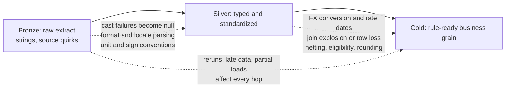

# 04 — Data Quality, Reconciliation, and Defect Management

## 1. Why DQ is central in AML/TM

In transaction monitoring, data quality is not just cleanup. It is part of the control environment. A rule output can be wrong because the rule code is wrong, but it can also be wrong because customer, account, transaction, or reference data is incomplete, duplicated, stale, or incorrectly stitched.

A strong AML/TM pipeline must answer:

```text
Did we receive the expected source data?
Did we transform it correctly?
Did we preserve required keys and dates?
Did we handle exceptions explicitly?
Did we run rules on the right population?
Did output reconcile?
Can every defect be traced to a root cause?
```

---

## 2. Data quality dimensions

| Dimension | Question | Example check |
|---|---|---|
| Completeness | Are required fields populated? | customer_id is not null. |
| Validity | Are values within allowed domain? | country_code exists in reference table. |
| Accuracy | Does target match source truth? | transaction amount matches source extract. |
| Consistency | Do related datasets agree? | account customer_id matches customer table. |
| Uniqueness | Are business records duplicated? | one transaction_id per source system. |
| Timeliness | Did data arrive and process on time? | daily extract landed before SLA. |
| Referential integrity | Do foreign keys resolve? | transaction account_id exists in account table. |
| Reconciliation | Do source and target totals align? | source count equals target count after approved exclusions. |
| Point-in-time correctness | Was the correct historical state used? | risk rating valid on transaction date. |
| Traceability | Can output be traced to inputs? | alert links to supporting transactions and batch ID. |

---

## 3. DQ check examples

### Required field check

```sql
SELECT
    batch_id,
    COUNT(*) AS failed_records
FROM silver_transactions
WHERE transaction_id IS NULL
   OR account_id IS NULL
   OR transaction_date IS NULL
GROUP BY batch_id;
```

### Duplicate check

```sql
SELECT
    source_system,
    transaction_id,
    COUNT(*) AS duplicate_count
FROM silver_transactions
GROUP BY source_system, transaction_id
HAVING COUNT(*) > 1;
```

### Referential integrity check

```sql
SELECT
    t.batch_id,
    COUNT(*) AS orphan_transaction_count
FROM silver_transactions t
LEFT JOIN silver_accounts a
  ON t.account_id = a.account_id
WHERE a.account_id IS NULL
GROUP BY t.batch_id;
```

### Reference-data validity check

```sql
SELECT
    t.country_code,
    COUNT(*) AS invalid_country_count
FROM silver_transactions t
LEFT JOIN ref_country c
  ON t.country_code = c.country_code
WHERE c.country_code IS NULL
GROUP BY t.country_code;
```

### Point-in-time coverage check

```sql
SELECT
    t.transaction_id,
    t.country_code,
    t.transaction_date
FROM silver_transactions t
LEFT JOIN ref_country_risk r
  ON t.country_code = r.country_code
 AND t.transaction_date BETWEEN r.effective_start_date AND r.effective_end_date
WHERE r.country_code IS NULL;
```

---

## 4. Reconciliation framework

Reconciliation compares stages and explains differences.

```text
Source extract
  ↓ compare count/amount/key coverage
Bronze raw table
  ↓ compare count/amount/valid records
Silver standardized table
  ↓ compare eligible population/exclusions
Gold rule input table
  ↓ compare aggregation totals
Alert output
```

### Control totals

Common totals:

```text
row count
unique customer count
unique account count
unique transaction count
total transaction amount
count by source system
count by transaction type
count by currency
count by transaction month
count by rule eligibility flag
count of rejected records
count of DQ exceptions
alert count by rule/month
```

### Reconciliation output table

```text
recon_id
batch_id
source_system
stage_from
stage_to
table_from
table_to
metric_name
metric_value_from
metric_value_to
difference
threshold
status
explanation
created_timestamp
```

### Example reconciliation query

```sql
WITH bronze AS (
    SELECT batch_id, COUNT(*) AS row_count, SUM(amount) AS total_amount
    FROM bronze_transactions
    GROUP BY batch_id
), silver AS (
    SELECT batch_id, COUNT(*) AS row_count, SUM(amount_original) AS total_amount
    FROM silver_transactions
    WHERE reject_flag = false
    GROUP BY batch_id
)
SELECT
    b.batch_id,
    b.row_count AS bronze_rows,
    s.row_count AS silver_rows,
    b.row_count - s.row_count AS rejected_or_missing_rows,
    b.total_amount AS bronze_amount,
    s.total_amount AS silver_amount,
    b.total_amount - s.total_amount AS amount_difference
FROM bronze b
JOIN silver s
  ON b.batch_id = s.batch_id;
```

---

## 5. Exception handling

A mature pipeline does not silently drop failed records. It routes them to exception tables with enough context for triage.

```text
dq_exception
  exception_id
  batch_id
  source_system
  table_name
  rule_name
  severity
  business_key
  column_name
  observed_value
  expected_condition
  error_description
  record_snapshot_reference
  created_timestamp
  owner
  status
```

### Severity model

| Severity | Meaning | Example |
|---|---|---|
| Critical | Output cannot be trusted. | Missing transaction extract for a month. |
| High | Rule output materially affected. | Customer/account joins fail for large population. |
| Medium | Some output affected; workaround possible. | Reference data gap for limited period. |
| Low | Does not affect current output materially. | Non-critical optional field missing. |

---

## 6. Defect management lifecycle

```text
Detected
  ↓
Logged
  ↓
Classified
  ↓
Assigned
  ↓
Root cause identified
  ↓
Fix designed
  ↓
Fix implemented
  ↓
Retested
  ↓
Evidence attached
  ↓
Business/QA sign-off
  ↓
Closed
```

### Defect categories

```text
source data defect
mapping defect
transformation defect
rule logic defect
reference data defect
point-in-time defect
performance defect
security/access defect
orchestration defect
reporting/evidence defect
legacy ambiguity
```

### Defect record template

```text
defect_id:
title:
severity:
category:
rule_id / table / pipeline:
batch_id:
source_period:
expected result:
actual result:
impact assessment:
root cause:
owner:
fix description:
retest query:
retest result:
evidence link:
approver:
closure date:
```

---

## 7. Distinguishing data defects from rule defects

This distinction is crucial.

### Data defect

The rule logic is correct, but input data is wrong or incomplete.

Examples:

- missing account-to-customer link
- duplicate transaction
- invalid country code
- stale reference data

### Rule defect

Input data is valid, but rule logic is wrong.

Examples:

- incorrect threshold operator
- wrong time window
- missing exclusion
- wrong aggregation key
- using current risk rating instead of historical risk rating

### Mapping defect

A field is mapped incorrectly from source to target.

Examples:

- source transaction date mapped to posting date incorrectly
- debit/credit direction reversed
- amount field mapped before currency conversion

---

## 8. Defect triage logic

When output does not match expected results, ask in this order:

1. Did both systems use the same source data period?
2. Did both systems evaluate the same eligible population?
3. Were exclusions applied consistently?
4. Were joins correct?
5. Were time windows correct?
6. Were thresholds and operators correct?
7. Was reference data point-in-time correct?
8. Were duplicates or reversals handled consistently?
9. Did the legacy system have undocumented behavior?
10. Is this an approved intentional difference?

---

## 9. Evidence pack design

A good evidence pack should allow a reviewer to reconstruct the run.

```text
1. Run manifest
2. Rule versions and parameter versions
3. Source extract inventory
4. DQ report
5. Reconciliation report
6. Alert output summary
7. Sample alert drill-through
8. Defect log
9. Retest evidence
10. Business and technology sign-off
```

### Sample drill-through evidence

For an alert:

```text
alert_key
rule_id
rule_version
customer_id
window_start
window_end
threshold
actual_value
supporting_transaction_ids
source batch IDs
reference data version
DQ status
reason code
```

---

## 10. Common anti-patterns

| Anti-pattern | Why it is risky |
|---|---|
| DQ checks only at the end | Root cause becomes hard to locate. |
| Only row-count reconciliation | Amounts, keys, and business eligibility can still be wrong. |
| Manual defect explanations | Explanations are not repeatable evidence. |
| Silent data drops | Output may look clean while missing risk. |
| No point-in-time checks | Historical results can be materially wrong. |
| No deterministic alert keys | Reruns create duplicates or cannot be matched. |
| Rule logic only in code | Business and audit cannot validate it easily. |
| No defect categories | Root causes get blurred. |

---

## 11. Case study: the amount that changed between bronze and gold

Scenario: month-end reconciliation for June 2022 shows the total transaction amount in the gold rule-input table does not match the bronze landing total for the same batch. The investigator's question is simple - "where did the money go?" - and the answer is never "it just changed."

First principle - **conservation of amount**:

```text
An amount never silently changes between layers.
It was dropped, duplicated, transformed, or reclassified.
Each of those has a detectable signature and a required piece of evidence.
```

Runnable version of this case study with assertions: **Appendix D** of [`../examples/spark/notebooks/aml_databricks_one_stop_learning.ipynb`](../examples/spark/notebooks/aml_databricks_one_stop_learning.ipynb).

### Where amounts change on the way to gold



### Bronze to silver: standardization factors

| Factor | What happens to the amount | Signature |
|---|---|---|
| Type casting | bad formats (`'1,250.40'`, `''`, stray characters) become null in legacy/`try_cast` mode, so `SUM` silently shrinks; with ANSI mode on, the same cast kills the run instead | total drops by exactly the unparseable rows; cast-failure DQ check fires |
| Locale and format parsing | European decimal commas, currency symbols, parentheses or trailing minus for negatives parsed wrongly | values shifted by orders of magnitude or sign-flipped |
| Unit normalization | source stores minor units (cents) and the load misses or double-applies the divide | totals off by exactly x100 or /100 |
| Sign conventions | debit/credit indicator not applied, or applied twice | totals off by 2x the affected flows; debits inflate instead of offset |
| Deduplication | duplicate source rows removed (correct, total drops), or the tie-breaker keeps the wrong version of an amended amount | difference equals specific removed rows; amended-row sampling disagrees with source |
| DQ quarantine | rejected records excluded from silver | difference equals quarantined rows; must reconcile with the exception table |
| Null and zero defaulting | empty amount loaded as 0 instead of null, or vice versa | counts match while totals differ; zero-amount rows appear in monitoring populations |

### Silver to gold: business-shaping factors

| Factor | What happens to the amount | Signature |
|---|---|---|
| Currency conversion | FX rate source, the rate **date** (transaction vs posting vs run date), and per-row rounding all change the number | difference concentrated in converted currencies; an approved, explainable difference when rate evidence exists |
| Join explosion | many-to-many join (for example ownership history without effective-date bounds) duplicates rows, so amounts double-count | total inflates by exact multiples of specific rows; row count rises with no new transactions |
| Join row loss | inner join drops transactions with missing reference rows | total shrinks by exactly the orphan rows; left-anti check finds them |
| Eligibility filters | population scoping (status, type, window) intentionally removes rows | expected difference; must be in the explained-difference register, not discovered by surprise |
| Netting and reversals | reversals netted against originals, or excluded, or accidentally double-counted | gross vs net mismatch; reversal pairs in samples |
| Rounding policy | rounding per row vs rounding the aggregate: the sum of rounded values is not the rounded sum; float instead of decimal adds drift | pennies-level differences that grow with row count |
| Timing and reruns | late-arriving data, watermark cutoffs, non-idempotent rerun appending a partial batch again | totals differ between runs of the same period; difference equals a batch or partition |

### Diagnostic table: from symptom to factor

The shape of the difference usually names the factor before any code is read:

| Symptom | Most likely factor |
|---|---|
| Total off by exactly x100 or /100 | unit normalization (minor units) |
| Pennies off, growing with volume | rounding policy or float arithmetic |
| Counts match, totals differ | casting, zero-defaulting, FX, or sign handling |
| Counts and totals both drop by the same rows | dedupe, quarantine, or inner-join row loss |
| Total inflates, row count rises, no new transactions | join explosion |
| Difference only in some currencies | FX rate source or rate date |
| Difference appears only on rerun | idempotency, late data, or partial overwrite |
| Difference equals one source system or period | extract gap or mapping defect |

### Worked micro-trace

Tiny batch of seven bronze rows (full runnable trace in notebook Appendix D):

```text
bronze (7 raw rows, amounts as strings):
  d1 100.10 CAD | d2 '1,250.40' CAD | d3 '' CAD | d4 200.20 CAD
  d5 300.00 CAD | d5 300.00 CAD (duplicate) | d6 100.00 USD

naive silver cast: total 1000.30
  -> the comma in d2 became a silent null: 1250.40 vanished

parsed silver: total 2250.70
  -> dedupe removes one d5 (-300.00), d3 quarantined (missing amount)
  -> silver total 1950.70; conservation: 2250.70 = 1950.70 + 300.00 + quarantined row

gold: d6 converted at 1.3567 -> 135.67 CAD; total 1986.37
  -> +35.67 is an APPROVED difference with rate evidence
  -> ownership join without effective dates would double d6: total 2122.04
```

Every hop either preserves the total or explains the difference with evidence. The moment a difference has no owner and no explanation, it is a defect, not a footnote.

### Control playbook

1. Emit control totals at every layer per batch: row count, distinct business keys, `SUM(amount)`, and totals by currency and source system.
2. Reconcile each hop with the conservation identity: `upstream_total = downstream_total + excluded(with reasons) + transformed(with evidence)`.
3. Keep a cast-failure DQ check: raw value present but typed value null is an exception row, never a silent drop. Decide deliberately whether ANSI mode should fail the run or `try_cast` should route to quarantine.
4. Convert currency with point-in-time rates keyed to a documented rate date, store the rate on the output row, and round once at an agreed place.
5. Bound every reference join with effective dates and check pre/post join row counts.
6. Register expected differences (eligibility filters, FX, netting) before reconciliation runs, so the report separates approved differences from defects.

Interview framing:

> When an amount differs between layers, I do not start in the code. I start with the shape of the difference - exact multiples point to unit errors, pennies point to rounding, count-preserving differences point to casting or FX, count-changing differences point to dedupe, quarantine, or joins, and rerun-only differences point to idempotency. Then I apply conservation of amount: every cent is either preserved, excluded with a reason, or transformed with evidence. Anything left over is a defect with an owner.

---

## 12. Active recall questions

1. Why is DQ part of AML/TM controls rather than just data cleanup?
2. What is the difference between completeness and reconciliation?
3. Why is point-in-time correctness a DQ dimension?
4. What should be included in an exception table?
5. How do you classify a mismatch between legacy output and cloud output?
6. What evidence should be attached before closing a defect?
7. Why are row counts insufficient as the only reconciliation measure?
8. How would you explain defect root cause analysis to a non-technical reviewer?
9. State the conservation-of-amount principle and why it turns "the total changed" into a tractable investigation.
10. The gold total is higher than silver, row counts rose, and no new transactions arrived. Name the factor and the proof query.
11. Counts match between bronze and silver but totals differ. List three factors that produce exactly this signature.
12. Why is an FX difference between silver and gold not automatically a defect, and what evidence makes it acceptable?

### Model answers

1. DQ is part of AML/TM controls because bad data can suppress, inflate, or misassign alerts. A monitoring result is only defensible if input quality and exceptions are visible.
2. Completeness asks whether required records or fields exist. Reconciliation asks whether totals and records agree across systems or processing layers.
3. Point-in-time correctness is a DQ dimension because historically valid results depend on effective-dated customer, account, risk, and reference data.
4. An exception table should include record key, source, failed check, severity, reason, affected rule/output, batch ID, detected timestamp, owner, and resolution status.
5. Classify a legacy/cloud mismatch by checking data, mapping, rule logic, reference data, parameters, timing, environment, and whether the difference is approved.
6. Defect closure evidence includes root cause, impacted records/periods, fix description, retest results, reconciliation before/after, sample evidence, approval, and closure date.
7. Row counts are insufficient because the same count can hide amount mismatches, missing keys, wrong joins, duplicate alerts, incorrect segmentation, or wrong supporting transactions.
8. Root cause analysis means tracing a symptom back through source data, mapping, transformations, rule logic, parameters, and outputs until the owner and fix are clear.
9. An amount never silently changes between layers; it was dropped, duplicated, transformed, or reclassified, each with a detectable signature. The identity `upstream_total = downstream_total + excluded(with reasons) + transformed(with evidence)` turns the investigation into accounting for a finite set of categories instead of guessing.
10. Join explosion: a many-to-many reference join (for example ownership history without effective-date bounds) duplicated transaction rows. Prove it by comparing pre/post join row counts and finding business keys whose post-join copy count exceeds one.
11. Type casting that nulls unparseable amounts (with `SUM` ignoring nulls), zero-vs-null defaulting, FX conversion changing values without changing rows, or sign/unit handling errors - all change totals while preserving counts.
12. FX is a transformation, not a loss: the difference is acceptable when it is registered as an expected difference and each converted row carries its rate, rate date, and source amount, so the reconciliation report can recompute and approve it.
