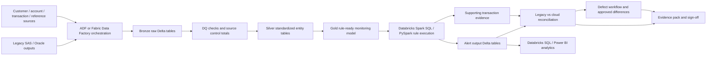

# 06 — Practice Lab: Retrieval Tests and What-If Scenarios

Use this file with the notes closed. The goal is not to memorize answers. The goal is to diagnose, explain, and defend your reasoning.

Answer key: [`12. Model Answer Key`](#12-model-answer-key). A shorter cross-repo version also lives in [`16-model-answer-bank.md#3-practice-lab-answers`](16-model-answer-bank.md#3-practice-lab-answers).

---

## 1. Retrieval Test A — Core concepts

Answer in your own words.

1. Explain AML transaction monitoring in five sentences without using the word “compliance.”
2. What is the difference between a scenario, a rule, an alert, a case, and a report?
3. Why does a monitoring system need both facts and context?
4. Why is customer risk rating not just a dashboard field?
5. What does “risk-based approach” mean in a data pipeline?
6. Why is a false positive not automatically a bad alert?
7. What does “lineage” mean for an alert?
8. Why is historical replay more difficult than current-month processing?
9. What is point-in-time correctness?
10. What is an evidence pack?

### Scoring rubric

| Score | Standard |
|---|---|
| 1 | Definition only, no example. |
| 2 | Definition plus example, but no tradeoff. |
| 3 | Clear explanation with example and one failure mode. |
| 4 | Explanation includes business, technical, and control implications. |
| 5 | Explanation includes tradeoffs, evidence, and how to test it. |

---

## 2. Retrieval Test B — Azure modernization

1. Explain the difference between raw/bronze, silver, and gold layers.
2. What is ADF/Fabric Data Factory responsible for?
3. What is Databricks/Spark useful for in a 5-year lookback?
4. What does Delta Lake add beyond plain Parquet files?
5. Why does Purview or another catalog/lineage tool matter?
6. What is idempotence, and why does it matter for reruns?
7. What is a deterministic alert key?
8. Why should partitions align with business processing windows?
9. What metadata should every output table include?
10. What does a run manifest contain?

---

## 3. Retrieval Test C — Rule migration

1. Why is legacy migration an equivalence problem?
2. What can go wrong when translating SAS logic into Spark SQL?
3. What can go wrong when translating Oracle stored logic into a cloud pipeline?
4. What can go wrong when extracting IMS/mainframe data?
5. Why do rules need version numbers?
6. What is a golden record test?
7. What is source-to-target mapping?
8. What belongs in the eligibility section of a rule spec?
9. What belongs in the controls section of a rule spec?
10. What is the difference between expected difference and defect?

---

## 4. Retrieval Test D — DQ and defects

1. List ten DQ dimensions without looking.
2. Explain why row counts are necessary but insufficient.
3. What is referential integrity?
4. What is the difference between a DQ exception and a defect?
5. Why should exception records not be silently dropped?
6. What is a source data defect?
7. What is a mapping defect?
8. What is a rule logic defect?
9. What evidence should be attached to close a defect?
10. How would you triage an alert mismatch?

---

## 5. What-if scenarios

### Scenario 1 — Alert count doubles

A migrated rule produces 20,000 alerts in Azure for June 2022. The legacy system produced 10,000 alerts for the same period.

Answer:

1. What are five possible root causes?
2. Which reconciliation metrics would you check first?
3. How would you determine whether this is a data defect, mapping defect, rule defect, or expected difference?
4. What evidence would you show to business owners?
5. What would prevent you from signing off?

### Scenario 2 — Alert count drops to zero

A rule that normally produces alerts generates zero alerts for three months of historical data.

Answer:

1. Why is “zero alerts” not automatically good news?
2. Which input tables would you check?
3. Which DQ checks might reveal the issue?
4. What rule-spec assumptions should be reviewed?
5. How would you create a golden test to reproduce the issue?

### Scenario 3 — Reference data has no effective dates

The country risk reference table only has current values, but the lookback covers five years.

Answer:

1. What risk does this create?
2. What point-in-time data is missing?
3. What mitigation options exist?
4. How would you document the limitation?
5. What sign-off is required?

### Scenario 4 — Account ownership changed

An account belonged to Customer A in 2021 and Customer B in 2023. The lookback output assigns all alerts to Customer B.

Answer:

1. What is the likely defect?
2. Which table design would prevent this?
3. Which test case should have caught it?
4. What downstream impacts could occur?
5. What remediation plan would you propose?

### Scenario 5 — Business wants to tune threshold before validation

The business team wants to reduce alert volume by increasing a threshold before the migration equivalence test is complete.

Answer:

1. Why is this risky?
2. How should equivalence and optimization be separated?
3. What analysis is needed before changing the threshold?
4. What governance artifacts must be updated?
5. What would you recommend as the next step?

### Scenario 6 — DQ exception table grows unexpectedly

A source extract has a sudden increase in missing account IDs.

Answer:

1. What questions do you ask the source-system team?
2. How do you assess impact on rule output?
3. Which severity would you assign and why?
4. What evidence belongs in the defect ticket?
5. Can the batch continue? Under what conditions?

### Scenario 7 — Rerun creates duplicate alerts

A pipeline rerun creates duplicate alerts for the same period.

Answer:

1. What design flaw likely exists?
2. How would deterministic alert keys help?
3. How should partition overwrite work?
4. What reconciliation metric catches this?
5. What code or process change would prevent recurrence?

### Scenario 8 — Legacy output cannot be reproduced

The old system has missing documentation and inconsistent outputs for the same input period.

Answer:

1. How do you proceed without guessing?
2. What assumptions must be documented?
3. What stakeholder decisions are required?
4. How do golden records help?
5. What evidence should be retained?

### Scenario 9 — Performance misses SLA

A rule cannot complete within the required processing window.

Answer:

1. Which Spark/SQL performance areas would you inspect?
2. How would partitioning help?
3. How could skewed joins affect runtime?
4. What tradeoff exists between performance optimization and equivalence validation?
5. What monitoring metrics should be captured?

### Scenario 10 — Audit asks why an alert triggered

An auditor selects one alert and asks for proof of why it exists.

Answer:

1. What fields do you show?
2. What supporting transactions do you show?
3. What rule version and parameter evidence do you show?
4. What DQ/reconciliation evidence do you show?
5. What would be a weak or unacceptable answer?

---

## 6. Reverse-engineering labs

### Lab 1 — Infer rule behavior from output

Output summary:

```text
rule_id: TM002
window: 7 days
alerts: 1,250
alert count increased most for high-risk customers
supporting transactions are mostly international wires
```

Infer:

1. What might the rule be aggregating?
2. What input tables are likely required?
3. What reference data may be involved?
4. Which DQ checks are critical?
5. What boundary tests should exist?

### Lab 2 — Infer defect from reconciliation

```text
Bronze transaction count: 5,000,000
Silver transaction count: 5,000,000
Gold rule input count: 3,200,000
Legacy eligible population: 4,900,000
Azure eligible population: 3,200,000
```

Infer:

1. Which stage likely introduced the problem?
2. Which filters or joins should be inspected?
3. What defect categories are possible?
4. What sample records would you request?
5. How would you summarize impact?

### Lab 3 — Infer governance gap

```text
Rule changed in production.
Alert volume dropped by 40%.
No rule-spec version changed.
No approval record is available.
```

Infer:

1. What governance failure occurred?
2. What evidence is missing?
3. How could version control prevent this?
4. What emergency review should happen?
5. What preventive control should be added?

---

## 7. Explain-it-back drills

Explain each in plain English:

1. “A lookback is a controlled historical replay.”
2. “An alert is a lineage object.”
3. “Rule migration is an equivalence problem.”
4. “Data quality is a control.”
5. “Spec-as-code turns governance into executable artifacts.”
6. “Point-in-time reference data protects historical truth.”
7. “False positives should be measured, not blindly eliminated.”
8. “A defect is not closed until it has evidence.”
9. “A rerunnable pipeline must be idempotent.”
10. “Analytics supports both preparation and post-alert review.”

---

## 8. Interview-role retrieval drills

Use these after reading `08-interview-knowledge-by-role-and-tech-stack.md` and at least one role-specific guide:

- `09-role-data-engineer.md`
- `10-role-data-analyst-bi.md`
- `ml/README.md`
- `12-role-qa-dq-engineer.md`
- `13-role-solution-architect-lead.md`
- `14-tech-stack-reference.md`
- `spark/README.md`
- `sql/README.md`
- `code/README.md`

### Drill 1 — Same project, five role lenses

Explain the 5-year AML/TM lookback modernization project as each role:

1. Data Engineer
2. Data Analyst / BI
3. Data Scientist
4. QA / DQ Engineer
5. Solution Architect / Lead

For each role, include:

1. What the role owns
2. Which risks the role cares about
3. Which artifacts the role produces
4. Which tech stack depth matters most
5. What evidence proves good work

### Drill 2 — Stack flashcards

Answer in two minutes each:

1. What does Azure Data Factory or Fabric Data Factory do that Databricks does not replace?
2. Why is Delta Lake useful for AML/TM replay and auditability?
3. How does PySpark lazy execution affect debugging and performance tuning?
4. What does Lakeflow add beyond standalone notebooks?
5. What is the difference between Lakeflow Jobs and Lakeflow Spark Declarative Pipelines?
6. When would you use a streaming table, materialized view, or temporary view?
7. How do DQ expectations differ from reconciliation reports?
8. How does Unity Catalog or a catalog/lineage layer support interview answers about governance?
9. What BI metric definitions must be locked before building dashboards?
10. What makes an ML-assisted alert prioritization model safe enough to discuss in a regulated context?

### Drill 3 — Interview story compression

Prepare three versions of the same project story:

1. **30 seconds:** role, problem, result.
2. **2 minutes:** architecture, controls, tradeoff, evidence.
3. **10 minutes:** source systems, data layers, rules, DQ, reconciliation, defects, governance, analytics, and lessons learned.

Score yourself:

| Score | Standard |
|---|---|
| 1 | Tool list only. |
| 2 | Describes tasks but not risk or evidence. |
| 3 | Connects tasks to business outcome. |
| 4 | Explains tradeoffs and failure modes. |
| 5 | Gives a role-specific, stack-specific, evidence-first answer. |

---

## 9. Informal scope-call practice

Use [`17-project-scope-call-prep.md`](17-project-scope-call-prep.md) when a meeting is described as informal but will cover project scope, team operations, remediation exercises, and skill fit.

Answer key: [`16-model-answer-bank.md#7-project-scope-call-prep-answers`](16-model-answer-bank.md#7-project-scope-call-prep-answers)

Practice:

1. Give a 30-second introduction for a remediation-heavy AML/TM analytics team.
2. Ask five project-scope questions.
3. Ask five team-operating-model questions.
4. Explain how data science can support remediation without jumping straight to model training.
5. Summarize what evidence proves a remediation exercise is complete.

---

## 10. Spark SQL and PySpark deep drills

Use these after reading `spark/spark-sql-pyspark-deep-learning.md`.

Before coding, run the relevant notebook:

- Canonical Databricks/Spark notebook: [`../examples/spark/notebooks/aml_databricks_one_stop_learning.ipynb`](../examples/spark/notebooks/aml_databricks_one_stop_learning.ipynb)
  - Step 14: Spark SQL versus PySpark micro-lab.
  - Appendix A: focused PySpark DataFrame practice.
  - Appendix B: focused Spark SQL query practice.

### Drill 1 — SQL to PySpark translation

Translate this query into PySpark DataFrame code:

```sql
SELECT
    customer_id,
    COUNT(*) AS txn_count,
    SUM(amount_cad) AS total_amount_cad
FROM gold_rule_input_transactions
WHERE transaction_type = 'WIRE'
  AND processing_month = '2022-06'
GROUP BY customer_id
HAVING SUM(amount_cad) > 100000;
```

Then explain:

1. Which operations are transformations?
2. Which operation triggers execution?
3. Which step may cause a shuffle?
4. What tests prove the output is correct?

### Drill 2 — Join diagnosis

A rule output drops from 50,000 alerts to 12,000 alerts after joining transactions to account history.

Answer:

1. Which join type was likely used?
2. How would a left anti join help?
3. Which point-in-time condition might be wrong?
4. What reconciliation metrics would you create?
5. What sample records would you inspect?

### Drill 3 — Spark performance triage

A monthly rule runs for six hours and most tasks finish quickly, but a few tasks run for almost the full duration.

Answer:

1. What Spark issue does this suggest?
2. Where do you confirm it?
3. Which key distributions would you inspect?
4. Which mitigations might help?
5. How do you prove tuning did not change business output?

### Drill 4 — Null and date boundary test

Create golden records for:

1. Null `country_code`
2. Blank `account_id`
3. Transaction exactly on `effective_start_date`
4. Transaction exactly on `effective_end_date`
5. Amount exactly equal to threshold

For each, write the expected behavior and the Spark SQL/PySpark condition that should handle it.

### Drill 5 — First-principles tiny rule

Use the tiny dataset from `spark/first-principles-examples.md`.

Answer without running code first:

1. Which rows survive the posted WIRE filter?
2. Which row becomes an orphan-account DQ exception?
3. Which rows remain after high-risk country filtering?
4. Which customer alerts and why?
5. What should the reconciliation counts be at each step?
6. Which Spark operations are narrow?
7. Which Spark operations likely cause a shuffle?
8. What supporting transaction rows prove the alert?

### Drill 6 — Query basics from memory

Use `spark/spark-sql-query-basics-examples.md`.

Answer and write SQL without looking:

1. Select posted WIRE transactions in June 2022.
2. Find transactions with null country code.
3. Explain why `country_code <> 'CA'` excludes nulls.
4. Count transactions by transaction type.
5. Find accounts with total transaction amount above 100.
6. Find orphan account transactions using a left anti join.
7. Use a CTE to build posted wires, join accounts, aggregate by customer, and filter above threshold.
8. Use `ROW_NUMBER()` to find latest transaction per account.
9. Build a reconciliation query showing posted wires, valid account matches, orphan accounts, and unexplained difference.
10. Build an alert query with deterministic alert key and supporting transaction query.

### Drill 7 — PySpark DataFrame basics from memory

Use `spark/pyspark-dataframe-basics-examples.md`.

Write PySpark code without looking:

1. Create the tiny `transactions_raw`, `accounts`, and `country_risk` DataFrames with explicit schema.
2. Cast `transaction_date` to date and `amount_cad` to decimal.
3. Select `transaction_id`, `account_id`, and `amount_cad`.
4. Filter posted WIRE transactions.
5. Filter June 2022 transactions with a half-open date range.
6. Find null `country_code` rows.
7. Create an `amount_band` column with `F.when`.
8. Count transactions by `transaction_type`.
9. Find orphan account transactions using `left_anti`.
10. Use `Window` and `row_number` to find latest transaction per account.
11. Build the high-risk posted-wire alert.
12. Assert that the alert customer is `c1` and supporting transactions are `t1` and `t2`.

---

## 11. Final capstone exercise

Design a mini solution for this case:

```text
A bank needs to replay 5 years of transaction monitoring data.
Legacy rules exist in SAS and Oracle.
Customer/account data comes from separate systems.
Some reference data changes over time.
The bank wants the new implementation on Azure/Fabric/Databricks.
The output must be auditable.
```

Your answer must include:

1. Target architecture
2. Data model
3. Rule migration approach
4. DQ/reconciliation framework
5. Defect management workflow
6. Evidence pack
7. Analytics plan
8. 30-day learning plan for a new team member

Do this closed-book first. Then compare with the model answer below.

---

## 12. Model Answer Key

Use this section after attempting the drills. A good answer does not need the same wording, but it should cover the same control logic, failure modes, and evidence.

### 12.1 Retrieval Test A - Core concepts

1. Transaction monitoring reviews financial activity for risk patterns using transactions, accounts, customers, and reference context. Scenarios define patterns that deserve review, such as unusual high-risk wires or structuring-like activity. Rules implement those scenarios as logic and thresholds. Alerts are generated for investigators to review with supporting evidence. The system is successful when alerts are explainable, reproducible, and tied to governed controls.
2. A scenario is the risk pattern. A rule is the technical/business logic that implements the scenario. An alert is the generated review item. A case is the investigation workflow after review begins. A report is the formal external filing decision after sufficient review and judgment.
3. Facts show what happened: amount, date, account, counterparty, country, transaction type. Context explains meaning: customer risk, product, expected behavior, relationship history, geography, sanctions or high-risk reference data. Without context, a rule cannot distinguish normal high-volume activity from unusual or risky behavior.
4. Customer risk rating affects eligibility, thresholds, prioritization, segmentation, and review expectations. It must be point-in-time for a lookback because using the current rating can rewrite historical risk.
5. Risk-based approach in a data pipeline means higher-risk customers, products, geographies, and activity receive stronger controls, clearer evidence, more careful DQ gates, and often different thresholds or review priority.
6. A false positive is not automatically bad because monitoring rules intentionally escalate uncertainty. It becomes a problem when false positives are unmeasured, unexplainable, concentrated in a segment, or caused by data/rule defects.
7. Alert lineage means the alert can be traced back to input records, rule version, parameters, transformations, DQ checks, reconciliation status, and run metadata.
8. Historical replay is harder than current-month processing because schemas, customer relationships, account ownership, reference data, risk ratings, and rule parameters may have changed across time.
9. Point-in-time correctness means using the customer, account, reference, and parameter state that was valid for the historical event or processing window being replayed.
10. An evidence pack is the set of artifacts that proves what ran, what data was used, what output was created, what differences or defects exist, and who approved the result.

### 12.2 Retrieval Test B - Azure modernization

1. Bronze/raw preserves landed source data with minimal changes. Silver standardizes, types, validates, deduplicates, and joins core entities. Gold creates rule-ready, BI-ready, and evidence-ready outputs at controlled grains.
2. ADF or Fabric Data Factory handles orchestration, movement, scheduling, parameters, dependency control, and integration with non-Databricks systems. It does not replace Spark transformations or rule logic.
3. Databricks/Spark is useful for distributed joins, aggregations, windows, rule execution, DQ checks, backfills, reconciliation, and large historical replay.
4. Delta Lake adds transaction logs, ACID writes, schema enforcement/evolution controls, history, time travel, and safer partition replacement compared with plain Parquet.
5. Purview, Unity Catalog, or another catalog/lineage layer matters because AML/TM outputs need access control, ownership, discoverability, auditability, and traceability from alert back to data source.
6. Idempotence means a run can be repeated without creating duplicates or inconsistent output. It matters for retries, defect fixes, and month/rule reruns.
7. A deterministic alert key is a stable key generated from rule ID/version, customer or account, time window, and trigger grain so reruns match prior results.
8. Partitions should align with business windows, such as processing month or transaction month, so backfills and reruns can isolate a period and reconcile it cleanly.
9. Every output table should include batch/run ID, processing period, source system, rule version, load timestamp, DQ status, lineage fields, and ownership or approval metadata.
10. A run manifest contains run ID, period, source snapshots, code version, rule versions, parameters, input/output counts, DQ results, reconciliation status, output locations, defects, and owner.

### 12.3 Retrieval Test C - Rule migration

1. Legacy migration is an equivalence problem because the first goal is to prove the cloud implementation reproduces approved legacy behavior before optimizing or changing the control.
2. SAS migration can fail because of macros, formats, DATA step retain behavior, sort/merge assumptions, missing-value semantics, date handling, and implicit business logic.
3. Oracle migration can fail because stored procedures, parameter tables, null semantics, date/time behavior, transaction boundaries, and optimizer-dependent assumptions may not translate directly.
4. IMS/mainframe extraction can fail because hierarchical relationships, copybook layouts, batch timing, encoding, and extract completeness may be misunderstood.
5. Rules need version numbers so each historical run can be tied to the exact approved logic and parameter set.
6. A golden record test is a tiny curated input case with known expected output, including edge cases and non-alert cases.
7. Source-to-target mapping documents how each legacy field maps to the cloud field, including type, transformation, grain, owner, DQ rule, and unresolved assumptions.
8. Eligibility section includes population, status, product scope, geography, date window, exclusions, required joins, and required reference data.
9. Controls section includes DQ checks, exception routing, reconciliation metrics, approval gates, run metadata, and evidence requirements.
10. Expected difference is approved and documented. Defect is an unresolved or unapproved mismatch that needs root cause, remediation, retest, and closure evidence.

### 12.4 Retrieval Test D - DQ and defects

1. Ten DQ dimensions: completeness, validity, accuracy, consistency, uniqueness, timeliness, referential integrity, point-in-time correctness, conformity, and reconciliation.
2. Row counts are necessary but insufficient because the same count can hide wrong keys, wrong amounts, duplicate alerts, bad joins, null handling, wrong risk ratings, or wrong supporting transactions.
3. Referential integrity means child records reference valid parent records, such as transactions having valid account IDs and accounts having valid customer IDs.
4. A DQ exception is a record or check failure. A defect is a confirmed issue requiring ownership, severity, impact, fix, retest, and closure.
5. Exception records should not be silently dropped because dropping them can suppress alerts, hide impact, and make reconciliation impossible.
6. Source data defect originates in upstream source values, extract completeness, or source-system behavior.
7. Mapping defect comes from incorrect source-to-target mapping, type conversion, transformation, or business meaning.
8. Rule logic defect means implemented logic differs from the approved rule specification.
9. Closure evidence should include root cause, impacted records/periods, fix description, before/after reconciliation, retest proof, sample records, owner approval, and closure date.
10. Triage alert mismatch by confirming scope, period, rule version, parameters, input counts, eligibility counts, joins, reference data, sample matched/unmatched records, and expected-difference approvals.

### 12.5 What-if Scenario Answers

| Scenario | Model answer |
|---|---|
| Alert count doubles | Check duplicate source rows, append-only rerun behavior, wider eligibility, many-to-many joins, threshold mismatch, missing exclusions, wrong date filter, and reference-data mismatch. First reconcile source counts, eligible population, distinct customers/accounts, total amount, duplicate business keys, and matched/unmatched legacy alert keys. Do not sign off until root cause, impact, fix or approved difference, and evidence are complete. |
| Alert count drops to zero | Zero alerts may mean broken ingestion, empty parameter table, bad join, wrong date filter, missing reference data, or unsupported input population. Check transactions, accounts, customers, ownership, rule parameters, country/product reference data, and DQ exceptions. Create a golden record that should trigger and trace exactly where it disappears. |
| Reference data has no effective dates | Current-state reference data can rewrite historical truth. The missing data is effective-dated country/product/risk values. Mitigate by sourcing historical snapshots, reconstructing from audit logs, limiting scope, adding assumptions, and getting control-owner sign-off. |
| Account ownership changed | Likely defect is current ownership join instead of point-in-time ownership join. Prevent it with effective-dated account-customer relationship tables. Test ownership-change boundary cases. Remediate by rebuilding affected periods and reconciling reassigned alerts. |
| Threshold tuning before validation | This mixes migration equivalence with optimization. First prove legacy/cloud equivalence, then run threshold impact analysis, update parameter version and rule spec, get approval, and compare before/after alert volume and risk impact. |
| DQ exception spike | Ask whether source extract, schema, upstream feed, account master, or load timing changed. Assess affected rules, periods, customers, and alert suppression/inflation risk. Severity depends on output impact. Continue only with quarantine, impact analysis, and approval. |
| Duplicate alerts on rerun | Likely append-only write, missing deterministic keys, or missing partition replacement. Use deterministic alert keys, delete/replace target period, reconcile duplicate key counts, and add idempotent write tests. |
| Legacy output cannot be reproduced | Do not guess. Preserve available extracts/output, document unknowns, create golden records, classify assumptions, obtain stakeholder decisions, and record approved limitations. |
| Performance misses SLA | Inspect file size, partitioning, scan volume, shuffles, skew, join strategy, spill, caching, and AQE. Tune only after correctness baseline exists, then prove output keys/counts/amounts did not change. |
| Audit asks why an alert triggered | Show rule ID/version, parameters, trigger metrics, customer/account context, supporting transactions, DQ status, reconciliation status, source lineage, and run manifest. A weak answer is “the job generated it” without evidence. |

### 12.6 Reverse-Engineering Lab Answers

| Lab | Model answer |
|---|---|
| Lab 1 | The rule likely aggregates international wire volume/count over a 7-day window, especially for high-risk customers. Inputs likely include transactions, accounts, customers, customer risk, ownership, country risk, and rule parameters. Critical DQ checks: missing account/customer keys, invalid country, duplicate transactions, effective-date coverage, and boundary-window tests. |
| Lab 2 | The issue likely appears between silver and gold rule input. Inspect eligibility filters, account/customer joins, current versus point-in-time status, product/status exclusions, and reference joins. Possible categories: mapping defect, rule eligibility defect, reference-data defect, or join defect. Request samples present in silver/legacy but absent from gold. |
| Lab 3 | Governance failed because production rule behavior changed without versioning or approval. Missing evidence: change request, updated spec, parameter version, test result, deployment approval, and impact analysis. Emergency review should freeze the change, quantify alert impact, restore or approve behavior, and add promotion gates. |

### 12.7 Explain-It-Back Answers

1. A lookback is a controlled historical replay because the system reprocesses past activity using repeatable logic and produces proof for every period.
2. An alert is a lineage object because it must explain which source rows, rule version, parameters, and run created it.
3. Rule migration is an equivalence problem because the first target is preserving approved behavior, not rewriting the rule.
4. Data quality is a control because bad data directly changes alert outcomes.
5. Spec-as-code turns governance into executable artifacts by making approved rule logic, parameters, tests, and controls versioned and runnable.
6. Point-in-time reference data protects historical truth by using values valid at the event date.
7. False positives should be measured because they show control sensitivity, workload, and tuning opportunity; blindly eliminating them can reduce risk coverage.
8. A defect is not closed until evidence proves root cause, fix, retest, impact, and approval.
9. A rerunnable pipeline must be idempotent so retries and backfills do not duplicate or corrupt outputs.
10. Analytics supports preparation through profiling, volume estimation, and DQ discovery; it supports post-alert review through trend, effectiveness, and workload analysis.

### 12.8 Interview-Role Drill Answers

| Role | Strong answer focus |
|---|---|
| Data Engineer | Owns ingestion, Spark/Delta transformations, rule execution tables, deterministic reruns, DQ outputs, and reconciliation evidence. Cares about grain, keys, partitions, scale, lineage, and idempotence. |
| Data Analyst / BI | Owns metric definitions, dashboards, drill-through, trends, and dashboard-to-source tie-outs. Cares about grain, filters, refresh status, access, and trusted executive reporting. |
| Data Scientist | Owns feature readiness, labels, leakage checks, explainable prioritization, MLflow evidence, and drift monitoring. Cares about point-in-time features and governance. |
| QA / DQ Engineer | Owns test strategy, golden records, DQ checks, defect classification, retest evidence, and sign-off support. Cares about edge cases, expected results, and defect closure proof. |
| Solution Architect / Lead | Owns target architecture, migration sequence, controls, security, NFRs, stakeholder decisions, and operating model. Cares about sign-off, ownership, governance, and sustainability. |

### 12.9 Stack Flashcard Answers

1. ADF/Fabric Data Factory orchestrates movement and dependencies across systems; Databricks does distributed processing and rule logic.
2. Delta supports replay and auditability through transaction log, ACID behavior, schema controls, history, and selective overwrite.
3. PySpark lazy execution means transformations build a plan and actions trigger work; debugging needs `explain`, counts, samples, and careful action placement.
4. Lakeflow adds managed ingestion/pipeline/job structure, expectations, monitoring, and production workflow patterns beyond ad hoc notebooks.
5. Lakeflow Jobs orchestrate tasks; Lakeflow Spark Declarative Pipelines define managed tables, flows, materialized views, streaming tables, and expectations.
6. Use streaming table for incremental event-like data, materialized view for maintained derived outputs, and temporary view for intermediate transformations.
7. DQ expectations validate records during processing; reconciliation compares totals, keys, and outputs across layers or systems.
8. Unity Catalog or lineage supports governance through access control, ownership, discovery, audit logs, and traceability.
9. Lock metric grain, time period, source table, filters, numerator/denominator, exclusions, refresh behavior, and security scope before building dashboards.
10. Safe ML-assisted prioritization needs point-in-time features, explainability, human review, MLflow tracking, monitoring, and approval before operational use.

### 12.10 Project Scope-Call Practice Answers

1. A strong 30-second intro: “I focus on AML/TM data modernization where rule behavior, DQ, reconciliation, and evidence matter as much as code. For a remediation or lookback effort, I would first understand scope, source systems, rule inventory, expected outputs, and sign-off criteria, then help turn that into repeatable Databricks/Spark pipelines, validation, dashboards, and evidence packs.”
2. Project-scope questions: Which rules and periods are in scope? What legacy outputs are the comparison baseline? Which source systems feed customer/account/transaction/reference data? What are the sign-off criteria? Which known defects or data limitations already exist?
3. Team-operating questions: Who owns rule interpretation? Who approves expected differences? How are defects triaged? What is the release cadence? What evidence is required for closure?
4. Data science supports remediation by profiling populations, identifying anomalies, prioritizing review, measuring rule overlap, estimating volume impact, and monitoring drift. It should not jump straight to model deployment before labels, leakage, governance, and decision rights are clear.
5. Completion evidence includes approved scope, rule specs, reconciled outputs, DQ exception impact, defect closure proof, evidence samples, dashboards tied to governed data, and sign-off.

### 12.11 Spark SQL And PySpark Drill Answers

1. SQL-to-PySpark translation: filter WIRE records for June 2022, group by `customer_id`, aggregate count and sum, filter total above 100000, then assert expected keys/counts/sums. Transformations are filter, groupBy, aggregate, and post-aggregate filter. `show`, `count`, write, or collect triggers execution. `groupBy` causes a shuffle.
2. Join diagnosis: likely inner join or point-in-time condition dropped valid account history. A left anti join shows transactions that failed to match account history. Reconcile pre/post join counts, unmatched account IDs, effective-date misses, distinct customers, and sample dropped records.
3. Spark performance triage: long-tail tasks suggest data skew. Confirm in Spark UI stage/task metrics. Inspect hot customer/account keys and partition sizes. Mitigations include salting, broadcast joins for small dimensions, repartitioning, skew-aware AQE, and pre-aggregation. Prove tuning by comparing output keys, counts, sums, and reconciliation metrics.
4. Null/date boundaries: null country should be routed to DQ or included/excluded explicitly; blank account should become a DQ exception; `effective_start_date` is usually inclusive; `effective_end_date` is usually exclusive; threshold equality depends on approved `>` or `>=` rule spec.
5. First-principles tiny rule: posted WIRE rows are the sample rows with both `POSTED` and `WIRE`; the orphan-account row is the one whose account key does not exist; high-risk rows are those whose country joins to high-risk reference data; `c1` alerts because its eligible total crosses the threshold; supporting rows must tie exactly to the alert.
6. Query basics: use half-open June date filters, `IS NULL` for null countries, explicit null logic for non-Canada tests, `GROUP BY` for counts/totals, `LEFT ANTI JOIN` for orphans, CTEs for readable rule steps, `ROW_NUMBER()` for latest row, and deterministic alert-key generation from stable fields.
7. PySpark basics: use explicit schemas, `F.to_date`, decimal casts, `select`, `filter`, `F.when`, `groupBy`, `left_anti`, `Window.partitionBy(...).orderBy(...)`, deterministic key construction, and assertions for expected alert customer and supporting transaction IDs.

### 12.12 Final Capstone Model Answer

#### 1. Target architecture



Architecture explanation:

- ADF or Fabric Data Factory orchestrates source extracts, dependency order, parameters, and schedule.
- Bronze keeps immutable landed data partitioned by source and business/load date.
- Silver standardizes transactions, accounts, customers, ownership history, risk ratings, and reference data.
- Gold creates rule-ready views at the correct grain, such as transaction, customer-window, account-window, and reference-effective-date grain.
- Databricks/Spark executes rules in versioned jobs or pipelines.
- Delta tables store alerts, supporting transactions, DQ exceptions, reconciliation results, and run manifests.
- Databricks SQL/Power BI expose governed analytics only after reconciliation gates pass.

#### 2. Data model

| Table | Grain | Key fields | Why it matters |
|---|---|---|---|
| `bronze_transactions` | one landed source transaction row | source system, transaction ID, load batch | immutable replay and source tie-out |
| `silver_transactions` | one standardized transaction | transaction ID, account ID, transaction date, amount, currency, type, status | rule input and DQ checks |
| `silver_accounts` | one account version | account ID, status, product, effective dates | account eligibility and historical status |
| `silver_customer_account_history` | one customer-account effective period | customer ID, account ID, effective start/end | point-in-time ownership |
| `silver_customers` | one customer version | customer ID, segment, risk rating, effective dates | risk-based segmentation |
| `silver_reference_country_risk` | one country-risk effective period | country code, risk level, effective start/end | high-risk geography logic |
| `gold_rule_input_transactions` | one eligible transaction candidate | transaction ID, customer ID, rule period, normalized fields | stable rule-ready input |
| `fact_alert` | one alert | alert key, rule ID/version, customer ID, period, trigger metric | investigation and BI grain |
| `fact_alert_supporting_transaction` | one alert-to-transaction row | alert key, transaction ID | drill-through evidence |
| `dq_exception` | one failed check/record | check ID, record key, severity, batch ID | visible data-quality impact |
| `reconciliation_result` | one metric per run/layer/rule | metric name, legacy value, cloud value, difference | sign-off proof |
| `run_manifest` | one pipeline/rule run | run ID, batch ID, code version, parameters, status | reproducibility |

Point-in-time join rule:

```text
transaction_date >= effective_start_date
transaction_date < effective_end_date
```

This avoids assigning all historical activity to the latest customer, account, risk, or country state.

#### 3. Rule migration approach

1. Inventory every SAS and Oracle rule with owner, purpose, inputs, parameters, thresholds, exclusions, output fields, schedule, and known defects.
2. Convert each rule into a public-readable rule specification before coding.
3. Build source-to-target mapping for each input field and document unresolved assumptions.
4. Create golden records for alert, non-alert, boundary, null, duplicate, orphan, and effective-date cases.
5. Implement the rule in Spark SQL or PySpark using the canonical gold input model.
6. Run parallel comparison against legacy output at aggregate, key, and sample-record levels.
7. Classify differences as data defect, mapping defect, rule defect, reference-data defect, parameter mismatch, environment issue, or approved expected difference.
8. Freeze equivalence before optimization. Performance tuning or threshold changes happen after equivalence is proven or formally waived.

#### 4. DQ and reconciliation framework

DQ checks:

| Check | Example | Action |
|---|---|---|
| Required fields | missing account ID, transaction date, amount | quarantine or fail depending on severity |
| Valid values | invalid country, status, currency | route to DQ exception |
| Duplicate keys | duplicate transaction ID within source/period | block or dedupe only with approved rule |
| Referential integrity | transaction account not in account table | DQ exception and impact analysis |
| Point-in-time coverage | no customer-account record valid on transaction date | DQ exception, likely blocker |
| Reference coverage | country has no risk record for date | exception or approved fallback |
| Control totals | bronze vs silver count/amount | reconcile before rule execution |

Reconciliation ladder:

1. Source extract to bronze: file count, row count, amount totals.
2. Bronze to silver: valid/invalid rows, duplicate counts, null counts, standardized amount totals.
3. Silver to gold: eligibility counts, excluded counts, orphan counts, reference misses.
4. Rule output: alert count, distinct customers, trigger amount, supporting transaction count.
5. Legacy vs cloud: matched alert keys, legacy-only alerts, cloud-only alerts, metric differences, approved expected differences.

#### 5. Defect management workflow

```text
Detected -> logged -> severity assigned -> owner assigned -> root cause found
-> fix or approved difference -> retest -> reconciliation updated -> evidence attached -> closed
```

Defect record should include:

- defect ID and severity
- affected rule, period, source, and layer
- root-cause category
- sample records
- expected vs actual behavior
- impacted alert count and amount
- fix description or approved-difference rationale
- retest result
- owner approval and closure date

#### 6. Evidence pack

A complete evidence pack should include:

- rule specification and version
- source-to-target mapping
- parameter snapshot
- run manifest
- input data snapshot IDs or Delta versions
- DQ check results and exception counts
- reconciliation metrics across each layer
- legacy/cloud comparison
- golden record test results
- alert output sample
- supporting transaction drill-through sample
- defect log and closure evidence
- approved expected differences
- sign-off record

Weak evidence:

```text
The notebook ran and produced alerts.
```

Strong evidence:

```text
Rule TM-WIRE-001 version 3 ran for June 2022 with parameter set 2022-06.
Bronze, silver, and gold counts reconciled within approved tolerance.
Legacy/cloud alert comparison had 9,982 matched alerts, 18 approved expected
differences, 0 unresolved severity-1 defects, and supporting transactions
for sampled alerts tied back to source transaction IDs.
```

#### 7. Analytics plan

Preparation analytics:

- profile five years of transaction volume by month, product, source, geography, and status
- measure missingness, duplicate rates, orphan rates, and reference coverage
- estimate alert volume by rule and segment
- identify high-volume customers, products, and source systems
- measure threshold sensitivity before proposing tuning

Post-alert analytics:

- alert counts by rule, month, customer risk, product, geography, and source
- false-positive or case-conversion trends where labels are reliable
- rule overlap and duplicate workload
- DQ/defect dashboard by severity, owner, age, and affected output
- reconciliation status by rule and period
- investigator or reviewer workload trends

Governance for analytics:

- dashboard metrics must define grain, filters, source table, refresh time, and rule version
- drill-through must tie alert totals to supporting transactions
- sensitive details require least-privilege access

#### 8. 30-day learning plan for a new team member

| Days | Focus | Expected outcome |
|---:|---|---|
| 1-3 | AML/TM foundations and project story | explain scenario, rule, alert, case, report, evidence |
| 4-6 | Data model and point-in-time joins | draw customer-account-transaction-reference model |
| 7-9 | Azure/Databricks architecture | explain ADF, ADLS/OneLake, Databricks, Delta, catalog/lineage |
| 10-12 | Spark SQL and PySpark notebook labs | run canonical notebook and explain each assertion |
| 13-15 | DQ checks and reconciliation | build/check required fields, duplicates, orphans, and control totals |
| 16-18 | Rule migration/spec-as-code | write a rule spec and golden test cases |
| 19-21 | Legacy/cloud comparison | classify mismatches and expected differences |
| 22-24 | Defect workflow and evidence pack | close a sample defect with retest evidence |
| 25-27 | BI/analytics and dashboard validation | define metrics and tie dashboard totals to source |
| 28-30 | Capstone replay | present mini architecture, run flow, risks, evidence, and sign-off path |

Final capstone answer in one paragraph:

```text
I would build a governed Databricks lakehouse replay pipeline where ADF/Fabric
orchestrates source extracts into bronze Delta, Spark standardizes customer,
account, transaction, ownership, and effective-dated reference data into silver,
gold tables provide rule-ready point-in-time inputs, and versioned Spark SQL or
PySpark rules generate deterministic alert and supporting-transaction outputs.
Each run emits a manifest, DQ exceptions, layer-by-layer reconciliation,
legacy/cloud comparison, defect records, approved differences, and evidence
packs. Analytics dashboards sit on reconciled Delta outputs and show alert,
DQ, defect, and sign-off metrics with drill-through. The team proves migration
equivalence before tuning, uses golden records for edge cases, and requires
business/control-owner approval before production sign-off.
```
