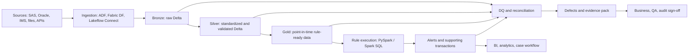

# 08 - Interview Knowledge Index by Role and Tech Stack

This page is the navigation hub for interview preparation. Each role now has a separate one-stop guide with knowledge, theory, Q&A, diagrams, stack notes, common mistakes, and closed-book drills.

Use this index first, then study the role file that matches the job you are preparing for.

---

## 1. Role guides

| Role | One-stop guide | Best for |
|---|---|---|
| Data Engineer | [`09-role-data-engineer.md`](09-role-data-engineer.md) | Azure Databricks, PySpark, Delta Lake, Lakeflow, ingestion, medallion architecture, rule execution, reruns, reconciliation, performance. |
| Data Analyst / BI | [`10-role-data-analyst-bi.md`](10-role-data-analyst-bi.md) | SQL, Databricks SQL, Power BI, semantic metrics, alert dashboards, DQ dashboards, executive reporting, dashboard validation. |
| Data Scientist | [`ml/aml-ml-data-science-guide.md`](ml/aml-ml-data-science-guide.md) | Feature engineering, alert prioritization, false-positive analysis, leakage prevention, explainability, MLflow, drift monitoring. |
| QA / DQ Engineer | [`12-role-qa-dq-engineer.md`](12-role-qa-dq-engineer.md) | Test strategy, DQ dimensions, golden records, reconciliation, defect lifecycle, Lakeflow expectations, sign-off evidence. |
| Solution Architect / Lead | [`13-role-solution-architect-lead.md`](13-role-solution-architect-lead.md) | Target architecture, delivery roadmap, governance, security, cost, operating model, migration sequencing, production readiness. |

For stack-specific study across all roles, use [`14-tech-stack-reference.md`](14-tech-stack-reference.md). For Spark, use [`spark/README.md`](spark/README.md). For SQL, use [`sql/README.md`](sql/README.md). For ML and data science, use [`ml/README.md`](ml/README.md). For one runnable Databricks path, use [`../examples/spark/notebooks/aml_databricks_one_stop_learning.ipynb`](../examples/spark/notebooks/aml_databricks_one_stop_learning.ipynb).

---

## 2. Shared project story

All role guides use the same sanitized project story:

```text
A financial institution needs to replay multiple years of transaction monitoring data.
Legacy rules exist in SAS, Oracle, IMS/mainframe extracts, files, and parameter tables.
The target environment uses Azure, Databricks, PySpark/Spark SQL, Delta Lake, and Lakeflow.
The team must preserve rule behavior first, validate legacy-to-cloud equivalence,
resolve data quality defects, and produce audit-ready evidence.
```

This story can be adjusted for different interviews:

- Data Engineer: focus on scalable, rerunnable pipelines.
- Analyst/BI: focus on trusted metrics and dashboards.
- Data Scientist: focus on governed analytics and explainable scoring.
- QA/DQ: focus on proving correctness and closing defects.
- Architect/Lead: focus on the full operating model and roadmap.

---

## 3. Tech stack map

| Stack area | Data Engineer | Analyst / BI | Data Scientist | QA / DQ | Architect / Lead |
|---|---|---|---|---|---|
| Azure Data Factory / Fabric Data Factory | Orchestration and source movement. | Understand refresh lineage. | Usually indirect. | Validate pipeline run status. | Choose orchestration pattern. |
| Azure Databricks | Core implementation platform. | SQL and governed access. | Feature engineering and ML workflows. | Test data and control checks. | Platform architecture and governance. |
| PySpark / Spark SQL | Transformations, joins, aggregations, rule execution. | SQL analysis and validation. | Large-scale features. | Test queries and comparison logic. | Understand capability and tradeoffs. |
| Delta Lake | ACID tables, reruns, time travel, selective overwrite. | Stable reporting tables. | Reproducible feature and score tables. | Version comparison and audit evidence. | Lakehouse foundation. |
| Lakeflow | Connect, declarative pipelines, expectations, jobs. | Understand freshness and controls. | Feature pipeline orchestration. | DQ expectations and event logs. | Standardized pipeline operating model. |
| Databricks SQL / Power BI | Support reporting datasets. | Core dashboard and metric stack. | Model monitoring dashboards. | QA dashboards. | Executive and control reporting. |
| MLflow / MLOps | Usually support deployment. | Consume scores and model metrics. | Core experiment and model lifecycle. | Validate model inputs/outputs. | Govern model lifecycle. |
| SAS / Oracle / IMS | Migration source logic. | Legacy comparison context. | Historical label and rule context. | Parallel validation source. | Migration risk and sequencing. |

---

## 4. What every role must know

No matter which role you prepare for, you should be able to explain:

1. Why AML/TM is a risk-based control system.
2. Why a 5-year lookback is historical replay plus proof.
3. Why point-in-time correctness matters.
4. Why migration equivalence comes before optimization.
5. Why DQ exceptions must be visible and impact-assessed.
6. Why an alert is a lineage object, not only an output row.
7. Why dashboards need governed metric definitions.
8. Why ML needs explainability and monitoring in AML/TM.
9. Why defect closure requires evidence.
10. Why architecture must include an operating model.

---

## 5. Study sequence

### If you have one day

1. Read this index.
2. Read the role guide for the job you are targeting.
3. Answer that guide's closed-book drills.
4. Practice the project story in 2 minutes.

### If you have three days

1. Day 1: target role guide.
2. Day 2: Data Engineer guide plus QA/DQ guide.
3. Day 3: Architect/Lead guide plus Analyst/BI or Data Scientist guide depending on the role.

### If you have one week

1. Read all five role guides.
2. Build a 30-second, 2-minute, and 10-minute version of the project story.
3. Practice one diagram per role.
4. Answer the Q&A banks out loud.
5. Use `06-practice-lab-retrieval-tests.md` for mixed scenarios.

---

## 6. Interview answer shape

Use this structure when answering technical or behavioral questions:

```text
Context:
  What business or control problem existed?

Role:
  What part did I own?

Design:
  What data, architecture, model, test, or dashboard did I create?

Controls:
  How did I validate, reconcile, monitor, or govern it?

Tradeoff:
  What alternatives existed and why did I choose this path?

Evidence:
  What proved the work was correct or useful?
```

---

## 7. Master diagram



Use this diagram as the base. Each role guide teaches how to explain it from that role's point of view.
