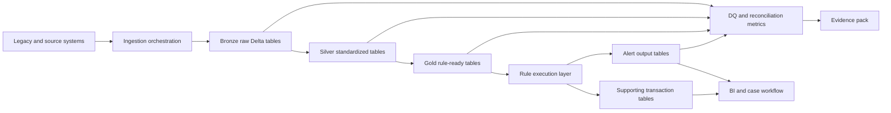
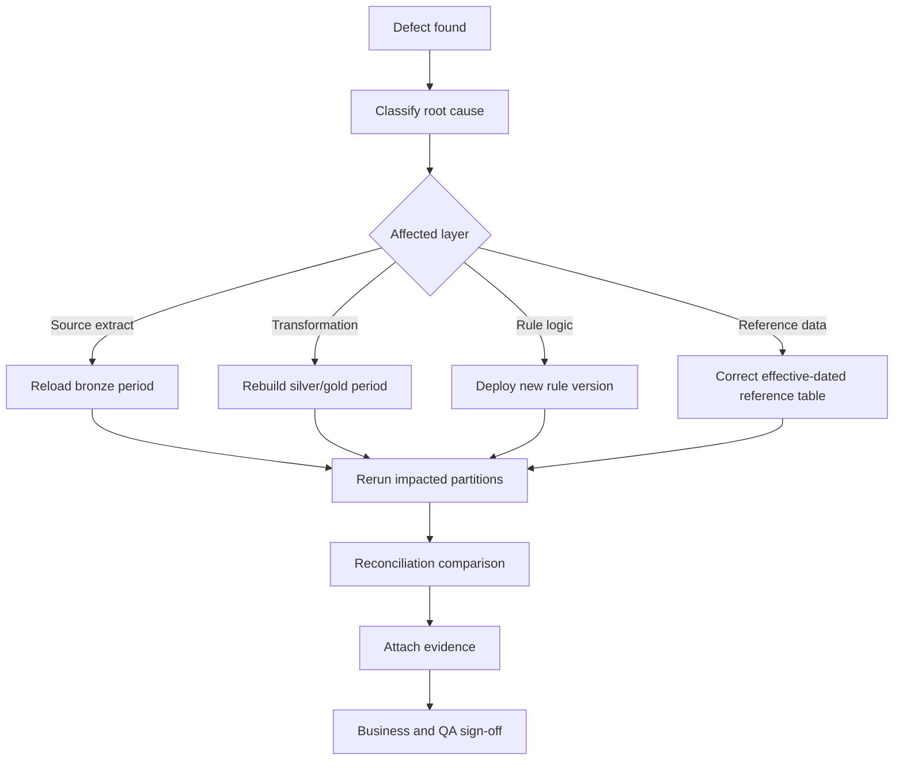

# 09 - Role Guide: Data Engineer

This is a one-stop interview and study guide for a Data Engineer working on AML / Transaction Monitoring modernization, especially a 5-year lookback on Azure, Databricks, PySpark, Delta Lake, and Lakeflow.

The role is not just "build ETL." In this domain, a strong Data Engineer builds repeatable, explainable, evidence-producing data systems.

---

## 1. Role scope

### What the Data Engineer owns

- Source ingestion from files, databases, APIs, CDC feeds, and legacy extracts.
- Bronze, silver, and gold data layers.
- PySpark / Spark SQL transformations.
- Rule-ready feature tables and aggregations.
- Delta Lake table design and rerun behavior.
- Databricks Jobs, Lakeflow pipelines, and orchestration integration.
- Technical DQ checks, exception routing, reconciliation outputs, and run metadata.
- Performance tuning for large historical replay.
- Production monitoring and support runbooks.

### What the Data Engineer does not own alone

- Business rule policy.
- Final suspicious transaction reporting decisions.
- Investigator workflow.
- Model risk approval.
- Regulatory interpretation.

But the engineer must design data outputs that let those owners do their work.

---

## 2. Mental model

Think of AML/TM data engineering as four linked systems:

```text
source truth -> governed transformation -> rule execution -> evidence
```

If one piece is weak, the final alert cannot be trusted.

### Core principle

Every output row must be explainable:

```text
Why did this alert exist?
Which data created it?
Which rule version ran?
Which parameters applied?
Which DQ checks passed?
Which exceptions or defects affected it?
Can we reproduce it?
```

---

## 3. End-to-end architecture diagram



### Interview explanation

- Sources provide transactions, accounts, customers, reference data, and legacy outputs.
- Ingestion lands immutable data with batch metadata.
- Bronze preserves source truth.
- Silver standardizes keys, dates, types, and exception handling.
- Gold creates rule-ready stitched entities and features.
- Rule execution writes alerts and supporting records.
- DQ and reconciliation run at every layer.
- Evidence tables make audit and business sign-off possible.

---

## 4. Theory you must know

### 4.1 Data contracts

A data contract defines what the upstream system promises and what the downstream system depends on.

For AML/TM, a contract should include:

- table name
- business grain
- primary business key
- required fields
- allowed values
- effective-date logic
- expected delivery frequency
- retention period
- source control totals
- late-arriving correction process
- owner and escalation path

Example:

```text
transactions
grain: one row per source transaction event
key: source_system + transaction_id
required: account_id, transaction_date, amount, currency, transaction_type
delivery: daily by 06:00
controls: row count, total amount, distinct transaction count
```

### 4.2 Medallion architecture

Bronze:

- raw landed data
- minimal transformation
- source metadata
- immutable history
- replay foundation

Silver:

- standardized schema
- deduplication
- data type normalization
- key normalization
- exception handling
- referential checks

Gold:

- business-ready entities
- rule-ready features
- point-in-time joins
- curated aggregates
- reporting datasets

Interview warning:

Do not describe bronze/silver/gold as only "raw, clean, aggregated." In AML/TM, each layer has a control purpose.

### 4.3 Point-in-time correctness

Historical replay must use the customer, account, and reference data state that applied when the transaction happened.

Bad:

```sql
SELECT *
FROM transactions t
JOIN customer_current c
  ON t.customer_id = c.customer_id;
```

Better:

```sql
SELECT *
FROM transactions t
JOIN customer_history c
  ON t.customer_id = c.customer_id
 AND t.transaction_date >= c.effective_start_date
 AND t.transaction_date <  c.effective_end_date;
```

Why it matters:

- Customer risk rating can change.
- Account ownership can change.
- Country risk can change.
- Product status can change.
- Using current state for historical activity can create false alerts or miss valid alerts.

### 4.4 Idempotence

An idempotent job can run more than once and produce the same logical output without duplicates.

Bad rerun pattern:

```text
append all alerts again
```

Good rerun pattern:

```text
replace target partition for rule_id + rule_version + processing_period
```

Better with deterministic keys:

```text
alert_key = hash(rule_id, rule_version, customer_id, account_id, window_start, window_end, reason_code)
```

### 4.5 Reconciliation

Reconciliation proves that data movement and transformation did not silently lose, duplicate, or distort the population.

Common metrics:

- row count
- distinct customer count
- distinct account count
- distinct transaction count
- amount totals
- count by source system
- count by transaction month
- count by transaction type
- count by rule eligibility flag
- exception count
- alert count by rule and period

---

## 5. Data Engineer stack knowledge

## 5.1 Azure Data Factory / Fabric Data Factory

Use for:

- orchestration
- source movement
- scheduling
- dependencies
- retries
- monitoring
- calling Databricks jobs

Do not overclaim:

ADF/Fabric Data Factory does not replace the need for well-designed Spark transformations, Delta table design, DQ checks, and rule execution logic.

Interview answer:

> I usually treat ADF or Fabric Data Factory as orchestration and movement, while Databricks handles heavy transformation, rule execution, and scalable lakehouse processing. The boundary depends on source connectivity, transformation complexity, monitoring needs, and team standards.

## 5.2 Azure Databricks

Know:

- workspace
- notebooks
- repos / Git integration
- jobs
- job clusters
- interactive clusters
- SQL warehouses
- Unity Catalog
- cluster policies
- secrets
- runtime versions
- libraries
- audit logs

Production pattern:

```text
source-controlled code
parameterized job
job cluster
environment-specific config
Delta tables in governed catalog
structured logs
metrics tables
alerting
runbook
```

## 5.3 PySpark / Spark SQL

For the full Spark learning path, use [`spark/README.md`](spark/README.md). For low-level row movement examples, use [`spark/first-principles-examples.md`](spark/first-principles-examples.md).

Must know:

- lazy execution
- transformations versus actions
- narrow versus wide transformations
- joins
- window functions
- aggregations
- shuffles
- skew
- broadcast joins
- partition pruning
- explain plans
- Spark UI
- caching
- decimal precision
- null behavior
- date/time handling

AML/TM use cases:

- rolling 7-day, 30-day, or 90-day transaction aggregation
- high-risk geography totals
- customer-account stitching
- latest-effective record lookup
- duplicate removal
- eligible population calculation
- alert key generation

## 5.4 Delta Lake

Know:

- ACID transaction log
- schema enforcement
- schema evolution
- merge/upsert
- selective overwrite
- table history
- time travel
- change data feed
- optimize / clustering concepts
- vacuum retention implications

AML/TM value:

- rerun a period safely
- compare table versions
- prove which data version supported sign-off
- prevent incompatible schema writes
- support incremental downstream processing

## 5.5 Lakeflow

Lakeflow is useful when the team wants declarative, governed, monitored data engineering on Databricks.

Know three pieces:

- Lakeflow Connect: ingestion connectors.
- Lakeflow Spark Declarative Pipelines: declarative SQL/Python pipelines with flows, streaming tables, materialized views, temporary views, expectations, and event logs.
- Lakeflow Jobs: orchestration and production monitoring for tasks.

AML/TM example:

```text
Lakeflow Connect lands source data
Lakeflow pipeline validates and transforms into silver/gold
Expectations track required keys and valid domains
Quarantine stores invalid records
Lakeflow Jobs orchestrate rule execution, recon, and evidence publication
```

---

## 6. Rule execution design

### Rule input grain

Before coding a rule, define the grain:

- transaction-level
- account-day
- customer-day
- customer-window
- counterparty-window
- rule-month

If grain is unclear, output will be unclear.

### Rule output tables

Alert output should include:

- alert_key
- rule_id
- rule_version
- batch_id
- processing_period
- customer_id
- account_id, when applicable
- window_start
- window_end
- alert_date
- reason_code
- threshold_value
- observed_value
- supporting_record_count
- source_data_version
- created_timestamp

Supporting transaction output should include:

- alert_key
- transaction_id
- source_system
- account_id
- transaction_date
- amount
- currency
- transaction_type
- counterparty fields, if allowed
- country or geography fields
- reason contribution

---

## 7. Rerun and defect remediation diagram



Key interview point:

Do not rerun everything blindly. Identify the affected data period, layer, rule, and output partitions.

---

## 8. Performance theory

### Common Spark bottlenecks

| Symptom | Possible cause | What to check |
|---|---|---|
| One task runs much longer | data skew | Spark UI task duration and shuffle size |
| Job scans too much data | missing partition pruning | filters, table layout, explain plan |
| Join is slow | large shuffle join | join keys, broadcast side, skew, table stats |
| Out of memory | large state or shuffle | groupBy/window size, executor memory, spill |
| Small file problem | too many tiny files | output file counts, compaction strategy |
| Wrong output after tuning | semantic change | before/after record-level comparison |

### Performance answer framework

```text
1. Confirm expected output and test data.
2. Inspect Spark plan and Spark UI.
3. Check scan size, joins, shuffles, skew, spills, and file counts.
4. Improve layout, joins, filtering, and partition strategy.
5. Compare output before and after optimization.
6. Document performance result and semantic equivalence.
```

---

## 9. Data Engineer Q&A bank

### Q1. Design a 5-year AML lookback pipeline.

Strong answer:

> I would start with source and rule inventory, then land immutable extracts into bronze with batch IDs and control totals. Silver would standardize schemas, normalize keys and dates, deduplicate, and quarantine invalid records. Gold would stitch customer, account, transaction, and reference data using point-in-time logic. Rule execution would be parameterized by rule version and processing period, writing deterministic alert keys and supporting transactions. Every stage would publish reconciliation metrics, DQ exceptions, run logs, and evidence for sign-off.

### Q2. How do you prevent duplicate alerts on rerun?

Strong answer:

> I design the output to be idempotent. The job writes by rule, version, and processing period, usually replacing the target partition or using deterministic keys with merge logic. I also keep batch metadata and reconciliation checks for duplicate alert keys, duplicate supporting records, and unexpected count changes.

### Q3. Why is point-in-time logic important?

Strong answer:

> In a lookback, current customer or reference state may not match historical reality. If a customer became high risk in 2024, that does not mean their 2021 transactions should use the 2024 risk rating unless the rule explicitly says so. Point-in-time joins protect historical truth and prevent false mismatches during legacy comparison.

### Q4. How do you migrate SAS or Oracle rules to Spark?

Strong answer:

> I first reverse-engineer behavior, not syntax. I identify inputs, filters, joins, date logic, missing value behavior, parameters, aggregation grain, outputs, and known exceptions. Then I write a rule spec, build golden records, implement equivalent Spark logic, compare aggregate and record-level outputs, classify mismatches, and only optimize after equivalence is proven.

### Q5. Alert counts doubled after migration. What do you check?

Strong answer:

> I compare source counts, eligible population, joins, filters, reference data effective dates, duplicate transactions, aggregation windows, threshold parameters, currency conversion, and output key logic. I would sample records that appear only in Databricks and only in legacy, classify the difference, and decide whether it is a source defect, mapping defect, rule logic defect, point-in-time defect, or expected difference.

### Q6. When would you use Lakeflow expectations?

Strong answer:

> I would use expectations for row-level quality rules inside a pipeline, such as required transaction IDs, nonnegative amounts, valid account IDs, or valid country codes. The policy depends on severity: warn for visibility, quarantine or drop for known bad rows, and fail for critical defects where output cannot be trusted.

### Q7. How do you debug a slow Spark job?

Strong answer:

> I check the Spark UI and plan first: input scan size, shuffle volume, skew, spills, join strategy, partition pruning, and output file counts. Then I change one thing at a time, such as filters, broadcast joins, layout, skew handling, or aggregation strategy. I verify that the output is unchanged after optimization.

### Q8. What metadata should every production table include?

Strong answer:

> At minimum: batch ID, source system, ingestion timestamp, processing period, pipeline version, rule version where relevant, created timestamp, and data quality or exception flags. For alert outputs I also include deterministic alert key, reason code, threshold, observed value, and supporting-record linkage.

---

## 10. Whiteboard diagrams to practice

### Diagram 1 - Medallion pipeline

```text
sources -> landing -> bronze -> silver -> gold -> rules -> alerts -> evidence
```

Explain:

- what each layer stores
- what controls run there
- how reruns work
- where defects are detected

### Diagram 2 - Reconciliation ladder

```text
source extract count
  -> bronze count
  -> silver valid + exception count
  -> gold eligible population
  -> rule aggregate count
  -> alert output count
```

Explain:

- each comparison
- allowed differences
- blocked differences
- evidence retained

### Diagram 3 - Point-in-time join

```text
transaction_date = 2022-06-15
customer risk history:
  LOW:  2021-01-01 to 2023-02-01
  HIGH: 2023-02-01 to 9999-12-31
correct risk for transaction = LOW
```

---

## 11. Interview checklist

Before an interview, be ready to explain:

- one end-to-end data pipeline
- one rule migration
- one DQ defect
- one reconciliation mismatch
- one Spark performance issue
- one rerun strategy
- one dashboard or evidence output
- one tradeoff between equivalence and optimization
- one example of point-in-time logic
- one example of how Azure Databricks, Delta Lake, PySpark, and Lakeflow fit together

---

## 12. Closed-book drills

Model answers: [`16-model-answer-bank.md#4-role-guide-drill-answers`](16-model-answer-bank.md#4-role-guide-drill-answers)

Answer without looking:

1. What is the difference between bronze, silver, gold, and evidence layers?
2. How do you design deterministic alert keys?
3. Why is a current customer table dangerous in a lookback?
4. What are ten reconciliation metrics?
5. What can cause Spark and legacy outputs to differ?
6. How would you use Lakeflow expectations in AML/TM?
7. How do you rerun one rule for one month safely?
8. What is your Spark performance debugging sequence?
9. What metadata belongs in a run manifest?
10. How do you know a migrated rule is ready for sign-off?
