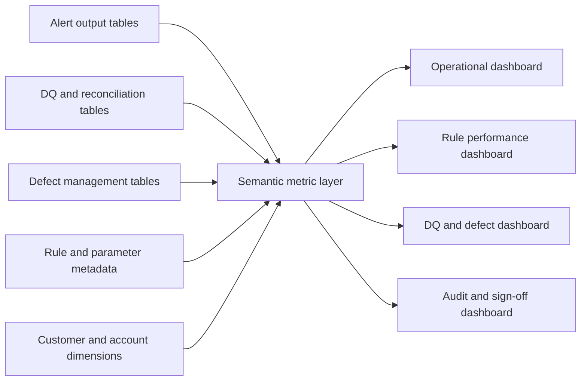
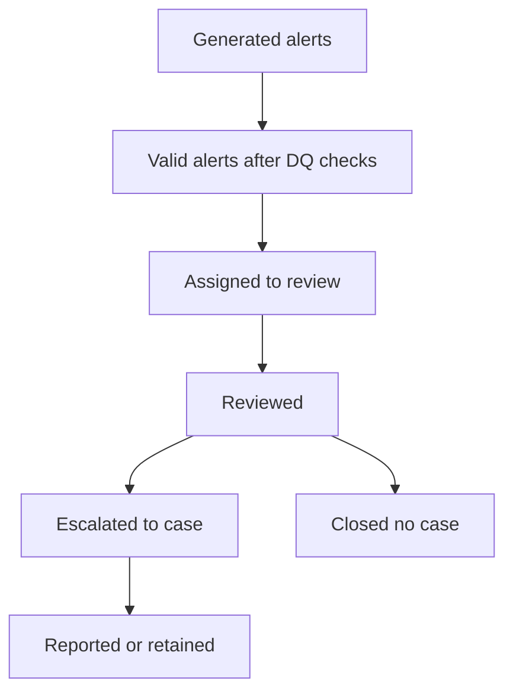
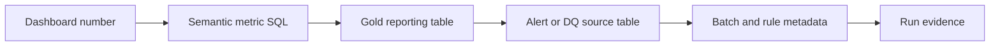
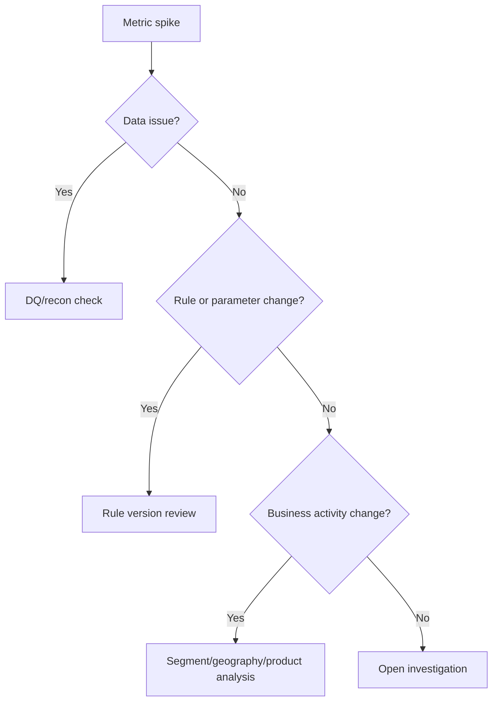

# 10 - Role Guide: Data Analyst / BI

This is a one-stop interview and study guide for a Data Analyst or BI professional working with AML / Transaction Monitoring data, dashboards, reporting, and stakeholder analysis.

The role is not just "make dashboards." In AML/TM, a strong analyst turns alerts, defects, rules, and pipeline outputs into trusted decisions.

---

## 1. Role scope

### What the Data Analyst / BI role owns

- Metric definitions and semantic consistency.
- SQL analysis over alert, transaction, customer, rule, defect, and reconciliation data.
- Operational dashboards for monitoring workload and data health.
- Control dashboards for sign-off, audit, and governance.
- Trend analysis, anomaly explanation, and business commentary.
- Drill-through views for rule, customer segment, period, source system, and defect root cause.
- Report validation against governed source tables.
- Stakeholder communication across compliance, QA, engineering, operations, and leadership.

### What this role does not own alone

- Source system fixes.
- Rule policy decisions.
- Final SAR/STR decisions.
- Production pipeline code.
- Model risk approval.

But the analyst must know enough about those areas to avoid misleading reporting.

---

## 2. Mental model

BI in AML/TM is a trust layer:

```text
data output -> governed metric -> explainable dashboard -> stakeholder decision
```

A dashboard is weak if the user cannot answer:

```text
What exactly does this number mean?
What is the grain?
Which data version does it use?
Which filters are applied?
Does it reconcile to the source?
What changed since last period?
Can I drill into the cause?
```

---

## 3. BI architecture diagram



Interview explanation:

- Dashboards should not calculate business definitions differently in every report.
- A semantic or governed metric layer keeps alert count, eligible population, exception rate, and defect age consistent.
- BI outputs must connect to rule metadata and run metadata, not only alert rows.

---

## 4. Theory you must know

### 4.1 Metric grain

Grain means the level represented by one row or one metric.

Common AML/TM grains:

- one transaction
- one account
- one customer
- one alert
- one alert-rule-month
- one case
- one defect
- one DQ check result
- one reconciliation metric
- one batch run

If grain is unclear, metrics will be wrong.

Example:

```text
Alert count by rule/month uses alert grain.
Eligible customer count by rule/month uses customer-rule-month grain.
False-positive rate uses reviewed alert grain.
Defect age uses defect grain.
```

### 4.2 Core metric definitions

| Metric | Definition | Common trap |
|---|---|---|
| Alert count | Number of generated alerts for a rule and period. | Counting supporting transactions instead of alert rows. |
| Eligible population | Records or entities that passed rule eligibility filters. | Mixing transaction count and customer count. |
| Exception rate | DQ exceptions divided by relevant input population. | Using total source rows when only a subset was checked. |
| Case conversion rate | Cases created divided by reviewed alerts. | Dividing by all generated alerts before review is complete. |
| False-positive rate | Non-escalated reviewed alerts divided by reviewed alerts. | Treating unreviewed alerts as false positives. |
| Defect aging | Days from defect open date to current date or closure. | Ignoring paused or waiting-for-source status. |
| SLA breach count | Items exceeding agreed time threshold. | Using calendar days when SLA uses business days. |
| Reconciliation difference | Metric value from stage A minus stage B. | Ignoring approved exclusions. |

### 4.3 Operational versus control reporting

Operational dashboard:

- Who needs to act today?
- Which rules spiked?
- Which batches failed?
- Which defects are aging?
- Which alerts are pending review?

Control dashboard:

- Which runs are signed off?
- Which DQ checks passed?
- Which exceptions remain unresolved?
- Which defects block production?
- Which rule versions generated outputs?
- What evidence supports approval?

Interview point:

Operational dashboards help teams work. Control dashboards help teams prove.

### 4.4 Dashboard trust

A trusted dashboard needs:

- governed metric definitions
- clear refresh timestamp
- data lineage
- run period and batch ID
- rule version
- filter visibility
- drill-through details
- reconciliation to source tables
- known limitations
- access control

---

## 5. AML/TM reporting domains

### 5.1 Alert monitoring

Useful dimensions:

- rule ID
- rule version
- processing month
- customer risk rating
- customer type
- product
- channel
- geography
- source system
- alert reason code
- investigator queue

Useful metrics:

- generated alerts
- suppressed alerts, if applicable
- reviewed alerts
- escalated cases
- closed as no case
- conversion rate
- average review time
- alert volume change versus prior period

### 5.2 Rule performance

Questions:

- Which rules create the most volume?
- Which rules have low case conversion?
- Which segments drive spikes?
- Did volume change after a threshold or data change?
- Is the rule stable across months?
- Are spikes explained by real activity, data defects, or rule issues?

### 5.3 DQ and reconciliation

Questions:

- Which checks failed?
- Which source system caused the issue?
- What is the severity?
- What output is affected?
- Can the batch continue?
- What evidence is attached?

### 5.4 Defect management

Useful dimensions:

- defect category
- severity
- status
- owner
- source system
- rule ID
- affected period
- aging bucket
- root cause
- sign-off status

Useful metrics:

- open defects
- critical/high defects
- defects by category
- average age
- reopened defects
- closure rate
- blockers to sign-off

---

## 6. Dashboard design diagrams

### 6.1 Alert funnel



How to explain:

- Each stage must have a definition.
- Counts should reconcile from generated to reviewed.
- Drop-offs should have reasons.
- Timing matters because some alerts are still pending.

### 6.2 Dashboard validation path



How to explain:

If an executive asks why alert volume is 12,500, the analyst should trace it back to metric SQL, source table, batch period, rule version, and evidence.

### 6.3 Spike investigation



---

## 7. SQL knowledge for this role

### 7.1 Alert count by rule and month

```sql
SELECT
    rule_id,
    rule_version,
    processing_month,
    COUNT(DISTINCT alert_key) AS alert_count
FROM gold_alerts
GROUP BY rule_id, rule_version, processing_month;
```

### 7.2 Month-over-month change

```sql
WITH monthly AS (
    SELECT
        rule_id,
        processing_month,
        COUNT(DISTINCT alert_key) AS alert_count
    FROM gold_alerts
    GROUP BY rule_id, processing_month
)
SELECT
    rule_id,
    processing_month,
    alert_count,
    LAG(alert_count) OVER (
        PARTITION BY rule_id
        ORDER BY processing_month
    ) AS prior_alert_count,
    alert_count - LAG(alert_count) OVER (
        PARTITION BY rule_id
        ORDER BY processing_month
    ) AS alert_count_change
FROM monthly;
```

### 7.3 Defect aging buckets

```sql
SELECT
    severity,
    status,
    CASE
        WHEN DATEDIFF(current_date(), opened_date) <= 7 THEN '0-7 days'
        WHEN DATEDIFF(current_date(), opened_date) <= 30 THEN '8-30 days'
        WHEN DATEDIFF(current_date(), opened_date) <= 60 THEN '31-60 days'
        ELSE '60+ days'
    END AS aging_bucket,
    COUNT(*) AS defect_count
FROM defect_register
WHERE status <> 'Closed'
GROUP BY severity, status, aging_bucket;
```

### 7.4 Dashboard reconciliation

```sql
WITH dashboard_metric AS (
    SELECT COUNT(DISTINCT alert_key) AS alert_count
    FROM gold_alerts
    WHERE rule_id = 'TM001'
      AND processing_month = '2022-06'
),
recon_metric AS (
    SELECT metric_value_to AS alert_count
    FROM recon_results
    WHERE rule_id = 'TM001'
      AND processing_month = '2022-06'
      AND metric_name = 'alert_count'
      AND stage_to = 'alert_output'
)
SELECT
    d.alert_count AS dashboard_alert_count,
    r.alert_count AS reconciled_alert_count,
    d.alert_count - r.alert_count AS difference
FROM dashboard_metric d
CROSS JOIN recon_metric r;
```

---

## 8. Stack knowledge for Analyst / BI

### 8.1 Databricks SQL

Know:

- SQL warehouses
- SQL editor
- dashboards
- scheduled queries
- alerts
- query history
- query profile
- metric views or semantic definitions
- permissions through catalog governance

AML/TM use:

- alert monitoring dashboards
- reconciliation summaries
- defect aging reports
- rule performance analysis
- investigator workload reporting

### 8.2 Power BI

Know:

- semantic model
- measures
- relationships
- star schema
- row-level security
- refresh schedule
- incremental refresh
- drill-through
- bookmarks
- deployment pipelines

AML/TM use:

- executive control dashboard
- rule owner dashboard
- QA dashboard
- DQ exception dashboard
- audit sign-off dashboard

### 8.3 Data modeling

Recommended reporting model:

```text
fact_alert
fact_case
fact_dq_check
fact_reconciliation
fact_defect
dim_rule
dim_customer_segment
dim_product
dim_geography
dim_date
dim_batch
```

Interview point:

Analytical models need stable dimensions and clear facts. A flat alert table may be fine for exploration but weak for governed BI.

---

## 9. Q&A bank

### Q1. How would you design an AML alert dashboard?

Strong answer:

> I would separate executive control, operational workload, rule performance, and DQ/defect views. The executive page would show alert volume, case conversion, critical defects, sign-off status, and trend changes. The rule page would show alert counts by rule, version, segment, and month. The DQ page would show failed checks, exception rates, severity, and affected outputs. Every page would display refresh time, processing period, rule version, and drill-through to supporting details.

### Q2. Alert volume increased 40 percent. How do you investigate?

Strong answer:

> I would first confirm the metric definition and refresh. Then I would compare by rule, month, customer risk, product, geography, and source system. I would check whether a rule version, threshold, source feed, DQ issue, or eligibility population changed. I would compare eligible population and alert conversion, not only alert count. Finally I would summarize whether the spike is business-driven, data-driven, rule-driven, or unresolved.

### Q3. How do you make sure dashboard metrics are correct?

Strong answer:

> I validate the metric SQL against governed source tables and reconciliation outputs. I check grain, filters, joins, distinct keys, date periods, and rule versions. I reconcile dashboard totals to the gold alert table or control report and document known exclusions. I also make definitions reusable so different dashboards do not calculate the same metric differently.

### Q4. What is the difference between operational and audit reporting?

Strong answer:

> Operational reporting helps teams manage work: failed runs, pending alerts, aging defects, and rule spikes. Audit reporting proves controls: which batch ran, which rule version ran, which DQ checks passed, which defects remained, who approved, and what evidence supports the output.

### Q5. How do you explain a DQ issue to business stakeholders?

Strong answer:

> I translate the technical failure into business impact. For example: "Account IDs are missing for 2.4 percent of June wire transactions from source system A. Three rules depend on account-customer joins, so their eligible population may be understated. This is a high severity issue until source confirms the missing keys or remediation is complete."

### Q6. What makes a BI report misleading?

Strong answer:

> Misleading reports usually have unclear grain, inconsistent metric definitions, hidden filters, stale refreshes, missing rule version, unvalidated joins, or no reconciliation to source. In AML/TM, a report can also mislead by combining unresolved defects with expected differences.

### Q7. What metrics would you track for rule tuning?

Strong answer:

> Alert volume, eligible population, alert rate, case conversion, false-positive rate, investigator workload, average review time, segment breakdown, threshold sensitivity, and historical backtest impact. I would avoid recommending tuning from alert count alone.

### Q8. How do you handle row-level security?

Strong answer:

> I identify who should see which customers, regions, products, and case details. Sensitive AML data should follow least privilege. Executive summaries can be aggregated, while drill-through details may require restricted access. The security model must be tested so dashboard filters do not expose restricted detail.

---

## 10. Interview dashboard templates

### 10.1 Executive control view

Sections:

- overall alert volume
- case conversion
- critical/high defects
- DQ pass rate
- sign-off status
- month-over-month movement
- top risk drivers

Decision supported:

```text
Can leadership trust the run and where should they focus attention?
```

### 10.2 Rule performance view

Sections:

- alert volume by rule
- alert rate by eligible population
- trend by month
- case conversion
- segment distribution
- threshold sensitivity
- expected differences and defects

Decision supported:

```text
Which rules need validation, tuning analysis, or defect review?
```

### 10.3 DQ and defect view

Sections:

- failed checks
- exception counts
- severity
- affected rules
- defect aging
- root cause
- owner
- closure evidence status

Decision supported:

```text
Can the batch proceed, and what blocks sign-off?
```

---

## 11. Common mistakes

- Counting transactions instead of alerts.
- Ignoring rule version.
- Mixing reviewed and unreviewed alerts in false-positive rate.
- Treating dashboard refresh as data validation.
- Building visuals before defining metrics.
- Using current customer segment for historical alerts without point-in-time logic.
- Showing totals without explaining approved exclusions.
- Combining DQ exceptions and confirmed defects.
- Forgetting access control for sensitive data.

---

## 12. Closed-book drills

Answer without looking:

1. Define alert count, eligible population, exception rate, and case conversion.
2. What are five dimensions for slicing alert volume?
3. How do you validate a dashboard total?
4. How do you investigate a rule spike?
5. What belongs on an executive AML control dashboard?
6. What belongs on a DQ/defect dashboard?
7. What is metric grain and why does it matter?
8. Why can false-positive rate be misleading?
9. What does an audit-ready dashboard show?
10. How do Databricks SQL, Power BI, Delta tables, and semantic models fit together?
