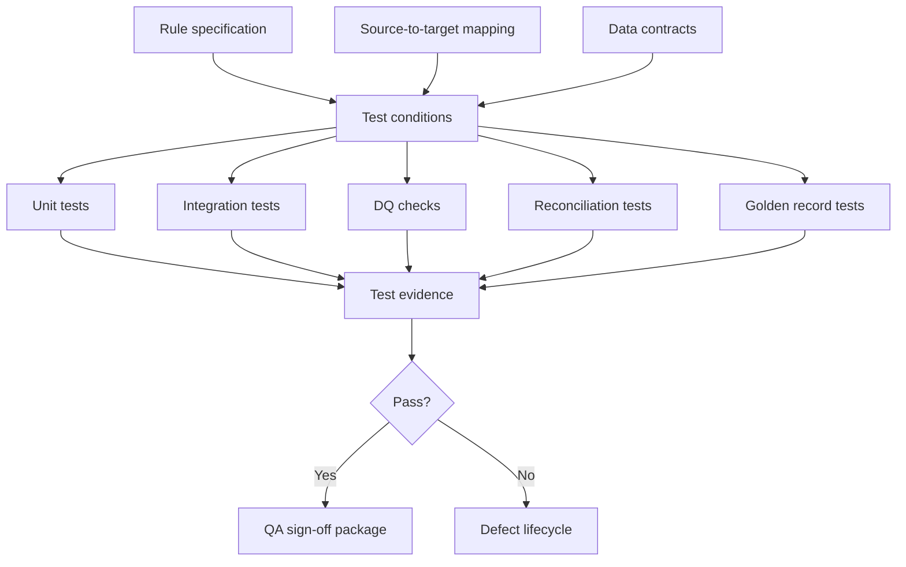
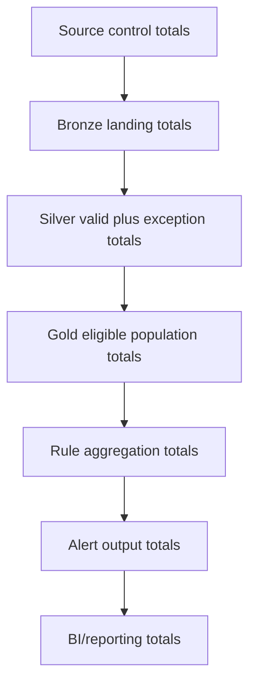
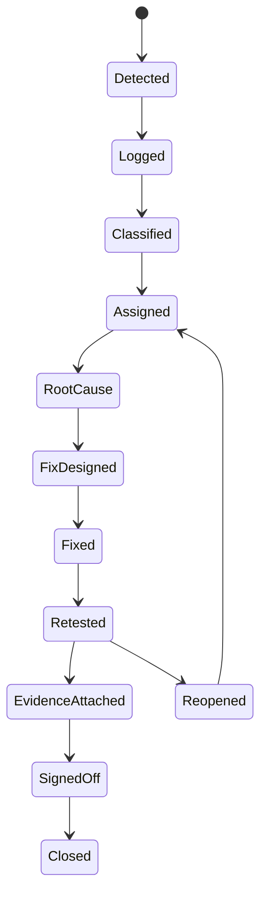

# 12 - Role Guide: QA / DQ Engineer

This is a one-stop interview and study guide for a QA Engineer, Data Quality Engineer, or Data Validation Engineer working on AML / Transaction Monitoring modernization.

The role is not just "test the pipeline." In AML/TM, a strong QA/DQ Engineer proves that data, logic, outputs, defects, and sign-off evidence are trustworthy.

---

## 1. Role scope

### What the QA / DQ Engineer owns

- Test strategy for source ingestion, transformations, rule logic, and outputs.
- Data quality checks across completeness, validity, uniqueness, referential integrity, point-in-time correctness, and traceability.
- Reconciliation between source, bronze, silver, gold, rule input, and alert output.
- Golden record design.
- Boundary and negative test cases.
- Legacy-to-cloud parallel run validation.
- Defect classification, severity, evidence, retest, and closure.
- Test automation using SQL, PySpark, expectations, and CI/CD checks.
- QA sign-off evidence.

### What the role does not own alone

- Business approval of rule thresholds.
- Source system remediation.
- Production release approval by itself.
- Final interpretation of regulatory obligations.

But QA/DQ must provide the evidence those owners need.

---

## 2. Mental model

QA/DQ in AML/TM is evidence engineering:

```text
requirement -> test -> result -> defect or sign-off evidence
```

The best QA answer always connects:

```text
What should happen?
What actually happened?
What is the impact?
What evidence proves it?
Who must fix or approve it?
```

---

## 3. Test architecture diagram



Interview explanation:

- QA does not begin after coding.
- QA starts from rule specs, mappings, and data contracts.
- Tests must trace to requirements.
- Failures become classified defects with evidence.

---

## 4. DQ theory

### 4.1 Core data quality dimensions

| Dimension | Question | AML/TM example |
|---|---|---|
| Completeness | Are required fields populated? | `customer_id`, `account_id`, `transaction_date` are not null. |
| Validity | Do values match allowed domains? | `country_code` exists in reference table. |
| Accuracy | Does target match source truth? | Transaction amount matches source extract. |
| Consistency | Do related records agree? | Account belongs to the same customer in account and relationship tables. |
| Uniqueness | Are business keys duplicated? | One transaction per source transaction ID. |
| Timeliness | Did data arrive and process on time? | Daily extract landed before SLA. |
| Referential integrity | Do foreign keys resolve? | Transaction account exists in account table. |
| Reconciliation | Do counts and totals align across stages? | Bronze row count equals silver valid rows plus exceptions. |
| Point-in-time correctness | Was historical state used correctly? | Risk rating valid on transaction date. |
| Traceability | Can output be traced to inputs? | Alert links to supporting transactions, batch ID, and rule version. |

### 4.2 DQ exception versus defect

DQ exception:

```text
A data record failed a defined quality rule.
```

Defect:

```text
A confirmed issue in data, logic, mapping, process, or control that requires remediation or formal acceptance.
```

Example:

- 10 transactions have missing `account_id`: DQ exceptions.
- Missing `account_id` affects 20 percent of wire transactions and reduces rule eligibility: high severity defect.

### 4.3 Severity model

| Severity | Meaning | Example |
|---|---|---|
| Critical | Output cannot be trusted or production must stop. | Missing source extract for a month. |
| High | Material rule output impact likely. | Large account-customer join failure. |
| Medium | Limited output impact or workaround exists. | Reference gap for small population. |
| Low | Minimal current output impact. | Optional descriptive field missing. |

Interview point:

Severity should consider output impact, not just technical failure.

---

## 5. Reconciliation framework

### 5.1 Reconciliation ladder



At each step, QA asks:

- Are counts equal where they should be equal?
- If not equal, is the difference explained?
- Are approved exclusions documented?
- Are rejected records preserved?
- Does the difference affect rule output?

### 5.2 Metrics to reconcile

- row count
- distinct transaction count
- distinct account count
- distinct customer count
- total amount
- amount by currency
- count by transaction type
- count by source system
- count by period
- valid records
- rejected records
- eligible population
- alert count
- supporting transaction count

### 5.3 Record-level comparison

Aggregate checks are necessary but not enough.

Record-level comparisons should inspect:

- keys present in legacy only
- keys present in cloud only
- keys present in both with field differences
- amount differences
- date differences
- status differences
- risk rating differences
- rule reason differences

---

## 6. Golden record testing

Golden records are small, controlled examples where expected output is known.

### Golden test design

Include:

- positive case
- negative case
- threshold boundary
- null required field
- duplicate transaction
- reversed transaction
- excluded account
- customer risk change
- account ownership change
- missing reference data
- multi-currency transaction

### Example golden matrix

| Test | Setup | Expected result |
|---|---|---|
| Positive threshold | High-risk customer exceeds 30-day threshold. | Alert generated. |
| Below threshold | Same customer below threshold. | No alert. |
| Boundary equal | Amount exactly equals threshold. | Depends on spec: `>` or `>=`. |
| Excluded account | Account is internal operations account. | No alert, exclusion counted. |
| Missing country risk | Country not found in reference table. | DQ exception or fail depending severity. |
| Risk change | Customer risk changes after transaction date. | Historical risk used. |
| Duplicate | Same source transaction appears twice. | Deduplicated or flagged based on rule. |

---

## 7. Defect lifecycle



### Defect categories

- source data defect
- ingestion defect
- mapping defect
- transformation defect
- rule logic defect
- reference data defect
- point-in-time defect
- reconciliation defect
- BI/reporting defect
- performance defect
- governance defect

### Required defect evidence

- defect title
- severity
- affected source system
- affected table
- affected period
- affected rule, if applicable
- expected result
- actual result
- sample records
- aggregate impact
- root cause
- fix summary
- retest result
- before/after evidence
- approval or sign-off

---

## 8. Test levels

### 8.1 Source landing tests

- file arrived
- schema matches
- row count matches control total
- amount total matches control total
- duplicate file check
- source period check
- required metadata check

### 8.2 Transformation tests

- field mapping
- type casting
- date parsing
- trimming and standardization
- null handling
- deduplication
- join coverage
- exception routing

### 8.3 Rule logic tests

- eligibility filters
- exclusion filters
- joins
- aggregation window
- threshold logic
- reason code
- deterministic alert key
- supporting transactions
- rule version

### 8.4 Integration tests

- source to bronze
- bronze to silver
- silver to gold
- gold to rule output
- rule output to BI

### 8.5 Regression tests

- no unexpected output changes after code changes
- previous defects do not reappear
- golden records still pass
- rule output changes match approved expected differences

### 8.6 Parallel run validation

Compare:

- legacy output
- new cloud output
- record-level matches
- alert count by rule/month
- differences by category
- expected differences
- unresolved defects

---

## 9. Lakeflow and automated DQ

Lakeflow expectations can run row-level quality checks inside pipelines.

Policy choices:

- warn: keep record, emit metric
- drop: remove invalid record
- fail: stop pipeline
- quarantine pattern: preserve invalid records separately

Interview answer:

> For AML/TM, I avoid silently dropping records unless the rule explicitly allows it and the impact is measured. For critical required fields, I may fail the pipeline. For known quality issues, I may quarantine invalid records and report impact so business and QA can decide whether output remains usable.

Example DQ rules:

```text
transaction_id is not null
account_id is not null
amount >= 0
transaction_date is within processing period
country_code exists in reference table
account_id resolves to account table
customer risk rating is effective on transaction date
```

---

## 10. QA / DQ Q&A bank

### Q1. What is your test strategy for a migrated AML rule?

Strong answer:

> I start from the rule spec and source-to-target mapping. I design unit tests for filters, joins, windows, thresholds, and reason codes. I create golden records for positive, negative, boundary, exclusion, duplicate, and point-in-time scenarios. I run DQ checks before rule execution and reconciliation after each data layer. Then I compare cloud output to legacy output at aggregate and record level, classify differences, and require evidence before sign-off.

### Q2. Alert count does not match legacy. What do you do?

Strong answer:

> I compare source counts, eligible population, mapping logic, joins, reference data, effective dates, duplicates, thresholds, aggregation windows, and output keys. I split records into legacy-only, cloud-only, and matched-with-differences. Then I classify each difference as expected difference, source defect, mapping defect, transformation defect, rule logic defect, or point-in-time defect.

### Q3. Why are row counts insufficient?

Strong answer:

> Row counts can match while values, joins, dates, risk ratings, amounts, or eligibility flags are wrong. I need count, amount, distinct keys, domain checks, referential integrity, point-in-time checks, and record-level comparisons.

### Q4. How do you test point-in-time correctness?

Strong answer:

> I create records where customer risk, account ownership, or reference data changes over time. Then I test transactions before, during, and after the change. The expected result must use the historical record effective on the transaction date, not the current state.

### Q5. What evidence closes a defect?

Strong answer:

> A defect should close only with root cause, fix summary, before/after data, impacted population, retest result, and approval where needed. Verbal confirmation is not enough.

### Q6. When should a DQ failure block a run?

Strong answer:

> It should block when output cannot be trusted, such as missing source extracts, large key failures, critical reference gaps, or rule input corruption. Lower severity issues may continue only if exceptions are quarantined, impact is measured, and stakeholders accept the limitation.

### Q7. What is an expected difference?

Strong answer:

> An expected difference is an approved, documented output difference caused by a known change or limitation, not an unexplained mismatch. It should have business approval, impact analysis, and evidence.

### Q8. How do you test a dashboard?

Strong answer:

> I validate metric definitions, grain, filters, joins, refresh time, row-level security, and totals against governed source tables or reconciliation outputs. I also test drill-through records and edge cases like no data, failed runs, and partially reviewed periods.

---

## 11. One-stop checklist

For any AML/TM rule or pipeline, QA/DQ should have:

- rule spec
- source-to-target mapping
- data contract
- test matrix
- golden records
- DQ checks
- reconciliation checks
- expected output
- actual output
- legacy comparison
- defect log
- retest evidence
- sign-off record
- known limitations

---

## 12. Common mistakes

- Testing only happy paths.
- Checking only row counts.
- Ignoring effective dates.
- Closing defects without evidence.
- Treating zero alerts as success without investigation.
- Mixing expected differences with unresolved defects.
- Dropping bad records silently.
- Not testing BI/reporting totals.
- Not preserving sample records.
- Testing code without tracing back to rule requirements.

---

## 13. Closed-book drills

Answer without looking:

1. What are the ten DQ dimensions?
2. What is the difference between a DQ exception and a defect?
3. What is a golden record?
4. What belongs in a rule test matrix?
5. Why can row counts pass while output is wrong?
6. How do you classify alert mismatches?
7. What evidence closes a defect?
8. When should a run fail?
9. How do Lakeflow expectations help QA?
10. What does QA sign-off require?
