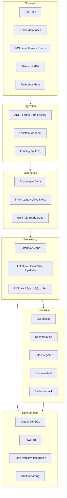
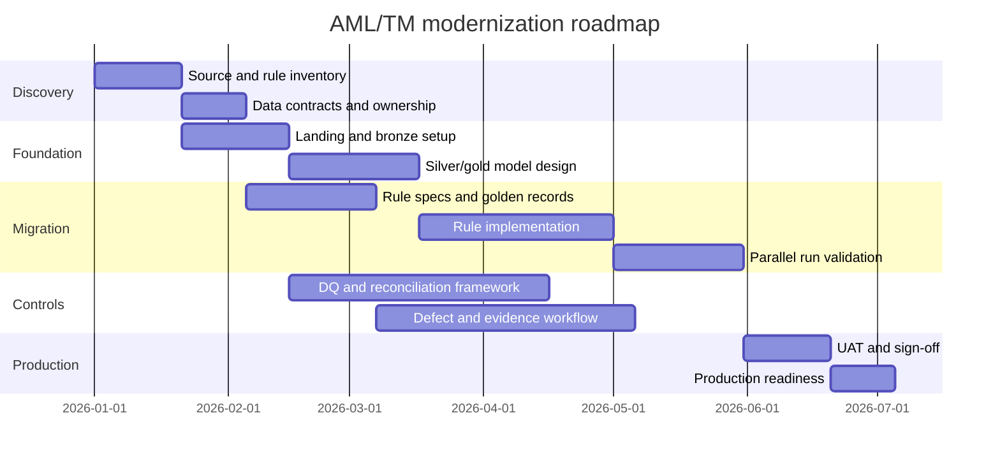
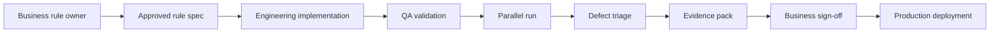
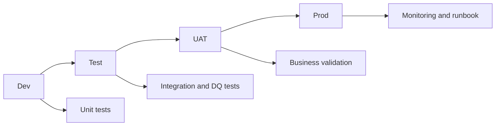
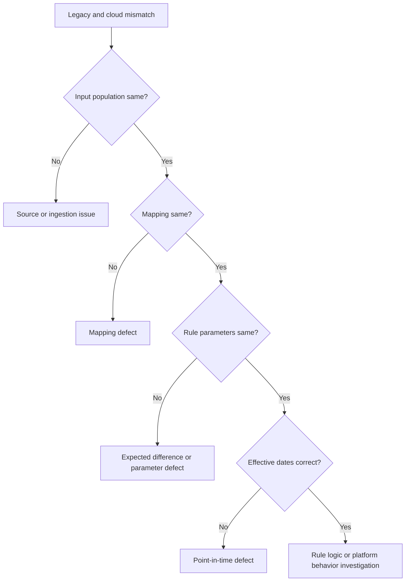

# 13 - Role Guide: Solution Architect / Lead

This is a one-stop interview and study guide for a Solution Architect, Technical Lead, Data Lead, or Delivery Lead working on AML / Transaction Monitoring modernization.

The role is not just "draw the architecture." In AML/TM, a strong lead connects business risk, data architecture, delivery sequencing, governance, security, operations, and sign-off.

---

## 1. Role scope

### What the Solution Architect / Lead owns

- Target architecture across source ingestion, lakehouse, rule execution, evidence, BI, and workflow integration.
- Technology selection and fit-for-purpose tradeoffs.
- Migration sequencing and delivery roadmap.
- Non-functional requirements: scale, SLA, recoverability, cost, security, observability, maintainability.
- Data governance, lineage, catalog, access control, and auditability.
- Rule migration approach and equivalence strategy.
- DQ, reconciliation, defect, and sign-off operating model.
- Environment strategy: dev, test, UAT, prod.
- Stakeholder alignment across compliance, data engineering, QA, platform, audit, and operations.
- Risk management and production readiness.

### What the role does not own alone

- Final rule policy decisions.
- Source system remediation.
- Investigator decisions.
- Regulatory reporting decisions.
- Day-to-day implementation of every pipeline.

But the lead is accountable for making sure the overall solution can be delivered and operated safely.

---

## 2. Mental model

Architecture in AML/TM is a control system:

```text
business obligation -> data platform -> rule execution -> evidence -> operating model
```

The target design must answer:

```text
Can we ingest the right data?
Can we replay history?
Can we prove rule behavior?
Can we detect and resolve defects?
Can we explain outputs?
Can we operate this safely in production?
```

---

## 3. Reference architecture diagram



Interview explanation:

- The lakehouse is the replay and evidence foundation.
- Rule execution is separated from ingestion and reporting.
- Controls are not optional side reports; they are first-class outputs.
- BI and case workflows consume governed outputs, not raw ad hoc tables.

---

## 4. Core architecture theory

### 4.1 Separate layers by responsibility

| Layer | Responsibility | Lead-level concern |
|---|---|---|
| Source | System of record data. | Ownership, contracts, extraction timing. |
| Ingestion | Move and land data. | Reliability, metadata, retries, source controls. |
| Bronze | Preserve raw truth. | Immutability, retention, lineage. |
| Silver | Standardize and validate. | DQ, exception routing, schema governance. |
| Gold | Build business-ready rule inputs. | Point-in-time stitching, eligibility, performance. |
| Rule execution | Generate alerts and supporting records. | Versioning, equivalence, idempotence. |
| Evidence | Prove what happened. | Auditability, sign-off, defect linkage. |
| Consumption | BI and workflow. | Semantic consistency, access control, usability. |

### 4.2 Equivalence before optimization

Migration has two separate phases:

```text
Phase 1: Prove new platform reproduces legacy behavior.
Phase 2: Improve rule logic, thresholds, performance, and analytics through governed change.
```

Why this matters:

- If output changes during migration, nobody knows whether the new platform is wrong or the business logic changed.
- Equivalence gives confidence.
- Optimization creates value only after baseline behavior is understood.

### 4.3 Evidence as a product

Evidence should be designed, not assembled manually at the end.

Evidence pack contents:

- source inventory
- rule inventory
- source-to-target mapping
- rule specification
- run manifest
- DQ results
- reconciliation results
- expected differences
- defect register
- retest evidence
- approvals
- output samples
- lineage references

### 4.4 Build versus buy

Lakehouse strengths:

- historical replay
- scalable transformation
- lineage and data products
- custom rule migration
- analytics and BI
- evidence automation

Specialized AML platform strengths:

- case management
- investigator workflow
- scenario libraries
- regulatory reporting workflow
- user-facing compliance operations

Strong architecture answer:

> I would use the lakehouse for controlled data ingestion, replay, rule execution, analytics, and evidence. I would integrate with specialized AML or case platforms where workflow, investigation, and reporting features are required.

---

## 5. Azure and Databricks architecture knowledge

### 5.1 Azure components

ADLS Gen2:

- scalable lake storage
- raw and curated zones
- access controls
- long-term retention

Azure Data Factory / Fabric Data Factory:

- orchestration
- source movement
- triggers
- dependency control
- Databricks job calls

Azure Databricks:

- Spark transformation
- rule execution
- Delta Lake tables
- SQL analytics
- ML and feature engineering
- jobs and Lakeflow

Microsoft Purview or catalog/lineage layer:

- catalog
- lineage
- impact analysis
- data discovery

Key Vault:

- secrets
- credentials
- connection strings

Azure Monitor / Log Analytics:

- infrastructure and job monitoring
- alerting
- operational logs

### 5.2 Databricks components

Unity Catalog:

- catalogs, schemas, tables, views, volumes
- centralized permissions
- lineage
- governed data access

Delta Lake:

- ACID tables
- schema enforcement
- time travel
- table history
- selective overwrite

Lakeflow:

- Connect for ingestion
- Declarative Pipelines for pipeline definitions and expectations
- Jobs for orchestration and production monitoring

Databricks SQL:

- SQL warehouses
- dashboards
- query history
- BI integration

Cluster policies:

- control runtime versions
- cost
- instance types
- security constraints

---

## 6. Migration roadmap



### Roadmap explanation

1. Discover sources, rules, owners, and constraints.
2. Build platform foundation.
3. Define rule specs and test cases.
4. Implement pipelines and rules.
5. Validate equivalence.
6. Resolve defects.
7. Produce evidence.
8. Sign off.
9. Operate and optimize.

---

## 7. Governance model

### 7.1 Ownership matrix

| Area | Owner | Supporting roles |
|---|---|---|
| Rule intent and threshold | Financial Crime / Compliance | Data Scientist, QA, Engineering |
| Source data contract | Source system owner | Data Engineering, QA |
| Pipeline implementation | Data Engineering | Platform, QA |
| DQ framework | QA/DQ | Data Engineering, Business Owner |
| Reconciliation sign-off | QA and Business Owner | Data Engineering |
| Defect remediation | Assigned owner by root cause | QA, Lead |
| Architecture standards | Solution Architect | Platform, Security |
| Access control | Platform / Security | Data Owner, Architect |
| Production operation | Data Engineering / Ops | Platform, QA |
| Audit evidence | Lead / QA / Compliance | All teams |

### 7.2 Change control

Any change to rule behavior should capture:

- change reason
- affected rule ID
- old logic
- new logic
- expected output impact
- backtest result
- owner approval
- QA test result
- deployment date
- rollback plan

### 7.3 Production readiness checklist

- source contracts approved
- pipelines version controlled
- environments separated
- secrets managed
- DQ checks implemented
- reconciliation implemented
- rule specs approved
- golden records passed
- parallel run completed
- critical defects closed
- expected differences approved
- runbook completed
- monitoring configured
- access reviewed
- evidence pack complete

---

## 8. Non-functional requirements

### Scale and performance

Questions:

- How much historical data must be replayed?
- What is the required replay window?
- Which rules are most expensive?
- What are expected peak volumes?
- What partitions or clustering support query patterns?

Answer standard:

- Estimate data volume, period count, rule complexity, SLA, and peak workload.
- Map performance design to partitions, file layout, cluster/SQL warehouse sizing, and monitoring.

### Reliability

Questions:

- What happens if a source file arrives late?
- Can one rule fail without blocking all rules?
- How are retries handled?
- Are reruns idempotent?
- What is the recovery point?

Answer standard:

- Define late-file handling, retry behavior, rule-level isolation, idempotent writes, checkpointing, and recovery point objective.
- Show how failed runs are detected, rerun, reconciled, and documented.

### Security

Questions:

- Who can see PII or sensitive AML data?
- Are secrets in Key Vault or equivalent?
- Is least privilege enforced?
- Are audit logs retained?
- Is data encrypted?
- Is network access controlled?

Answer standard:

- Define least-privilege roles, catalog/table permissions, secret management, audit logging, encryption, network controls, and sensitive-data access review.

### Observability

Questions:

- What logs exist?
- What metrics are emitted?
- What failures alert operations?
- Where is run status visible?
- Can a single alert be traced to source data?

Answer standard:

- Emit run status, task status, input/output counts, DQ metrics, reconciliation metrics, failure alerts, lineage, and alert drill-through evidence.

### Cost

Questions:

- Which workloads need large clusters?
- Which workloads can use SQL warehouses?
- Are clusters job-scoped?
- Is autoscaling controlled?
- Are unnecessary full refreshes avoided?
- Are historical replays scheduled efficiently?

Answer standard:

- Separate heavy replay jobs from BI workloads, use job-scoped compute, schedule backfills intentionally, avoid unnecessary full refreshes, and monitor cost by run/rule/period.

---

## 9. Lead-level diagrams to practice

### 9.1 Control flow



### 9.2 Environment promotion



### 9.3 Decision tree for mismatch



---

## 10. Interview Q&A bank

### Q1. Design the target architecture for AML rule migration to Azure Databricks.

Strong answer:

> I would design a lakehouse architecture with source ingestion through ADF/Fabric Data Factory or Lakeflow Connect, raw data in bronze Delta tables, standardized and validated data in silver, point-in-time rule-ready data in gold, rule execution in Databricks using PySpark or Spark SQL, and alert plus supporting transaction outputs. Controls would include DQ checks, reconciliation, run manifests, defect tracking, lineage, and evidence packs. Consumption would be through Databricks SQL, Power BI, and case workflow integration with governed access.

### Q2. How would you sequence a 5-year lookback project?

Strong answer:

> I would start with rule and source inventory, data contracts, and rule ownership. Then build ingestion and lakehouse foundations, define mappings and rule specs, create golden records, implement DQ and reconciliation, migrate rules, run parallel validation, triage defects, produce evidence, obtain sign-off, and only then optimize or tune rules through controlled change.

### Q3. When would you use Databricks versus Fabric or Synapse?

Strong answer:

> I would choose based on workload and organization standards. Databricks is strong for Spark-heavy transformation, Delta lakehouse processing, large historical replay, ML, and Lakeflow pipelines. Fabric can be strong for integrated Microsoft analytics, OneLake, Power BI-centered workflows, and lakehouse/warehouse experiences. Synapse may appear in existing enterprise analytics estates. The architecture should avoid tool-first decisions and focus on replay, governance, performance, and operating model.

### Q4. How do you prove equivalence?

Strong answer:

> Equivalence requires same input population, same rule parameters, same point-in-time reference data, same eligibility logic, same aggregation window, and comparable output grain. I would use golden records, aggregate reconciliation, record-level comparison, legacy-only/cloud-only analysis, and documented expected differences. Business and QA sign-off must be based on evidence.

### Q5. How do you handle business wanting threshold tuning before equivalence?

Strong answer:

> I would separate the two decisions. First prove migration equivalence using the existing threshold. Then run threshold tuning as a governed optimization with impact analysis, backtesting, approval, and a new rule version. Mixing them creates ambiguity because output differences could be migration defects or intentional changes.

### Q6. What are the top production risks?

Strong answer:

> Missing or late source data, point-in-time defects, duplicate alerts on rerun, unresolved high-severity DQ issues, uncontrolled rule changes, insufficient access controls, lack of monitoring, cost overruns during replay, and weak evidence for sign-off.

### Q7. What does a good runbook include?

Strong answer:

> It includes schedule, dependencies, source checks, job sequence, expected SLAs, failure alerts, rerun procedure, partition remediation, escalation contacts, DQ failure handling, reconciliation review, defect logging, sign-off steps, and rollback or recovery guidance.

### Q8. How do you manage cost?

Strong answer:

> I manage cost through job clusters, cluster policies, workload sizing, partition-aware replay, avoiding unnecessary full refreshes, using SQL warehouses for BI, monitoring utilization, scheduling large backfills deliberately, and reviewing storage retention policies with audit requirements in mind.

---

## 11. Architecture tradeoffs

### Batch versus streaming

Batch is often better for:

- monthly rule execution
- historical lookback
- controlled reconciliation
- evidence packs

Streaming is useful for:

- near-real-time monitoring
- event-driven ingestion
- incremental data availability

Lead answer:

> Use streaming where latency requirements justify operational complexity. Use triggered batch for most historical replay and scheduled monitoring workloads.

### Exact replication versus modernization

Exact replication:

- proves migration confidence
- simplifies comparison
- may preserve old defects temporarily

Modernization:

- improves design
- can reduce noise
- can create validation ambiguity

Lead answer:

> Sequence them. Equivalence first, modernization second.

### Central lakehouse versus specialized AML platform

Central lakehouse:

- replay
- analytics
- lineage
- data products

Specialized AML platform:

- workflow
- case management
- regulatory reporting features

Lead answer:

> Integrate them with clear ownership boundaries.

---

## 12. Common mistakes

- Drawing a tool diagram without governance.
- Ignoring source data ownership.
- Treating DQ as a downstream report.
- Starting rule tuning before equivalence.
- Not defining sign-off criteria.
- Not designing reruns.
- Not including BI/reporting in architecture.
- Ignoring audit evidence until the end.
- Allowing uncontrolled notebooks in production.
- Underestimating stakeholder alignment.

---

## 13. Closed-book drills

Answer without looking:

1. Draw the end-to-end AML/TM modernization architecture.
2. What are the responsibilities of bronze, silver, gold, rule execution, and evidence layers?
3. Why should equivalence and optimization be separate phases?
4. What belongs in an evidence pack?
5. What are the main Azure and Databricks components?
6. What are ten production readiness checks?
7. What are the top security concerns?
8. How do you handle a legacy/cloud mismatch?
9. How do you manage cost during a 5-year replay?
10. What makes architecture an operating model, not just a diagram?

### Model answers

1. Architecture flows from sources to ingestion, bronze, silver, gold, rule execution, alerts, evidence, BI, governance, and audit.
2. Bronze preserves, silver standardizes, gold curates, rule execution applies scenarios, and evidence proves why outputs exist.
3. Equivalence proves migration correctness; optimization intentionally changes performance or behavior and needs separate approval.
4. Evidence pack includes spec, inputs, versions, manifests, DQ, reconciliation, alerts, supporting records, defects, approvals, and limitations.
5. Main components include ADLS/OneLake, Data Factory, Databricks, Spark, Delta, Unity Catalog/Purview, Databricks SQL, Power BI, Key Vault, and CI/CD.
6. Production readiness checks include data, DQ, reconciliation, security, performance, monitoring, recovery, cost, documentation, and sign-off.
7. Top security concerns include least privilege, sensitive data, secrets, workspace access, catalog permissions, row-level access, audit logs, and data exfiltration.
8. Handle mismatch by freezing scope, classifying root cause, sampling records, assigning owner, fixing/retesting or approving difference, and documenting impact.
9. Manage cost with partitioned replay, right-sized compute, autoscaling, job clusters, efficient file layout, scheduling, monitoring, and avoiding unnecessary reruns.
10. Architecture is an operating model when it defines ownership, controls, runbooks, monitoring, sign-off, support, cost, and change governance.
