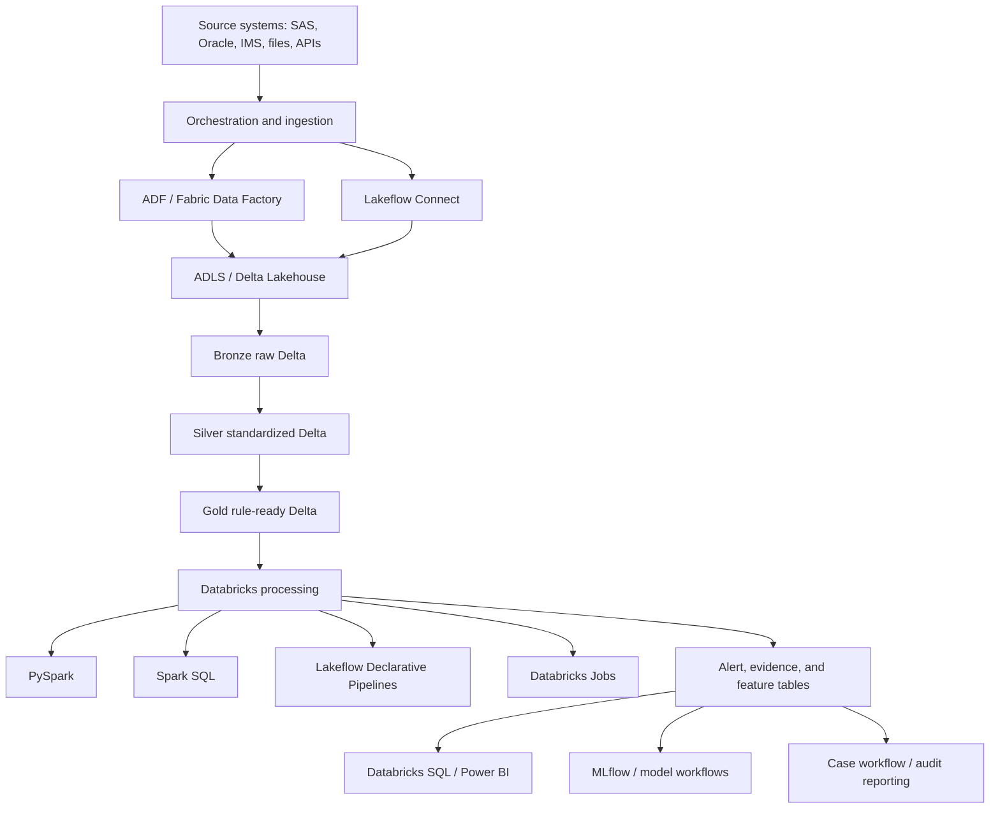
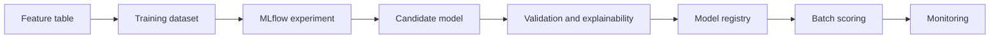

# 14 - Tech Stack Reference for AML/TM Modernization

This is a one-stop technical reference for the stack used throughout the role guides:

- Azure platform
- Azure Data Factory / Fabric Data Factory
- Azure Databricks
- PySpark / Spark SQL
- Delta Lake
- Lakeflow
- Databricks SQL / Power BI
- MLflow / MLOps
- Legacy migration from SAS, Oracle, and IMS/mainframe

Use this when interview questions become stack-specific.

---

## 1. Master stack diagram



Core idea:

```text
Azure provides secure cloud foundation.
Databricks provides scalable data and AI processing.
Delta Lake provides reliable lakehouse storage.
Lakeflow provides governed pipeline and job patterns.
SQL/BI provides decision visibility.
MLflow provides governed model lifecycle.
```

---

## 2. Azure platform

### What to know

Azure is the cloud foundation. In an AML/TM modernization project, Azure services usually provide:

- secure storage
- identity and access control
- orchestration
- networking
- secrets
- monitoring
- governance and lineage integrations

### Common components

| Component | Use in AML/TM |
|---|---|
| ADLS Gen2 | Store raw, curated, evidence, and analytics data. |
| Azure Data Factory / Fabric Data Factory | Move data, orchestrate jobs, manage dependencies. |
| Azure Databricks | Transform data, execute rules, run analytics and ML. |
| Key Vault | Store secrets, credentials, tokens, keys. |
| Microsoft Purview or catalog layer | Catalog, lineage, discovery, impact analysis. |
| Azure Monitor / Log Analytics | Operational logs, alerts, infrastructure monitoring. |
| Azure DevOps / GitHub Actions | CI/CD, tests, deployment workflows. |

### Interview Q&A

Q: What is the boundary between ADF/Fabric Data Factory and Databricks?

Strong answer:

> ADF or Fabric Data Factory is usually orchestration and source movement. Databricks is usually transformation, rule execution, scalable Spark processing, and advanced analytics. The exact split depends on connectors, complexity, monitoring, and team standards.

Q: How do you secure AML data in Azure?

Strong answer:

> Use least privilege access, managed identities or service principals, Key Vault for secrets, private networking where required, encryption, audit logs, catalog permissions, row-level or table-level access controls, and separate environments for dev/test/UAT/prod.

---

## 3. Azure Databricks

### What to know

Azure Databricks is the main data processing and analytics platform in this study pack.

Important objects:

- workspace
- notebooks
- repos / Git integration
- jobs
- tasks
- job clusters
- interactive clusters
- SQL warehouses
- Unity Catalog
- catalogs, schemas, tables, views, volumes
- cluster policies
- secrets
- audit logs

### Production pattern

```text
Git-controlled code
  -> parameterized Databricks job
  -> job cluster with policy
  -> Delta tables in Unity Catalog
  -> logs and metrics
  -> DQ and reconciliation outputs
  -> monitored runbook
```

### Interview Q&A

Q: How do you productionize Databricks notebooks?

Strong answer:

> Move code into source control, parameterize it, separate environment config, use jobs and job clusters, manage libraries and runtime versions, write outputs to governed Delta tables, emit logs and metrics, and add DQ/reconciliation checks. Notebooks can remain an interface, but production behavior must be versioned and repeatable.

Q: Why use job clusters?

Strong answer:

> Job clusters are created for a specific run and terminated afterward, which improves repeatability, cost control, and isolation. Interactive clusters are useful for development but weaker for controlled production execution.

---

## 4. PySpark / Spark SQL

For the full deep-dive guide, use [`15-spark-sql-pyspark-deep-learning.md`](15-spark-sql-pyspark-deep-learning.md).

### Theory

Spark is a distributed processing engine. PySpark is the Python API for Spark. Spark SQL lets you write SQL over Spark-managed data.

Concepts to know:

- lazy execution
- transformations and actions
- logical plan and physical plan
- partitions
- shuffles
- joins
- aggregations
- window functions
- broadcast joins
- skew
- caching
- Spark UI
- explain plans
- file pruning

### AML/TM use cases

- multi-year transaction transformations
- customer-account stitching
- point-in-time reference joins
- rolling window aggregation
- threshold rule execution
- deduplication
- reconciliation metrics
- feature engineering

### Common Spark interview questions

Q: What is lazy execution?

Strong answer:

> Spark does not execute transformations immediately. It builds a plan and executes when an action is called. This lets Spark optimize the plan, but it also means errors and performance issues may appear later than the line where a transformation was defined.

Q: What causes shuffles?

Strong answer:

> Wide operations like joins, groupBy, distinct, repartition, and window operations can move data across the cluster. Shuffles are expensive, so I inspect join keys, partitioning, filtering, skew, and aggregation strategy.

Q: How do you implement rolling 30-day monitoring?

Strong answer:

> Define the entity grain, choose the transaction date column, filter eligible transactions, join point-in-time dimensions, aggregate over the required window, compare to threshold, generate deterministic alert keys, and link supporting transactions. Then test boundary dates and threshold equality.

---

## 5. Delta Lake

### Theory

Delta Lake is a lakehouse storage layer that adds a transaction log to data files. It supports reliable table operations over cloud storage.

Key features:

- ACID transactions
- schema enforcement
- schema evolution controls
- table history
- time travel
- merge/upsert
- selective overwrite
- change data feed
- optimized metadata handling

### AML/TM value

Delta matters because AML/TM needs:

- reproducible runs
- safe reruns
- table version history
- schema controls
- audit support
- selective remediation
- incremental downstream processing

### Rerun pattern

```text
rule_id = TM001
rule_version = 1.0.0
processing_month = 2022-06

Replace only this output partition after fix:
rule_id=TM001/rule_version=1.0.0/processing_month=2022-06
```

### Interview Q&A

Q: Why not store everything as plain Parquet?

Strong answer:

> Plain Parquet is a file format, but Delta provides transactional table behavior, schema enforcement, table history, time travel, and safer updates. For AML/TM reruns and auditability, those controls are very valuable.

Q: What is the audit risk of aggressive vacuum?

Strong answer:

> Vacuum can remove old data files needed for time travel. If audit or replay requirements depend on historical table versions, retention settings must be aligned with governance requirements.

---

## 6. Lakeflow

### What Lakeflow means

Lakeflow is Databricks' data engineering approach for ingestion, transformation, and orchestration.

Main areas:

- Lakeflow Connect
- Lakeflow Spark Declarative Pipelines
- Lakeflow Jobs

### Lakeflow Connect

Use for:

- managed connectors
- source ingestion
- databases
- enterprise apps
- cloud storage
- message buses
- files

### Lakeflow Spark Declarative Pipelines

Use for:

- declarative pipeline definitions
- SQL or Python pipelines
- flows
- streaming tables
- materialized views
- temporary views
- expectations
- event logs

Dataset choices:

| Dataset type | Use when |
|---|---|
| Streaming table | Ingestion or incremental append-style processing. |
| Materialized view | Complex transformation or analytical result that should refresh incrementally. |
| Temporary view | Intermediate logic that does not need materialized storage. |

### Expectations

Expectation policies:

- warn: keep bad row but track violation
- drop: discard bad row
- fail: stop pipeline
- quarantine pattern: preserve invalid records separately

AML/TM guidance:

```text
Do not silently drop records unless the rule and control process allow it.
For critical keys, fail or quarantine.
Always measure output impact.
```

### Lakeflow Jobs

Use for:

- orchestration
- task dependencies
- notebooks
- pipelines
- SQL queries
- ML jobs
- production monitoring
- control flow

### Interview Q&A

Q: What is the difference between Lakeflow Jobs and Lakeflow Declarative Pipelines?

Strong answer:

> Declarative Pipelines define and manage data transformations, dependencies, datasets, expectations, and pipeline execution. Jobs orchestrate tasks, including notebooks, pipelines, SQL, connectors, ML, and control-flow steps. A solution can use both: pipelines for transformation logic and jobs for the end-to-end workflow.

Q: Triggered or continuous mode?

Strong answer:

> Triggered mode fits scheduled batch workloads and most historical replay because it processes available data and stops. Continuous mode fits low-latency streaming requirements but costs more and adds operational complexity.

---

## 7. Databricks SQL / Power BI

### Databricks SQL

Use for:

- SQL analytics
- dashboards
- scheduled queries
- alerts
- query history
- query profiles
- governed lakehouse reporting

### Power BI

Use for:

- executive dashboards
- semantic models
- metric definitions
- drill-through reports
- row-level security
- scheduled refresh

### AML/TM reporting model

```text
fact_alert
fact_reconciliation
fact_dq_check
fact_defect
dim_rule
dim_batch
dim_date
dim_customer_segment
dim_product
dim_geography
```

### Interview Q&A

Q: What makes a dashboard trustworthy?

Strong answer:

> Metric definitions, grain, filters, refresh time, rule version, batch ID, lineage, reconciliation to source tables, access control, and drill-through evidence.

---

## 8. MLflow / MLOps

### MLflow

Use for:

- experiment tracking
- parameters
- metrics
- artifacts
- feature lists
- code version
- data version
- model version
- explainability outputs

### AML/TM model lifecycle



### Interview Q&A

Q: Why is MLflow useful in regulated analytics?

Strong answer:

> It records what was trained, with which data, which parameters, which metrics, which artifacts, and which model version. That evidence supports review, reproducibility, comparison, and governance.

---

## 9. Legacy migration stack

### SAS

Know:

- DATA steps
- PROC SQL
- macros
- formats/informats
- missing values
- sort order
- merge behavior
- date functions

Risk:

```text
Spark output may differ if SAS missing value, sorting, merge, or date behavior is not understood.
```

### Oracle

Know:

- SQL dialects
- stored procedures
- analytic functions
- indexes
- materialized views
- date arithmetic
- transaction behavior
- exception handling

Risk:

```text
Distributed Spark execution may not behave like procedural stored logic unless the behavior is explicitly designed.
```

### IMS / mainframe

Know:

- hierarchical records
- segment relationships
- copybook-style layouts
- packed decimals
- encoding
- extract timing
- batch windows

Risk:

```text
Flattening hierarchy incorrectly can break customer-account-transaction relationships.
```

---

## 10. Stack interview answer pattern

When asked about any tool, answer with this shape:

```text
What it is:
  Define the tool simply.

Where it fits:
  Explain the architecture layer.

Why it matters:
  Connect it to AML/TM replay, control, or evidence.

Failure mode:
  Explain what can go wrong.

Example:
  Give a concrete rule, DQ, dashboard, or rerun example.
```

Example for Delta Lake:

```text
Delta Lake is the table storage layer for the lakehouse.
It fits under bronze, silver, gold, alert, and evidence tables.
It matters because AML/TM needs safe reruns, schema enforcement, and table history.
A failure mode is uncontrolled schema evolution or vacuum retention that breaks audit needs.
Example: rerun TM001 for June 2022 by replacing only that partition and comparing table versions.
```

---

## 11. Closed-book stack drills

Answer without looking:

1. What does ADF/Fabric Data Factory do in this architecture?
2. What does Databricks do?
3. Why is PySpark useful for a 5-year lookback?
4. Why is Delta Lake better than plain Parquet for AML/TM?
5. What are Lakeflow Connect, Declarative Pipelines, and Jobs?
6. What are streaming tables, materialized views, and temporary views?
7. What are Lakeflow expectation policies?
8. What makes Databricks SQL or Power BI reporting trustworthy?
9. What does MLflow track?
10. What are the migration risks for SAS, Oracle, and IMS?
