# 14 - Tech Stack Reference for AML/TM Modernization

This is the one-stop stack reference for the repo. It is written for AML /
Transaction Monitoring modernization interviews and project execution, not for
generic cloud trivia.

Use it when someone asks:

- where each tool fits
- why a tool is used
- what can go wrong
- how to explain the stack in an interview
- how to connect Azure, Databricks, Spark, Delta, Lakeflow, BI, MLflow, and
  legacy migration into one controlled AML/TM platform

This page is intentionally self-contained. The Spark, SQL, ML, and notebook
tracks go deeper for practice, but this page should be enough to answer stack
design and interview questions without hunting through scattered notes.

---

## Code Bootstrap

For hands-on practice, run the consolidated notebook first:

[`../examples/spark/notebooks/aml_databricks_one_stop_learning.ipynb`](../examples/spark/notebooks/aml_databricks_one_stop_learning.ipynb)

Expected validation output:

```text
Databricks one-stop notebook validation passed.
```

That notebook creates the tiny AML/TM learning tables used across this repo:

- `transactions`
- `accounts`
- `country_risk`
- DQ outputs
- alert outputs
- supporting transaction evidence
- reconciliation evidence

When this document includes code, it includes setup, run order, expected output,
and validation checks. For a larger runnable library of Spark SQL and PySpark
examples, use:

- [`spark/README.md`](spark/README.md)
- [`spark/spark-sql-pyspark-deep-learning.md`](spark/spark-sql-pyspark-deep-learning.md)
- [`../examples/spark/notebooks/aml_databricks_one_stop_learning.ipynb`](../examples/spark/notebooks/aml_databricks_one_stop_learning.ipynb)

---

## 1. Stack Mental Model

### 1.1 First principles

An AML/TM modernization stack exists to answer five questions reliably:

1. Did we receive the expected data?
2. Did we transform it correctly?
3. Did the rule/model/dashboard use the right version of the data?
4. Can we reproduce the output later?
5. Can an auditor or reviewer understand the evidence?

The stack is not just "cloud + Spark." It is a control system.

```text
source data -> governed ingestion -> standardized tables -> rule-ready features
            -> deterministic rules and/or models -> alert evidence
            -> reconciliation -> dashboard/reporting -> audit support
```

### 1.2 Master architecture

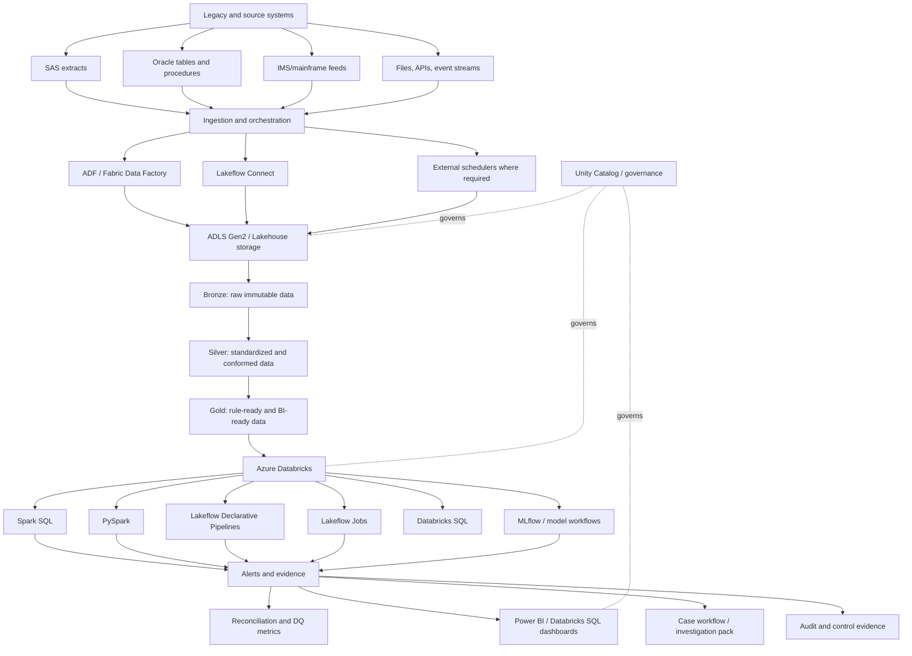

### 1.3 Responsibility matrix

| Layer | Primary tools | Main responsibility | AML/TM example | Common trap |
|---|---|---|---|---|
| Source | SAS, Oracle, IMS, files, APIs | Provide historical and current data | 5-year transaction replay extract | Treating legacy output as self-explanatory |
| Ingestion | ADF, Fabric Data Factory, Lakeflow Connect | Move data with run metadata | Daily account and transaction landing | Transforming complex business logic in copy steps |
| Storage | ADLS Gen2, Delta Lake | Store raw, curated, and evidence data | Bronze/silver/gold/evidence zones | Using plain files without table controls |
| Governance | Unity Catalog, Purview, Key Vault | Access, lineage, secrets, discovery | Catalog-level grants and lineage | Sharing direct storage credentials |
| Processing | Databricks, Spark SQL, PySpark | Transform and execute rules/features | Rolling 30-day alert rule | Ignoring joins, grain, skew, and rerun logic |
| Pipelines | Lakeflow Declarative Pipelines | Manage data dependencies and quality | Quarantine invalid reference rows | Dropping bad records silently |
| Orchestration | Lakeflow Jobs, ADF, Fabric Data Factory | Schedule and coordinate tasks | Monthly replay workflow | No idempotency or retry design |
| Analytics | Databricks SQL, Power BI | Review metrics and exceptions | Alert volume by rule/version/month | Unclear metric grain and stale refresh |
| ML/MLOps | MLflow, feature tables, monitoring | Govern experiments and scoring | Alert prioritization model | Model without lineage or explainability |
| CI/CD | GitHub Actions, Azure DevOps, Databricks bundles | Test and deploy repeatably | Promote dev to UAT to prod | Manual notebook edits in production |

### 1.4 Stack answer pattern

When asked about any tool, answer in this structure:

```text
What it is:
  Define the tool simply.

Where it fits:
  Name the architecture layer.

Why it matters:
  Connect it to replay, control, evidence, scale, or governance.

Failure mode:
  Explain what breaks if it is misused.

Example:
  Give an AML/TM rule, DQ, reconciliation, reporting, or rerun example.
```

Example:

```text
Delta Lake is the table storage layer for the lakehouse.
It fits under bronze, silver, gold, alert, and evidence tables.
It matters because AML/TM needs safe reruns, schema enforcement, table history,
and reproducible evidence.
A failure mode is aggressive vacuum retention that removes files needed for
audit replay.
Example: rerun TM001 for June 2022 by replacing only the output partition and
comparing the before/after reconciliation counts.
```

---

## 2. Azure Platform Foundation

### 2.1 What Azure provides

Azure is the secure cloud foundation. In AML/TM modernization, Azure usually
provides:

- storage
- identity
- networking
- secrets
- orchestration
- monitoring
- deployment
- governance integration
- cost controls

Azure is not the business logic. It is the platform that lets the business logic
run safely, repeatably, and observably.

### 2.2 Core components

| Component | What it does | AML/TM use |
|---|---|---|
| ADLS Gen2 | Cloud data lake storage with hierarchical namespace | Raw extracts, curated Delta tables, evidence files |
| Microsoft Entra ID | Identity and access management | User, group, service principal, managed identity access |
| Key Vault | Secret and key management | Database credentials, tokens, keys |
| Azure Data Factory | Managed ETL/ELT and orchestration | Copy source data, trigger Databricks jobs, manage dependencies |
| Fabric Data Factory | Fabric orchestration and data movement | Fabric-centered lakehouse workflows |
| Azure Databricks | Spark, SQL, lakehouse, ML, jobs | Rule execution, data engineering, feature engineering |
| Azure Monitor / Log Analytics | Operational monitoring | Pipeline alerts, job failures, platform metrics |
| Microsoft Purview | Catalog, governance, lineage support | Discover data assets and support impact analysis |
| GitHub Actions / Azure DevOps | CI/CD | Validate Markdown, notebooks, bundles, deployment |

### 2.3 Storage zone design

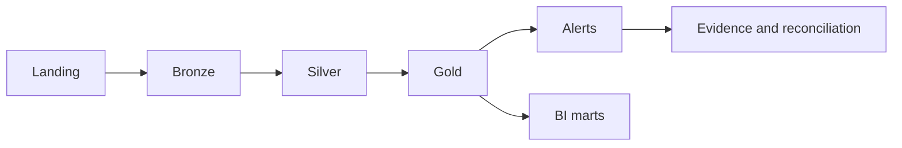

| Zone | Grain | Should it be changed? | Example |
|---|---|---|---|
| Landing | Source file or extract | Usually no | Raw Oracle extract file |
| Bronze | Source-like table | Append or controlled reload | `bronze.transactions_raw` |
| Silver | Standardized business entity | Controlled transforms | `silver.transactions_standardized` |
| Gold | Rule-ready / BI-ready table | Versioned and tested | `gold.customer_daily_activity` |
| Alerts | Rule/model output | Reproducible by batch/version | `alert.tm001_monthly_output` |
| Evidence | Support and control output | Retained for review | Supporting transactions and reconciliation |

### 2.4 Design principles

Use separate environments:

```text
dev -> test -> UAT -> prod
```

Use separate concerns:

```text
identity != secrets != storage path != compute permissions != table grants
```

Use separate data states:

```text
raw != standardized != rule-ready != report-ready != evidence
```

Use least privilege:

```text
People and jobs should have only the access required for their role.
```

### 2.5 AML/TM Azure example

Scenario:

```text
The bank needs to replay 5 years of historical transactions and compare legacy
rule outputs with new Databricks rule outputs.
```

Azure design:

- ADLS stores raw extracts and Delta table files.
- Key Vault stores connection credentials.
- ADF copies historical monthly extracts into landing/bronze.
- Databricks transforms bronze to silver/gold and runs rules.
- Unity Catalog governs tables and access.
- Azure Monitor and Databricks job logs track failures.
- Power BI reports reconciliation metrics and alert volume.

### 2.6 Azure failure modes

| Failure mode | Why it matters | Control |
|---|---|---|
| Direct storage keys shared with users | Hard to govern and rotate | Use managed identity, service principals, and catalog grants |
| Raw data overwritten | Replay evidence disappears | Make bronze immutable or reloadable with versioned batch metadata |
| No environment separation | UAT/prod behavior drifts | Separate catalogs, workspaces, targets, and deployment config |
| Secrets in notebooks | Credential exposure | Use Key Vault-backed secrets or approved secret scopes |
| No operational logs | Failed jobs cannot be explained | Centralize job, pipeline, and platform logs |
| No cost guardrails | Replay can overrun budget | Cluster policies, job clusters, autoscaling, budget alerts |

### 2.7 Azure interview Q&A

Q: What is the boundary between ADF/Fabric Data Factory and Databricks?

Strong answer:

> ADF or Fabric Data Factory usually handles orchestration, scheduling, source
> movement, and dependency control. Databricks usually handles scalable
> transformation, Spark processing, rules, features, DQ logic, and analytics.
> The split depends on connector support, complexity, monitoring, and standards.

Q: How do you secure AML data in Azure?

Strong answer:

> Use least privilege, managed identities or service principals, Key Vault,
> private networking where required, encryption, audit logs, Unity Catalog or
> equivalent table permissions, row-level or table-level controls, and separate
> dev/test/UAT/prod environments.

Q: Why use ADLS Gen2 for a lakehouse?

Strong answer:

> It supports scalable storage for raw and curated data. With Delta Lake and a
> governance layer, it can hold source-like raw data, curated tables, alert
> evidence, and replay outputs without forcing everything into a traditional
> warehouse first.

Q: What should be in bronze versus silver?

Strong answer:

> Bronze should preserve source-like data and ingestion metadata. Silver should
> standardize types, keys, timestamps, statuses, and reference joins. Do not put
> rule-specific business logic into bronze because it makes source evidence hard
> to reconstruct.

Q: What is the main risk of poor environment separation?

Strong answer:

> You cannot prove which code, config, table version, or access policy produced
> a result. For AML/TM, that weakens auditability and makes defect triage much
> harder.

Q: How do you handle secrets?

Strong answer:

> Do not store secrets in notebooks, YAML committed to Git, or screenshots. Use
> Key Vault or approved secret scopes, restrict access, rotate credentials, and
> use managed identity where possible.

Q: What should an Azure runbook contain?

Strong answer:

> Job name, owner, schedule, input tables, output tables, dependency graph,
> retry policy, known failure modes, monitoring links, reconciliation checks,
> escalation path, and rollback/rerun instructions.

Q: How do you explain cloud cost control for a replay?

Strong answer:

> Use job clusters or serverless where appropriate, right-size compute, avoid
> unnecessary continuous clusters, partition historical workloads, monitor
> shuffle and spill, cap parallelism when needed, and track cost by job, batch,
> and environment.

---

## 3. ADF and Fabric Data Factory

### 3.1 First principles

ADF and Fabric Data Factory are orchestration and data movement tools. They are
strong when the problem is:

- connect to a source
- copy data
- trigger work
- pass parameters
- wait for dependencies
- retry failures
- record operational status

They are weaker when the problem is complex distributed transformation with
joins, windows, skew handling, and rule logic. That is normally Databricks/Spark
territory.

### 3.2 Orchestration pattern

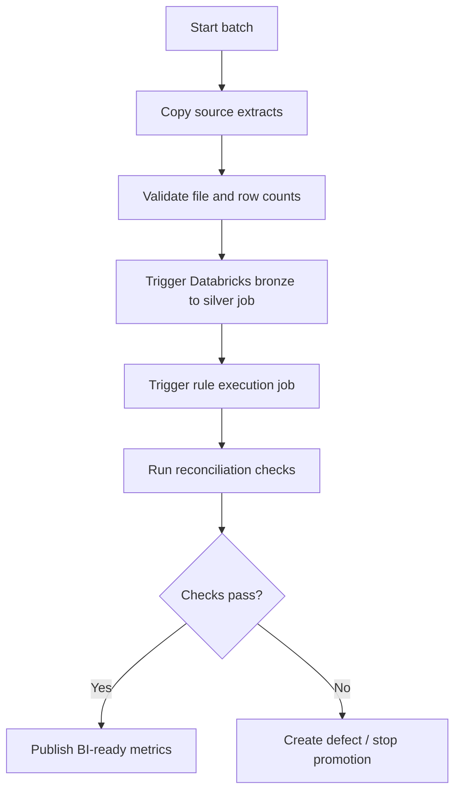

### 3.3 Parameters to pass

| Parameter | Why it matters |
|---|---|
| `batch_id` | Ties every table and log to one run |
| `source_system` | Supports lineage and troubleshooting |
| `processing_date` | Separates business date from run date |
| `lookback_start_date` | Controls historical replay windows |
| `lookback_end_date` | Controls replay scope |
| `rule_version` | Makes rule output reproducible |
| `environment` | Prevents dev/test/prod confusion |
| `expected_source_count` | Supports ingestion reconciliation |

### 3.4 Idempotency

Idempotency means rerunning the same job with the same inputs does not create
duplicate or inconsistent outputs.

AML/TM example:

```text
If batch AML_2022_06_RULE_TM001_V1 is rerun, the job should replace or merge
only that batch/rule/month output, then regenerate reconciliation evidence.
It should not append duplicate alerts.
```

### 3.5 ADF/Data Factory failure modes

| Failure mode | Impact | Better pattern |
|---|---|---|
| Copy succeeded but transform failed | Partial pipeline state | Persist run status by stage |
| Retry appends duplicates | Inflated alert counts | Use batch keys and idempotent writes |
| Parameters hard-coded | Wrong month/environment run | Pass explicit config |
| Source count not captured | Cannot reconcile ingestion | Store file count, row count, checksum where feasible |
| Complex logic in copy activity | Hard to test and review | Push complex logic to Spark/SQL with tests |
| No dependency graph | Race conditions | Explicit tasks and dependencies |

### 3.6 ADF/Fabric interview Q&A

Q: When would you use ADF instead of Databricks?

Strong answer:

> I would use ADF for source connectivity, movement, scheduling, dependency
> control, retries, and triggering work. I would use Databricks for complex
> transformations, joins, rule execution, DQ checks, and analytics at scale.

Q: How do you make a pipeline rerunnable?

Strong answer:

> Parameterize the batch, define deterministic output keys, write by partition
> or merge key, record run metadata, validate counts, and make retries replace
> the same target scope instead of blindly appending.

Q: What metadata should ingestion capture?

Strong answer:

> Source system, file/table name, extract timestamp, landing path, row count,
> byte size, checksum where feasible, ingestion timestamp, batch ID, pipeline
> run ID, and success/failure status.

Q: How do you decide whether a transformation belongs in ADF mapping data flows
or Spark?

Strong answer:

> I look at complexity, scale, team skill, testing approach, observability, and
> maintainability. Simple format conversion may fit in the factory. Multi-table
> joins, windows, rule logic, and reusable transformations usually belong in
> Spark or SQL where they can be versioned and tested clearly.

Q: What is the risk of using schedule time as business time?

Strong answer:

> A run on July 1 might process June data, late-arriving data, or a backfill.
> Business effective date, processing date, and run timestamp must be separate
> fields.

Q: How should failed ingestion be handled?

Strong answer:

> Stop dependent tasks when critical data is missing, record the failed stage,
> alert the owner, preserve logs and partial evidence, and allow a controlled
> rerun from the failed stage or from the beginning depending on the state.

Q: What makes orchestration auditable?

Strong answer:

> Every task has a run ID, parameters, start/end time, status, input and output
> references, owner, version, logs, and reconciliation result.

Q: How do ADF and Lakeflow Jobs overlap?

Strong answer:

> Both can orchestrate workflows. ADF is often broader for Azure source movement
> and cross-service orchestration. Lakeflow Jobs is Databricks-native and strong
> for coordinating notebooks, pipelines, SQL tasks, ML tasks, and Databricks
> production monitoring.

---

## 4. Azure Databricks

### 4.1 What Azure Databricks provides

Azure Databricks is the data engineering, analytics, and AI platform in this
learning stack. It provides:

- Spark processing
- notebooks
- jobs and tasks
- SQL warehouses
- Delta Lake tables
- Unity Catalog governance
- Databricks SQL dashboards
- MLflow and model workflows
- Git and Databricks Asset Bundle deployment patterns
- Databricks Connect for local IDE workflows

### 4.2 Main objects to know

| Object | Meaning | AML/TM use |
|---|---|---|
| Workspace | Collaborative Databricks environment | Development and operations surface |
| Notebook | Interactive code document | Exploration, learning, controlled job task |
| Repo/Git folder | Source-controlled code | Reviewable transformation and rule logic |
| Cluster | Spark compute | Development or job execution |
| Job cluster | Ephemeral compute for one job run | Repeatable production execution |
| SQL warehouse | SQL compute endpoint | BI, ad hoc SQL, dashboards |
| Job | Orchestrated workflow | End-to-end monthly replay |
| Task | Unit inside a job | Notebook, pipeline, SQL, Python, ML step |
| Secret scope | Secret access abstraction | Token or credential lookup |
| Unity Catalog | Governance layer | Catalogs, schemas, tables, grants, lineage |
| Volume | Governed non-tabular storage object | Config files, reference files, evidence files |

### 4.3 Development to production path

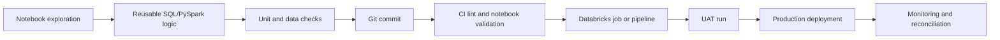

### 4.4 Production notebook rules

Notebooks can be production interfaces, but production behavior must be
controlled.

Good pattern:

- code lives in Git
- inputs are parameters
- outputs are named tables with batch metadata
- runtime version is controlled
- dependencies are pinned or managed
- job cluster policy is defined
- DQ and reconciliation are part of the run
- failures are observable
- promotion path is reviewed

Weak pattern:

- manual notebook edits in production
- hidden widgets
- hard-coded paths
- no run ID
- no output version
- no tests
- no reconciliation

### 4.5 Compute choices

| Compute | Use when | Watch out |
|---|---|---|
| Interactive cluster | Development and debugging | Can drift from production |
| Job cluster | Scheduled/repeatable production job | Startup time and dependency setup |
| Serverless | Managed compute experience where available | Feature/runtime compatibility and cost controls |
| SQL warehouse | SQL queries, dashboards, BI | Not ideal for complex PySpark code |
| Single user cluster | Isolated user workloads | Less shared operational pattern |
| Shared/standard access mode | Governed shared access | Must match Unity Catalog and security needs |

### 4.6 Unity Catalog

Unity Catalog is the governance layer for data and AI assets. The key namespace
is:

```text
catalog.schema.object
```

Example:

```text
aml_dev.silver.transactions_standardized
aml_uat.gold.customer_daily_activity
aml_prod.alerts.tm001_alerts
```

Objects to know:

| Object | Meaning | Example |
|---|---|---|
| Metastore | Top-level metadata container by region/account | One regional governance boundary |
| Catalog | Primary data isolation unit | `aml_dev`, `aml_uat`, `aml_prod` |
| Schema | Logical grouping inside catalog | `bronze`, `silver`, `gold`, `alerts` |
| Table | Governed tabular data | `gold.customer_daily_activity` |
| View | Governed query abstraction | Masked analyst view |
| Volume | Governed non-tabular files | Reference files, evidence exports |
| External location | Governed pointer to cloud storage | ADLS path managed by permissions |

### 4.7 Managed versus external tables

| Table type | Who manages files? | Use when |
|---|---|---|
| Managed table | Unity Catalog manages table lifecycle and files | Databricks-owned curated tables |
| External table | Cloud storage lifecycle remains external | Existing storage layout or shared platform ownership |

Interview nuance:

```text
Managed/external is not mainly about "secure versus insecure."
It is about lifecycle ownership, storage location management, and access model.
Both still need governance.
```

### 4.8 Databricks Connect and VS Code

Databricks Connect lets local tools connect to Databricks compute, but the local
Python version, `databricks-connect` package version, and Databricks Runtime
must be compatible.

Repo setup guide:

```text
docs/code/databricks-connect-local-setup.md
```

Critical troubleshooting rule:

```text
The Databricks extension must use the interpreter where databricks-connect is
installed. In this repo that is:

${REPO_ROOT}/.venv-databricks-connect/bin/python
```

### 4.9 Databricks failure modes

| Failure mode | Impact | Control |
|---|---|---|
| Interactive cluster used as production | Hard to reproduce output | Job clusters and pinned config |
| Runtime versions drift | Different Spark behavior | Runtime pinning and release testing |
| Hard-coded catalog/path | Wrong environment writes | Environment parameters |
| No Unity Catalog design | Access sprawl | Catalog/schema/table grant model |
| No job-level observability | Failures missed | Job alerts, event logs, metrics |
| No reconciliation task | Wrong output can be published | Mandatory DQ/recon before publish |
| Local IDE uses wrong Python | Databricks Connect fails | Dedicated compatible venv |

### 4.10 Databricks interview Q&A

Q: How do you productionize Databricks notebooks?

Strong answer:

> Move code into source control, parameterize inputs, separate environment
> config, use jobs or pipelines, choose controlled compute, write governed Delta
> outputs, emit logs and metrics, and include DQ and reconciliation checks.

Q: Why use job clusters?

Strong answer:

> Job clusters are created for a specific run and terminated afterward. They
> improve repeatability, cost control, and isolation compared with long-lived
> interactive clusters.

Q: What is Unity Catalog?

Strong answer:

> Unity Catalog is Databricks governance for data and AI assets. It provides a
> catalog/schema/table namespace, access control, auditing, lineage, discovery,
> and governance over tables, views, volumes, and related assets.

Q: How would you organize catalogs for AML?

Strong answer:

> I would usually separate by environment or major isolation boundary, such as
> `aml_dev`, `aml_uat`, and `aml_prod`, then use schemas such as bronze, silver,
> gold, alerts, dq, and evidence. The final design depends on access boundaries,
> ownership, region, and enterprise standards.

Q: Why should production code avoid hard-coded paths?

Strong answer:

> Hard-coded paths make promotion and reruns risky. The same logic should run in
> dev, UAT, and prod with different configuration, not different code.

Q: What is the role of Databricks SQL warehouses?

Strong answer:

> SQL warehouses provide SQL compute for BI, dashboards, ad hoc analysis, and
> reporting over governed lakehouse tables. They are not the same thing as a
> general PySpark cluster.

Q: How do you debug a failed Databricks job?

Strong answer:

> Check task status, parameters, cluster/runtime, driver and executor logs,
> Spark UI, input table versions, output writes, DQ failures, and recent code or
> config changes. Then decide whether to rerun, repair, or roll back.

Q: Why is Databricks Connect version matching important?

Strong answer:

> Databricks Connect depends on compatible local Python, package version, and
> target runtime. If they do not match, local code may fail before reaching the
> cluster or behave differently from the target runtime.

Q: What is a cluster policy?

Strong answer:

> A cluster policy constrains how clusters can be created. It supports cost,
> security, and standardization by limiting runtime versions, node types,
> autoscaling, libraries, access mode, and other settings.

Q: How do you make Databricks outputs auditable?

Strong answer:

> Write output with rule ID, rule version, batch ID, processing period, code
> version, input table versions where feasible, run metadata, supporting
> transactions, DQ results, and reconciliation metrics.

---

## 5. Spark SQL and PySpark

For deep practice, use [`spark/spark-sql-pyspark-deep-learning.md`](spark/spark-sql-pyspark-deep-learning.md).
This section gives enough stack-level depth to answer design and interview
questions without leaving the page.

### 5.1 What Spark is

Spark is a distributed execution engine. It splits work into tasks across
executors and coordinates the work through a driver.

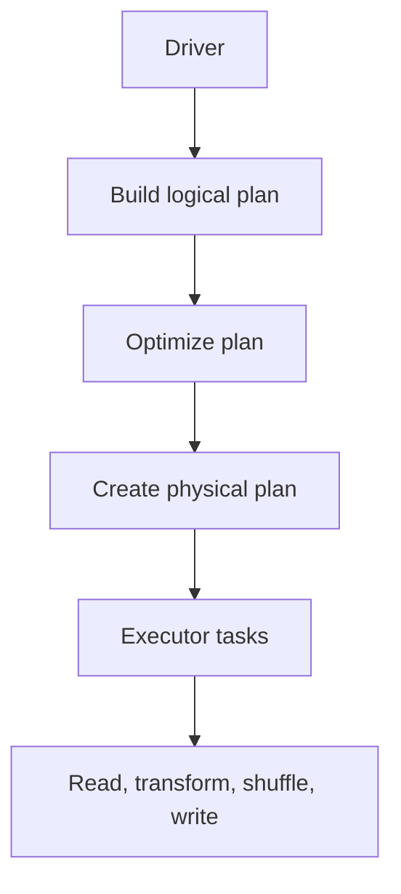

### 5.2 Spark SQL versus PySpark

| Interface | Best for | AML/TM example |
|---|---|---|
| Spark SQL | Clear relational logic | Rule query with joins, filters, windows |
| PySpark DataFrame | Reusable programmatic pipelines | Rule factory, DQ library, dynamic feature generation |
| Both | Production systems with reviewable logic | SQL views called from PySpark orchestration |

Mental model:

```text
Spark SQL and PySpark DataFrame code often compile into the same optimizer.
Choose the interface that makes the logic easier to review, test, and maintain.
```

### 5.3 Core Spark concepts

| Concept | Meaning | Why it matters |
|---|---|---|
| Lazy execution | Transformations build a plan; actions execute it | Errors may appear at action time |
| Transformation | Creates a new DataFrame plan | `select`, `filter`, `join`, `groupBy` |
| Action | Triggers execution | `count`, `show`, `collect`, `write` |
| Partition | Slice of distributed data | Affects parallelism and shuffle |
| Shuffle | Data movement across executors | Expensive and common in joins/aggregations |
| Broadcast join | Send small table to all executors | Useful for small reference data |
| Skew | Uneven key distribution | One task can become a bottleneck |
| Window function | Calculation over ordered/partitioned rows | Rolling activity and dedupe logic |
| Explain plan | Query execution plan | Helps debug performance |

### 5.4 Runnable micro-lab location

PySpark, Python, and Spark SQL practice should live in notebooks so the learner
can run every cell in order.

The tech-stack Spark SQL versus PySpark micro-lab now lives in:

[`../examples/spark/notebooks/aml_databricks_one_stop_learning.ipynb`](../examples/spark/notebooks/aml_databricks_one_stop_learning.ipynb)

Run the notebook top to bottom and use the section:

```text
Step 14 - Tech Stack Micro-Lab: Same Rule in Spark SQL and PySpark
```

The notebook creates tiny data, runs the same high-value customer activity rule
through Spark SQL and PySpark, compares the outputs, and asserts that both match
the expected result.

### 5.5 Spark design checklist

Before writing Spark code, answer:

1. What is the row grain?
2. What is the business date?
3. What is the processing date?
4. What is the rule or feature version?
5. What input tables are required?
6. Are joins one-to-one, one-to-many, or many-to-many?
7. Which keys can be null?
8. Which operations cause shuffles?
9. How will output be deduplicated?
10. How will the result be reconciled?

### 5.6 Spark failure modes

| Failure mode | Symptom | Fix |
|---|---|---|
| Many-to-many join | Row counts explode | Prove join cardinality before joining |
| `collect()` on large data | Driver crashes | Use distributed writes or limited samples |
| Missing point-in-time logic | Wrong historical customer status | Join using effective dates |
| Threshold boundary not tested | Off-by-one alert differences | Test equality, below, above |
| Skewed join key | One slow task | Salt, pre-aggregate, broadcast, or redesign |
| Ambiguous column names | Wrong field selected | Alias tables and select explicit columns |
| Time zone mismatch | Wrong date window | Standardize date/time handling |
| Cache overuse | Memory pressure | Cache only reused expensive DataFrames |

### 5.7 Spark interview Q&A

Q: What is lazy execution?

Strong answer:

> Spark builds a plan when transformations are defined and executes when an
> action is called. This lets Spark optimize the full plan, but it means errors
> and performance issues may surface later than the line where code was written.

Q: What causes shuffles?

Strong answer:

> Wide operations such as joins, groupBy, distinct, repartition, and many window
> operations can move data across the cluster. Shuffles are expensive, so I
> inspect keys, filters, partitioning, skew, and explain plans.

Q: How do you implement rolling 30-day monitoring?

Strong answer:

> Define entity grain, business date, eligible transactions, point-in-time
> dimensions, window boundaries, threshold logic, deterministic alert keys, and
> supporting transaction evidence. Then test boundary dates and threshold
> equality.

Q: Why can SQL and PySpark produce similar performance?

Strong answer:

> Both Spark SQL and PySpark DataFrame APIs use Spark's optimizer for structured
> queries. Performance depends more on the logical plan, joins, filters,
> partitions, file layout, and data size than on whether the user typed SQL or
> DataFrame syntax.

Q: How do you debug a slow Spark job?

Strong answer:

> Check the Spark UI, stages, tasks, shuffles, spill, skew, input size, join
> strategy, partition count, file sizes, explain plan, filters, and whether the
> job is reading more data than expected.

Q: What is skew?

Strong answer:

> Skew means data is unevenly distributed across keys or partitions. A single
> heavy customer, merchant, or null key can make one task process far more data
> than the rest.

Q: What is a broadcast join?

Strong answer:

> A broadcast join sends a small table to all executors so Spark can avoid a
> large shuffle. It is useful for small reference tables such as country risk or
> product mapping, but the broadcast side must fit in memory.

Q: Why is `dropDuplicates` risky?

Strong answer:

> It hides which row survived unless the ordering and business rule are clear.
> For AML/TM, dedupe should define keys, tie-breakers, and evidence so results
> are explainable.

Q: Why test row counts after joins?

Strong answer:

> Joins are where many correctness defects appear. A row count increase may be
> expected for one-to-many joins, but unexpected multiplication can inflate
> transaction totals and alert volumes.

Q: How do you make Spark output deterministic?

Strong answer:

> Use deterministic keys, explicit ordering where row selection matters,
> controlled partition overwrite or merge logic, stable rule versions, and
> validation checks that compare row counts, sums, and exception populations.

---

## 6. Delta Lake

### 6.1 First principles

Delta Lake adds table reliability to cloud object storage. Plain Parquet stores
files. Delta adds a transaction log and table-level behavior.

Core capabilities:

- ACID transactions
- schema enforcement
- schema evolution controls
- table history
- time travel
- merge/update/delete
- streaming and batch unification
- change data feed patterns
- scalable metadata handling

### 6.2 Why Delta matters in AML/TM

AML/TM needs reproducibility.

Delta helps answer:

- Which table version did the rule read?
- Which rule version wrote this output?
- Can we rerun only one period?
- Can we compare output before and after a defect fix?
- Can we recover from a bad write?
- Can downstream jobs process only changed data?

### 6.3 Transaction log mental model

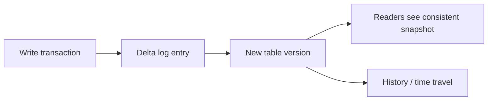

### 6.4 Delta table design for rules

Common output columns:

| Column | Purpose |
|---|---|
| `alert_id` | Deterministic alert key |
| `rule_id` | Rule identity |
| `rule_version` | Rule logic version |
| `batch_id` | Run identity |
| `processing_period` | Business period |
| `customer_id` | Monitored entity |
| `trigger_amount` | Explainable metric |
| `threshold_amount` | Threshold applied |
| `created_at` | Write timestamp |
| `input_snapshot_id` | Input version reference where available |

### 6.5 Safe rerun pattern

```text
Rule: TM001
Rule version: 1.0.0
Processing period: 2022-06
Batch: AML_TM001_2022_06_RERUN_002

Rerun should replace or merge only the target scope:
rule_id = TM001
rule_version = 1.0.0
processing_period = 2022-06
```

Do not blindly append rerun output unless duplicate alert semantics are
explicitly designed.

### 6.6 Delta failure modes

| Failure mode | Impact | Control |
|---|---|---|
| Uncontrolled schema evolution | Downstream jobs break silently | Require schema review |
| Aggressive vacuum | Historical versions unavailable | Align retention with audit requirements |
| No partition strategy | Slow replays and deletes | Partition by stable business period when useful |
| Too many tiny files | Slow queries | Optimize/compact where appropriate |
| Blind append reruns | Duplicate alerts | Use merge or scoped overwrite |
| No table history review | Bad write hard to explain | Capture version/history in run evidence |

### 6.7 Delta interview Q&A

Q: Why not store everything as plain Parquet?

Strong answer:

> Parquet is a file format. Delta provides transactional table behavior, schema
> enforcement, table history, time travel, and safer updates. AML/TM reruns and
> audit evidence benefit from those table controls.

Q: What is ACID in this context?

Strong answer:

> ACID means writes are handled as transactions so readers see consistent table
> snapshots and failed/partial writes do not become normal table state.

Q: What is time travel used for?

Strong answer:

> Time travel lets you query earlier table versions. It is useful for
> investigation, defect analysis, replay comparison, and proving what data was
> available at a point in time.

Q: What is the audit risk of aggressive vacuum?

Strong answer:

> Vacuum can remove old data files needed for historical table versions. If
> audit or replay depends on those versions, retention must match governance
> requirements.

Q: How do you handle schema changes?

Strong answer:

> Classify the change, review downstream impact, update contracts/tests, decide
> whether evolution is allowed, and record the change. Do not let critical AML
> tables evolve accidentally.

Q: When would you use merge?

Strong answer:

> Use merge when you need upsert behavior by key, such as updating a customer
> risk dimension or rerunning a scoped alert output where existing keys should
> be updated instead of duplicated.

Q: What is a bad Delta partitioning choice?

Strong answer:

> Partitioning by a high-cardinality field such as transaction ID creates too
> many small directories/files. Partitioning should match common filters and
> output management needs.

Q: What should be captured after a Delta write?

Strong answer:

> Target table, operation, row count, affected period, batch ID, rule version,
> table version/history reference where feasible, and reconciliation checks.

---

## 7. Lakeflow

### 7.1 What Lakeflow means

Lakeflow is Databricks' data engineering solution for ingestion,
transformation, and orchestration. The core areas are:

- Lakeflow Connect
- Lakeflow Declarative Pipelines
- Lakeflow Jobs

Simple map:

```text
Lakeflow Connect = ingest data
Lakeflow Declarative Pipelines = define and manage datasets and transformations
Lakeflow Jobs = orchestrate tasks and production workflows
```

### 7.2 Lakeflow architecture

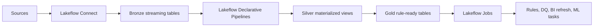

### 7.3 Lakeflow Connect

Use Lakeflow Connect for managed or standard ingestion from:

- enterprise applications
- databases
- cloud storage
- message buses
- files

AML/TM example:

```text
Use a managed connector or source ingestion pattern to bring customer,
account, and transaction data into bronze tables with source metadata and
batch identifiers.
```

### 7.4 Lakeflow Declarative Pipelines

Lakeflow Declarative Pipelines are for declarative batch and streaming data
pipelines in SQL or Python.

Concepts:

| Concept | Meaning | AML/TM use |
|---|---|---|
| Pipeline | Managed set of datasets and flows | Bronze-to-silver standardization |
| Flow | Processing logic | Load transaction files into a streaming table |
| Streaming table | Delta table with streaming/incremental support | Incremental raw transaction ingestion |
| Materialized view | Stored result refreshed by pipeline | Customer daily activity summary |
| Temporary view | Intermediate logic | Cleaned staging view not stored |
| Expectation | Data quality rule | Required account ID or valid amount |
| Event log | Pipeline operational evidence | DQ metrics and run troubleshooting |

### 7.5 Expectations and DQ policies

Expectation choices:

| Policy | Meaning | AML/TM guidance |
|---|---|---|
| Warn | Keep record and record violation | Non-critical profiling |
| Drop | Remove invalid record | Use carefully and measure impact |
| Fail | Stop pipeline | Critical keys or severe control break |
| Quarantine | Preserve invalid record separately | Best for reviewable exception handling |

AML/TM guidance:

```text
Do not silently drop records unless the control owner has approved that behavior.
For critical keys, fail or quarantine.
Always measure the output impact.
```

### 7.6 Triggered versus continuous

| Mode | Use when | AML/TM example |
|---|---|---|
| Triggered | Scheduled batch or backfill | Monthly historical replay |
| Continuous | Low-latency streaming | Near-real-time monitoring feed |

Most historical lookback workloads are triggered. Continuous mode adds cost and
operational complexity and should be justified by latency requirements.

### 7.7 Lakeflow Jobs

Lakeflow Jobs orchestrate Databricks workloads. A job can include tasks such as:

- notebooks
- pipelines
- SQL queries
- Python scripts
- dbt tasks where used
- ML training/scoring
- model deployment or inference tasks
- conditional branches
- loops

Example AML/TM job:

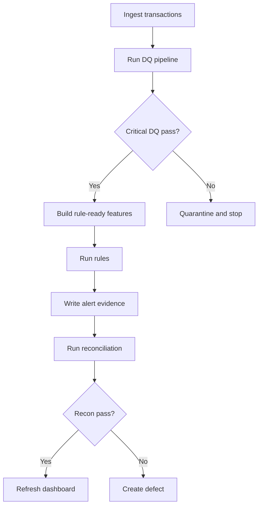

### 7.8 Lakeflow failure modes

| Failure mode | Impact | Control |
|---|---|---|
| Wrong dataset type | Poor performance or wrong persistence | Choose streaming table/materialized view/temp view intentionally |
| Silent drops | Alert undercount | Warn/quarantine/fail based on control criticality |
| Continuous mode by default | Higher cost and operational burden | Use triggered mode for batch replay |
| No event log review | Pipeline failures hard to diagnose | Include event log checks in runbook |
| Pipeline and job responsibilities blurred | Confusing ownership | Pipelines define data transformations; jobs orchestrate workflows |
| No CI/CD bundle strategy | Manual deployment drift | Promote with Git and deployment config |

### 7.9 Lakeflow interview Q&A

Q: What is Lakeflow?

Strong answer:

> Lakeflow is Databricks' data engineering solution for ingestion,
> transformation, and orchestration. It includes Connect for ingestion,
> Declarative Pipelines for data transformations, and Jobs for workflow
> orchestration.

Q: What is the difference between Lakeflow Jobs and Declarative Pipelines?

Strong answer:

> Declarative Pipelines define datasets, flows, dependencies, and DQ
> expectations. Jobs orchestrate tasks such as notebooks, pipelines, SQL, ML,
> and control flow. A production solution can use both.

Q: What is a streaming table?

Strong answer:

> A streaming table is a Delta table with additional support for streaming or
> incremental processing. It is useful when data arrives continuously or when a
> pipeline should process new data incrementally.

Q: What is a materialized view?

Strong answer:

> A materialized view stores the result of a query and can be refreshed by the
> pipeline. It is useful for curated summaries such as customer daily activity.

Q: When should an expectation fail the pipeline?

Strong answer:

> Fail when the violation breaks control reliability, such as missing customer
> ID, invalid transaction amount, or missing core reference data needed for a
> rule. Less critical issues may warn or quarantine.

Q: Why use quarantine instead of drop?

Strong answer:

> Quarantine preserves invalid records for review and reconciliation. Dropping
> records can reduce alert volume without evidence, which is dangerous in
> regulated monitoring.

Q: Triggered or continuous for a 5-year lookback?

Strong answer:

> Triggered mode. A historical replay processes available data by period and
> stops. Continuous mode is for low-latency streaming and would usually add
> unnecessary cost and complexity.

Q: How do Lakeflow event logs help?

Strong answer:

> They provide operational evidence about pipeline updates, data quality
> outcomes, failures, and performance. That helps troubleshooting and control
> reporting.

Q: How would you deploy Lakeflow safely?

Strong answer:

> Keep pipeline code in Git, parameterize environment settings, run CI checks,
> deploy through bundles or approved release tooling, test in UAT, and monitor
> event logs and reconciliation after release.

Q: What is a bad Lakeflow design for AML?

Strong answer:

> A pipeline that drops invalid transactions without evidence, mixes dev/prod
> paths, has no expectations, and publishes rule-ready tables without
> reconciliation.

---

## 8. Databricks SQL and Power BI

### 8.1 What they provide

Databricks SQL and Power BI are the visibility layer.

Databricks SQL provides:

- SQL warehouses
- SQL editor
- query history
- query profiles
- dashboards
- alerts
- BI integration

Power BI provides:

- semantic models
- report pages
- executive dashboards
- drill-through
- row-level security
- scheduled refresh
- certified datasets where governed

### 8.2 Reporting model

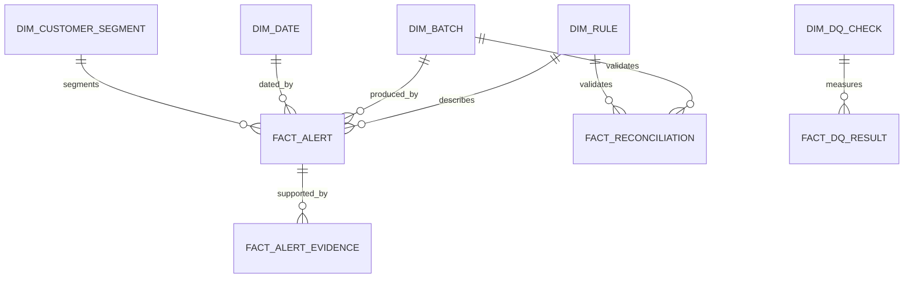

Common tables:

| Table | Grain | Purpose |
|---|---|---|
| `fact_alert` | One alert | Alert counts, severity, status |
| `fact_alert_evidence` | Alert-supporting transaction | Drill-through evidence |
| `fact_reconciliation` | Batch/rule/check | Source-to-target validation |
| `fact_dq_result` | Batch/check/table | DQ pass/fail and counts |
| `fact_defect` | One defect | Defect aging and severity |
| `dim_rule` | One rule version | Rule metadata |
| `dim_batch` | One run/batch | Run metadata |
| `dim_date` | One date | Period reporting |
| `dim_customer_segment` | One segment | Segmented alert analysis |

### 8.3 Trustworthy dashboard checklist

A dashboard is not trustworthy just because it renders.

It needs:

- metric definition
- grain
- filters
- refresh timestamp
- source table names
- rule version
- processing period
- batch ID
- reconciliation status
- owner
- access control
- drill-through evidence
- known exclusions

### 8.4 BI metric examples

| Metric | Definition question | Control question |
|---|---|---|
| Alert count | Count by created period or activity period? | Does it match alert output table? |
| Alert rate | Alerts divided by what denominator? | Is denominator same segment and period? |
| False positive rate | Based on closed cases or sampled QA? | Is closure outcome reliable? |
| DQ pass rate | Row-weighted or check-weighted? | Are critical checks separated? |
| Defect aging | Calendar days or business days? | Are severities defined consistently? |
| Rule hit amount | Sum trigger metric or transaction amount? | Can user drill to supporting rows? |

### 8.5 Databricks SQL / Power BI failure modes

| Failure mode | Impact | Control |
|---|---|---|
| Ambiguous metric definition | Stakeholders disagree | Metric glossary and semantic model |
| Dashboard refresh stale | Wrong operational decision | Display refresh and batch status |
| No drill-through | Cannot investigate | Evidence table and row-level detail |
| Duplicate fact grain | Inflated counts | Define grain and primary key |
| RLS missing | Unauthorized data exposure | Security model and testing |
| BI bypasses governed tables | Inconsistent numbers | Certified datasets and catalog permissions |
| Query too expensive | Slow dashboard | Aggregates, model design, SQL profiling |

### 8.6 Databricks SQL / Power BI interview Q&A

Q: What makes a dashboard trustworthy?

Strong answer:

> Metric definitions, grain, filters, refresh time, rule version, batch ID,
> lineage, reconciliation status, access control, and drill-through evidence.

Q: What is the difference between report date and activity date?

Strong answer:

> Report date is when the metric is published or viewed. Activity date is when
> the underlying transaction or event occurred. AML/TM reporting often needs
> both.

Q: Why does grain matter in BI?

Strong answer:

> If grain is unclear, joins and aggregations can double-count. A fact table
> must define whether each row is an alert, transaction, customer-day, rule-run,
> or DQ check.

Q: How do you validate Power BI numbers?

Strong answer:

> Compare against source SQL queries, reconciliation tables, row counts, known
> test batches, filter combinations, and drill-through samples. Validate both
> totals and segmented slices.

Q: When would you use Databricks SQL dashboards instead of Power BI?

Strong answer:

> Databricks SQL is useful for lakehouse-native operational dashboards,
> engineering metrics, SQL analysis, and quick governed views. Power BI is often
> better for enterprise semantic models, executive reporting, and broad business
> consumption.

Q: What is row-level security?

Strong answer:

> Row-level security restricts which rows a user can see based on identity,
> role, or attributes. In AML/TM, it may control access by region, business
> unit, or investigation scope.

Q: What is a query profile used for?

Strong answer:

> It helps identify slow scans, joins, shuffles, filters, and execution stages
> so SQL workloads can be tuned.

Q: What should a reconciliation dashboard show?

Strong answer:

> Source counts, target counts, difference counts, amount differences, DQ
> exceptions, failed checks, rule version, batch ID, run status, and links to
> defect records.

---

## 9. MLflow and MLOps

### 9.1 What MLflow provides

MLflow supports the model lifecycle:

- experiment tracking
- parameters
- metrics
- artifacts
- code version references
- model packaging
- model registry
- deployment and serving workflows where used
- monitoring and comparison

In AML/TM, ML should be treated as governed decision support, not a magic
replacement for controls.

### 9.2 AML/TM ML lifecycle

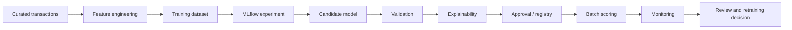

### 9.3 Typical AML/TM ML use cases

| Use case | Safer framing | Risk |
|---|---|---|
| Alert prioritization | Rank alerts for review order | Bias or missed high-risk cases |
| False-positive reduction | Support tuning and triage | Over-suppression |
| Segmentation | Group similar behavior | Segment drift |
| Anomaly detection | Flag unusual patterns | Explainability challenges |
| Investigator assist | Summarize evidence | Hallucination or unsupported claims |

### 9.4 Model evidence pack

A model evidence pack should include:

- business purpose
- training data period
- feature definitions
- label definition
- exclusion rules
- leakage checks
- performance metrics
- segment-level metrics
- explainability artifacts
- threshold selection
- validation results
- approval record
- monitoring plan
- rollback plan

### 9.5 MLOps failure modes

| Failure mode | Impact | Control |
|---|---|---|
| Label leakage | Unrealistic model performance | Point-in-time feature checks |
| No segment validation | Hidden unfairness or blind spots | Segment metrics and challenge review |
| No model version control | Cannot reproduce scores | MLflow tracking and registry |
| No data version | Training run cannot be recreated | Delta versions and feature snapshots |
| No monitoring | Drift missed | Ongoing metrics and alerting |
| Model treated as final decision | Governance risk | Human review and policy controls |
| Weak explainability | Reviewers cannot trust scores | Reason codes and feature contribution analysis |

### 9.6 MLflow/MLOps interview Q&A

Q: Why is MLflow useful in regulated analytics?

Strong answer:

> It records what was trained, with which data, parameters, metrics, artifacts,
> code references, and model version. That evidence supports comparison,
> reproducibility, review, and governance.

Q: What is label leakage?

Strong answer:

> Label leakage happens when training features include information that would
> not have been available at scoring time or that directly encodes the outcome.
> It makes model performance look better than reality.

Q: How do you make feature engineering point-in-time correct?

Strong answer:

> Use event dates, effective dates, and as-of joins so each training row only
> uses information available before the decision time.

Q: What metrics matter for AML models?

Strong answer:

> Precision, recall, false positive rate, alert volume impact, segment-level
> performance, stability, explainability, and operational review capacity.

Q: How should a model threshold be chosen?

Strong answer:

> Use business capacity, risk appetite, validation metrics, segment analysis,
> and governance review. Do not choose a threshold only because it optimizes one
> statistical metric.

Q: Why monitor model drift?

Strong answer:

> Customer behavior, products, fraud patterns, and data feeds change. Drift can
> make a previously validated model unreliable.

Q: How do you compare a model to existing rules?

Strong answer:

> Compare alert overlap, incremental detection, false positives, segment impact,
> review capacity, missed-risk scenarios, and evidence quality.

Q: What should not be automated blindly?

Strong answer:

> Suspicious activity decisions, suppression logic, or adverse customer impacts
> should not be automated without governance, explainability, validation, and
> human review expectations.

---

## 10. Legacy Migration Stack

### 10.1 Why legacy migration is hard

Legacy rule migration is not only syntax conversion. It is behavior
reconstruction.

You must preserve or intentionally change:

- data grain
- missing value behavior
- date/time logic
- sort order
- join semantics
- threshold boundaries
- reference data timing
- exception handling
- output keys
- audit evidence

### 10.2 SAS

Know:

- DATA steps
- PROC SQL
- macros
- formats and informats
- missing values
- sort order
- BY-group processing
- merge behavior
- date functions
- output datasets

Risk:

```text
Spark output can differ if SAS missing values, sort order, merge behavior,
retained variables, or date logic are not understood.
```

### 10.3 Oracle

Know:

- SQL dialect differences
- stored procedures
- analytic/window functions
- indexes
- materialized views
- date arithmetic
- transaction behavior
- exception handling
- hints and optimizer behavior

Risk:

```text
Distributed Spark execution may not behave like procedural stored logic unless
the behavior is explicitly designed and tested.
```

### 10.4 IMS/mainframe

Know:

- hierarchical records
- parent/child segments
- copybook-style layouts
- packed decimals
- EBCDIC/encoding concerns
- extract timing
- batch windows
- header/detail/trailer records

Risk:

```text
Flattening hierarchy incorrectly can break customer-account-transaction
relationships and inflate or suppress rule output.
```

### 10.5 Migration control pattern

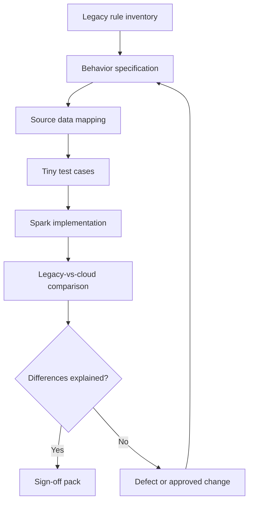

### 10.6 Legacy migration failure modes

| Failure mode | Impact | Control |
|---|---|---|
| "Lift and shift" without behavior spec | Hidden logic lost | Rule spec as code |
| No tiny test cases | Boundary defects missed | First-principles examples |
| Missing value mismatch | Different eligibility | Explicit null handling |
| Date function mismatch | Wrong lookback window | Calendar test matrix |
| Sort-dependent logic ignored | Different selected row | Explicit window ordering |
| One-to-many mapping missed | Row count explosion | Cardinality tests |
| No sign-off evidence | Audit weakness | Comparison pack and approvals |

### 10.7 Legacy migration interview Q&A

Q: Why is rule migration not just code conversion?

Strong answer:

> The goal is behavior equivalence or controlled modernization. You must
> understand source data, missing values, date logic, joins, thresholds,
> exceptions, and outputs, not just translate syntax.

Q: What is risky about SAS merge behavior?

Strong answer:

> SAS merge behavior can depend on sorted BY groups and retained values. A Spark
> join may multiply rows or handle missing keys differently unless the expected
> behavior is specified.

Q: How do you validate Oracle-to-Spark migration?

Strong answer:

> Build tiny deterministic cases, compare row counts and amount totals, test
> date and threshold boundaries, reconcile legacy and Spark outputs, and record
> every difference as a defect or approved change.

Q: What makes IMS data challenging?

Strong answer:

> IMS data is hierarchical and often extracted through legacy layouts. Parent
> child relationships, encoding, packed decimals, and batch timing must be
> handled carefully before flattening.

Q: How do you handle a known legacy bug?

Strong answer:

> Document it, quantify impact, get business/control owner decision, and decide
> whether the cloud version should reproduce the bug for comparison or correct
> it as an approved change.

Q: What is a reconciliation pack?

Strong answer:

> A set of evidence showing input counts, output counts, amount totals, matched
> records, unmatched records, reason codes for differences, defects, approvals,
> and sign-off status.

Q: Why are tiny examples important?

Strong answer:

> They expose first principles. A tiny dataset can prove threshold equality,
> null handling, date boundaries, join cardinality, and dedupe behavior before
> the same logic is applied to millions of rows.

Q: What is the role of a rule spec?

Strong answer:

> It defines the business behavior: scope, inputs, exclusions, joins, windows,
> thresholds, output fields, evidence, and tests. Code should implement the spec,
> not replace it.

---

## 11. End-to-End Production Checklist

Use this checklist before claiming a stack design is production-ready.

### 11.1 Data readiness

- Source inventory complete.
- Source owners identified.
- Required historical periods available.
- File/table counts captured.
- Business keys defined.
- Date fields defined.
- Data retention requirements understood.
- DQ checks designed by criticality.

### 11.2 Engineering readiness

- Code in Git.
- Runtime versions controlled.
- Environment config separated.
- Job/pipeline definitions reviewed.
- DQ and reconciliation built into workflow.
- Rerun strategy documented.
- Failure handling documented.
- Monitoring configured.
- Cost controls considered.

### 11.3 Governance readiness

- Catalog/schema/table model defined.
- Access grants reviewed.
- Secrets managed.
- Lineage available or documented.
- Sensitive data controls defined.
- Audit evidence retained.
- Rule/model approvals captured.
- Change management process followed.

### 11.4 Interview readiness

You should be able to explain:

- why each tool exists
- where data lives at each stage
- how a run is parameterized
- how failures are detected
- how reruns work
- how outputs are reconciled
- how access is controlled
- how production differs from development

---

## 12. Deep Q&A Bank

This bank is deliberately larger than a quick cheat sheet. Practice answering
closed book, then compare your answer to the strong answer.

### 12.1 Architecture

Q: What is the simplest way to explain the whole stack?

Strong answer:

> Sources feed governed ingestion. Data lands in a lakehouse, is standardized
> into Delta tables, processed by Databricks/Spark, governed by Unity Catalog,
> orchestrated by Lakeflow/ADF, reported through Databricks SQL or Power BI, and
> validated through DQ, reconciliation, and audit evidence.

Q: What is the difference between modernization and migration?

Strong answer:

> Migration moves existing behavior to a new platform. Modernization may improve
> architecture, governance, performance, testing, and operations. In AML/TM, any
> behavior change must be explicit and approved.

Q: What is the most important stack design habit?

Strong answer:

> Always tie code output back to data grain, input version, rule version, batch
> ID, DQ result, and reconciliation evidence.

Q: Why is "one source of truth" hard?

Strong answer:

> Different users may define period, grain, status, customer, or alert count
> differently. A governed semantic layer and metric definitions are needed.

Q: What is the biggest architecture smell?

Strong answer:

> Business-critical production outputs depend on manual notebook execution,
> hard-coded paths, hidden credentials, and no reconciliation.

### 12.2 Azure and governance

Q: What should be encrypted?

Strong answer:

> Data at rest and in transit should be protected according to platform and
> regulatory standards. Secrets and keys should be managed through approved
> services rather than embedded in code.

Q: How do you think about private networking?

Strong answer:

> Use private connectivity where required by security standards and data
> sensitivity. Balance security, operations, cost, and integration complexity.

Q: Why is lineage important?

Strong answer:

> Lineage helps explain where data came from, how it changed, what outputs it
> affected, and what must be retested after upstream changes.

Q: What does least privilege mean in practice?

Strong answer:

> Users, groups, jobs, and service principals receive only the permissions
> needed for their role and environment, with grants reviewed and audited.

Q: Why avoid personal credentials in production jobs?

Strong answer:

> Production jobs should not depend on one employee's account. Use service
> principals, managed identities, or approved workload identities.

### 12.3 Databricks and Spark

Q: What is the difference between a workspace and a catalog?

Strong answer:

> A workspace is a collaborative Databricks environment. A catalog is a Unity
> Catalog data governance object used to organize and secure data assets.

Q: What is the difference between a cluster and a SQL warehouse?

Strong answer:

> A cluster runs Spark workloads such as notebooks and PySpark jobs. A SQL
> warehouse is optimized for SQL queries, dashboards, and BI access.

Q: Why should rule outputs include rule version?

Strong answer:

> Without rule version, you cannot explain which logic produced an alert or
> compare old and new outputs reliably.

Q: Why should rule outputs include batch ID?

Strong answer:

> Batch ID ties output to a specific run, input scope, parameters, logs, and
> reconciliation evidence.

Q: How do you prevent row explosion?

Strong answer:

> Prove join cardinality, dedupe reference data before joining, use explicit
> keys, validate row counts before and after joins, and inspect unmatched and
> duplicated keys.

### 12.4 Delta and Lakeflow

Q: What does Delta add over files?

Strong answer:

> Delta adds transaction logs, table history, schema controls, time travel, and
> safer update/delete/merge behavior over cloud storage files.

Q: How do you decide between streaming table and materialized view?

Strong answer:

> Use a streaming table for incremental ingestion or streaming-style targets.
> Use a materialized view for stored transformation results that should be
> refreshed and queried efficiently.

Q: Why are expectations not enough by themselves?

Strong answer:

> Expectations detect or handle data quality issues, but the business still
> needs policy decisions, exception handling, impact measurement, reconciliation,
> and sign-off.

Q: What should happen when critical DQ fails?

Strong answer:

> Stop or quarantine depending on policy, preserve invalid records, record
> metrics, alert the owner, and prevent downstream publication until resolved.

Q: How do you design a rerun?

Strong answer:

> Define the target scope, make writes idempotent, preserve run metadata, avoid
> duplicate output, regenerate evidence, and compare before/after metrics.

### 12.5 BI and analytics

Q: What is a semantic model?

Strong answer:

> A semantic model defines business-friendly tables, relationships, measures,
> and security so users consume consistent metrics.

Q: Why can two dashboards disagree?

Strong answer:

> They may use different filters, grains, refresh times, source tables, status
> definitions, rule versions, or joins.

Q: What is drill-through evidence?

Strong answer:

> The detailed records supporting an aggregate metric or alert, such as the
> transactions that caused a customer to cross a threshold.

Q: How do you validate a dashboard after a data fix?

Strong answer:

> Refresh the semantic model, compare key totals, validate affected slices,
> check reconciliation status, and sample drill-through records.

Q: What is a BI anti-pattern in AML?

Strong answer:

> A dashboard that reports alert totals without rule version, processing period,
> batch status, reconciliation status, or evidence drill-through.

### 12.6 ML and model governance

Q: Why is explainability important?

Strong answer:

> Reviewers and control owners need to understand why a score or priority was
> produced. Explainability supports trust, challenge, validation, and governance.

Q: What is model monitoring?

Strong answer:

> Ongoing tracking of data drift, feature drift, score distribution,
> performance, segment behavior, and operational impact.

Q: What is an experiment?

Strong answer:

> A tracked training run or set of runs with parameters, metrics, artifacts, and
> model outputs that can be compared and reproduced.

Q: Why compare model results with rules?

Strong answer:

> Existing rules are the operational baseline. Comparison shows overlap,
> incremental value, missed-risk scenarios, and review capacity impact.

Q: What is the safest way to introduce ML?

Strong answer:

> Start with decision support such as prioritization or analyst assist, validate
> rigorously, keep human review, monitor outcomes, and require governance before
> material operational changes.

### 12.7 Legacy migration

Q: What should be in a legacy rule inventory?

Strong answer:

> Rule name, owner, purpose, source systems, inputs, joins, filters, thresholds,
> schedules, outputs, known defects, dependencies, and evidence requirements.

Q: How do you test threshold boundaries?

Strong answer:

> Create tiny cases below, exactly equal to, and above the threshold. Confirm
> whether equality should alert.

Q: How do you handle late-arriving data?

Strong answer:

> Define whether late data triggers rerun, adjustment, next-cycle inclusion, or
> exception reporting. Record the policy in the rule spec.

Q: Why is point-in-time reference data hard?

Strong answer:

> Customer risk, account status, geography, and product attributes can change.
> Historical rule output must use the version effective at the transaction or
> processing time required by the rule.

Q: What is a sign-off pack?

Strong answer:

> A package of rule spec, test cases, comparison results, reconciliations,
> defects, approved differences, evidence samples, and owner approvals.

---

## 13. Closed-Book Stack Drills

Model answers: [`16-model-answer-bank.md#tech-stack-closed-book-drills`](16-model-answer-bank.md#tech-stack-closed-book-drills)

Answer these without looking.

1. Draw the full AML/TM modernization stack from source to audit evidence.
2. Explain the boundary between ADF, Lakeflow Jobs, and Databricks processing.
3. Explain bronze, silver, gold, alert, and evidence zones.
4. Explain why Unity Catalog matters.
5. Explain managed versus external Delta tables.
6. Explain why Spark SQL and PySpark can share the same optimizer.
7. Explain lazy execution, transformations, actions, and shuffles.
8. Explain how to prevent row explosion in a join.
9. Explain why Delta Lake is better than plain Parquet for rule output.
10. Explain the risk of aggressive vacuum.
11. Explain Lakeflow Connect, Declarative Pipelines, and Jobs.
12. Explain warn, drop, fail, and quarantine expectations.
13. Explain triggered versus continuous pipeline mode.
14. Explain what makes a dashboard trustworthy.
15. Explain how to validate a Power BI number.
16. Explain what MLflow tracks.
17. Explain label leakage in AML.
18. Explain why rule migration is behavior reconstruction.
19. Explain SAS, Oracle, and IMS migration risks.
20. Explain what must be included in a sign-off pack.

---

## 14. Source Map

Use [`07-annotated-bibliography.md`](07-annotated-bibliography.md) for the full
source map. The most relevant official sources for this page are:

- Microsoft Learn: Azure Data Lake Storage
- Microsoft Learn: Azure Data Factory
- Microsoft Learn: Data engineering with Databricks
- Microsoft Learn: Unity Catalog on Azure Databricks
- Microsoft Learn: Databricks SQL on Azure Databricks
- Microsoft Learn: AI and machine learning on Azure Databricks
- Databricks Docs: Lakeflow Jobs
- Databricks Docs: Lakeflow Spark Declarative Pipelines
- Delta Lake documentation
- Apache Spark SQL, DataFrame, and performance tuning documentation
