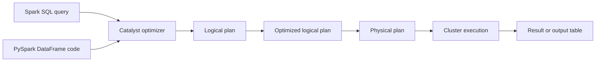
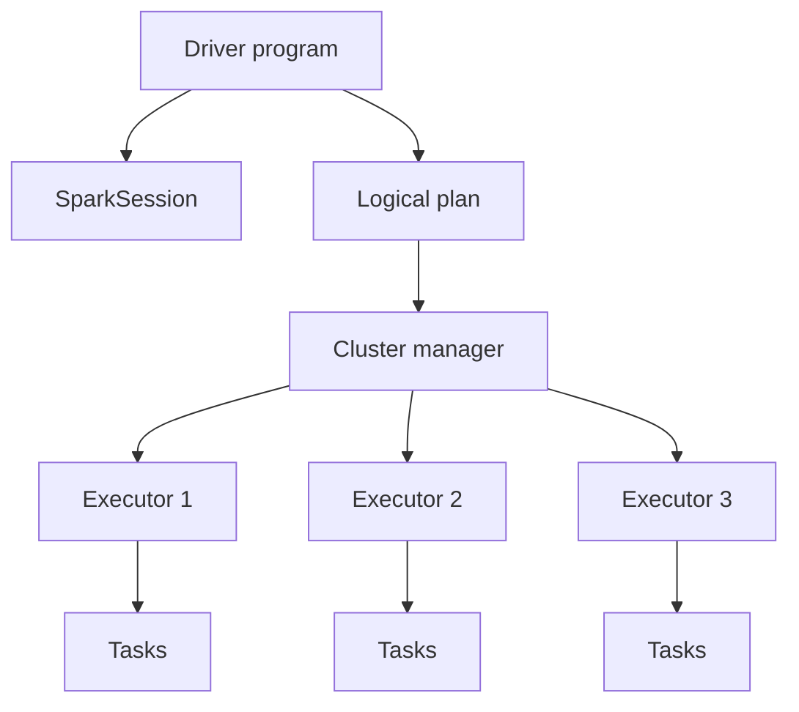
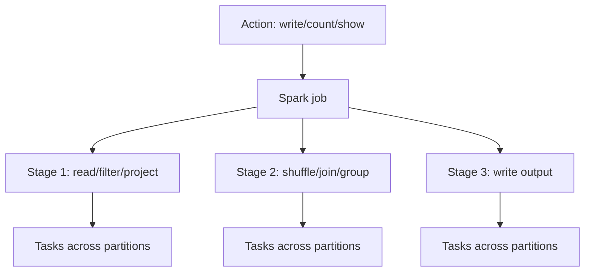

# 15 - Spark SQL and PySpark Deep Learning Guide

This is a one-stop learning guide for Spark SQL and PySpark in AML / Transaction Monitoring data engineering. It is written for practical interview readiness and real project execution on Azure Databricks, but the core concepts apply to Apache Spark generally.

The goal is not to memorize function names. The goal is to understand how Spark thinks, how SQL and PySpark map to the same execution engine, how to build correct transformations, and how to debug performance and correctness issues in a regulated data environment.

For low-level row-by-row examples using tiny AML/TM datasets, use [`16-spark-first-principles-examples.md`](16-spark-first-principles-examples.md). For query basics and many Spark SQL examples, use [`17-spark-sql-query-basics-examples.md`](17-spark-sql-query-basics-examples.md). For runnable PySpark DataFrame basics, use [`19-pyspark-dataframe-basics-examples.md`](19-pyspark-dataframe-basics-examples.md). Companion runnable examples live in `examples/spark/`.

---

## Code Bootstrap

Run one of these before practicing the examples:

```bash
spark-submit examples/spark/aml_pyspark_bootstrap.py
```

or, in Databricks SQL / Spark SQL:

```text
Run examples/spark/aml_sql_bootstrap.sql top to bottom.
```

Expected bootstrap output:

- PySpark bootstrap prints `AML/TM PySpark bootstrap validation passed.`
- SQL bootstrap returns `PASS` for all validation checks.
- Tiny learning data is created with `transactions`, `accounts`, and `country_risk`.

All code snippets in this guide should be treated as runnable only after the relevant bootstrap or an equivalent setup has been run.

---

## 1. What Spark is

Apache Spark is a distributed data processing engine. It lets you process datasets that are too large or too slow for a single machine by splitting work across a cluster.

In AML/TM modernization, Spark is useful because you may need to:

- replay multiple years of transaction data
- join customers, accounts, transactions, and reference data
- perform rolling-window rule calculations
- create rule-ready feature tables
- compare legacy and cloud outputs
- generate reconciliation metrics
- handle large DQ exception populations
- produce alert and evidence tables

Spark is not magic. It is powerful when the data model, join keys, partitioning, and execution plan are understood. It can be painfully expensive when used like a local Python script.

---

## 2. Mental model

Spark SQL and PySpark DataFrames are two front doors into the same engine.



Key idea:

```text
SQL and DataFrame API often compile into similar Spark execution plans.
Choose the interface that makes the logic clearer, testable, and maintainable.
```

---

## 3. When to use Spark SQL versus PySpark

### Use Spark SQL when

- logic is mostly relational
- business users or analysts understand the query
- the transformation is easy to express with `SELECT`, `JOIN`, `GROUP BY`, and window functions
- you want readable rule logic
- you are building Databricks SQL dashboards or validation queries
- you want quick ad hoc investigation

### Use PySpark DataFrame API when

- logic needs programmatic composition
- you need reusable functions
- you need dynamic rule generation
- you need complex branching
- you are building a production library
- you need structured testing around transformations
- you need to combine Spark work with Python configuration or metadata

### Use both when

- SQL is clearer for transformations
- PySpark is better for orchestration and reusable code
- SQL views simplify review
- PySpark functions generate common patterns

Example pattern:

```python
from pyspark.sql import functions as F

processing_month = "2022-06"

spark.sql(f"""
CREATE OR REPLACE TEMP VIEW eligible_transactions AS
SELECT *
FROM silver_transactions
WHERE processing_month = '{processing_month}'
  AND transaction_status = 'POSTED'
""")

result = (
    spark.table("eligible_transactions")
    .groupBy("customer_id")
    .agg(F.sum("amount_cad").alias("total_amount_cad"))
)
```

Interview answer:

> I do not treat Spark SQL and PySpark as enemies. They both use Spark's optimizer. I choose SQL for readable relational logic and PySpark for reusable, parameterized, testable pipelines.

---

## 4. Spark execution basics

### 4.1 Driver and executors



Driver:

- runs the main Spark application
- builds execution plans
- coordinates work
- collects results when requested

Executors:

- run tasks
- read/write data
- perform transformations
- cache data
- shuffle data

Common mistake:

```python
rows = df.collect()
```

This pulls all rows to the driver. For large AML datasets, this can crash the driver.

### 4.2 Transformations and actions

Transformations build a plan:

- `select`
- `filter`
- `withColumn`
- `join`
- `groupBy`
- `agg`
- `dropDuplicates`
- `repartition`

Actions execute the plan:

- `count`
- `show`
- `collect`
- `write`
- `take`
- `first`

Example:

```python
df2 = (
    df
    .filter(F.col("transaction_date") >= "2022-01-01")
    .select("transaction_id", "account_id", "amount")
)

# No Spark job has necessarily run yet.

df2.count()

# This action triggers execution.
```

### 4.3 Lazy execution

Spark waits to execute until an action is called.

Why it helps:

- Spark can optimize the full plan.
- Spark can push filters down.
- Spark can remove unused columns.
- Spark can choose join strategies.

Why it surprises people:

- errors may appear at `count()` or `write()`, not where the transformation was written
- repeated actions can recompute the same plan unless cached or materialized
- `show()` is not free

---

## 5. Spark objects you must know

### SparkSession

The entry point for Spark SQL and DataFrame work.

```python
spark
```

Common use:

```python
df = spark.table("silver.transactions")
df = spark.read.format("delta").load("/mnt/lake/silver/transactions")
spark.sql("SELECT COUNT(*) FROM silver.transactions")
```

### DataFrame

A distributed table-like dataset with named columns.

Important properties:

- immutable
- lazily evaluated
- schema-aware
- distributed
- optimized by Spark

### Column

A symbolic expression over a column.

```python
from pyspark.sql import functions as F

df = df.withColumn("amount_abs", F.abs(F.col("amount")))
```

`F.col("amount")` does not contain the data itself. It describes how to access the column when Spark executes.

### Row

A record in a DataFrame. Avoid working row-by-row in Python unless the data is tiny.

### Schema

Defines column names, types, and nullability.

```python
from pyspark.sql import types as T

schema = T.StructType([
    T.StructField("transaction_id", T.StringType(), False),
    T.StructField("account_id", T.StringType(), False),
    T.StructField("transaction_date", T.DateType(), False),
    T.StructField("amount", T.DecimalType(18, 2), True),
])
```

In AML/TM, schemas matter because silent type drift can break rules, joins, currency calculations, and reconciliation.

---

## 6. Data types and AML pitfalls

### Common Spark SQL types

- `STRING`
- `INT`
- `BIGINT`
- `DOUBLE`
- `DECIMAL(p, s)`
- `DATE`
- `TIMESTAMP`
- `BOOLEAN`
- `ARRAY`
- `MAP`
- `STRUCT`

### AML/TM guidance

Use `DECIMAL`, not floating point, for money:

```python
df = df.withColumn("amount_cad", F.col("amount_cad").cast("decimal(18,2)"))
```

Why:

- `DOUBLE` can introduce floating-point precision issues
- financial reconciliation needs exactness
- thresholds should compare consistently

Be explicit with dates:

```python
df = df.withColumn("transaction_date", F.to_date("transaction_date", "yyyy-MM-dd"))
```

Normalize strings before joins:

```python
df = df.withColumn("account_id_norm", F.upper(F.trim("account_id")))
```

---

## 7. Reading and writing data

### Read a table

```python
transactions = spark.table("silver.transactions")
```

### Read files

```python
df = (
    spark.read
    .format("parquet")
    .load("/mnt/bronze/source=oracle/table=transactions/")
)
```

### Read CSV with explicit schema

```python
df = (
    spark.read
    .option("header", True)
    .schema(schema)
    .csv("/mnt/landing/transactions/")
)
```

Avoid relying on schema inference for production AML pipelines. Inferred types can change when input samples change.

### Write Delta

```python
(
    df.write
    .format("delta")
    .mode("overwrite")
    .saveAsTable("silver.transactions")
)
```

### Partitioned write

```python
(
    alerts.write
    .format("delta")
    .mode("overwrite")
    .partitionBy("rule_id", "processing_month")
    .saveAsTable("gold.alerts")
)
```

Partition by fields used for filtering and reruns. Do not create extremely high-cardinality partitions such as `transaction_id`.

---

## 8. Core PySpark transformations

### Select columns

```python
df.select("transaction_id", "account_id", "amount")
```

### Rename columns

```python
df.withColumnRenamed("acct_id", "account_id")
```

### Add columns

```python
df.withColumn("amount_abs", F.abs(F.col("amount")))
```

### Filter rows

```python
df.filter(F.col("transaction_status") == "POSTED")
```

### Drop columns

```python
df.drop("raw_payload")
```

### Deduplicate

```python
df.dropDuplicates(["source_system", "transaction_id"])
```

Better deduplication with ordering:

```python
from pyspark.sql import Window

w = Window.partitionBy("source_system", "transaction_id").orderBy(F.col("ingestion_ts").desc())

deduped = (
    df
    .withColumn("rn", F.row_number().over(w))
    .filter(F.col("rn") == 1)
    .drop("rn")
)
```

Why better:

- deterministic
- keeps latest or best record
- easier to explain

---

## 9. Spark SQL basics

### Select and filter

```sql
SELECT
    transaction_id,
    account_id,
    amount,
    transaction_date
FROM silver_transactions
WHERE transaction_status = 'POSTED'
  AND transaction_date >= DATE '2022-01-01';
```

### Aggregate

```sql
SELECT
    customer_id,
    COUNT(*) AS txn_count,
    SUM(amount_cad) AS total_amount_cad
FROM gold_rule_input_transactions
GROUP BY customer_id;
```

### CTEs

```sql
WITH eligible AS (
    SELECT *
    FROM gold_rule_input_transactions
    WHERE transaction_type IN ('WIRE', 'EFT')
),
agg AS (
    SELECT
        customer_id,
        SUM(amount_cad) AS total_amount_cad
    FROM eligible
    GROUP BY customer_id
)
SELECT *
FROM agg
WHERE total_amount_cad > 100000;
```

### Temporary views

```python
df.createOrReplaceTempView("eligible_transactions")
```

```sql
SELECT COUNT(*)
FROM eligible_transactions;
```

Temporary views are useful for exploration and multi-step logic, but production pipelines should make ownership and materialization explicit.

---

## 10. Joins

### Join types

| Join type | Meaning | AML/TM example |
|---|---|---|
| Inner | Keep matching rows only. | Transactions with valid accounts. |
| Left | Keep all left rows and matching right rows. | Transactions with optional reference enrichment. |
| Left anti | Keep left rows with no match. | Find orphan transactions. |
| Left semi | Keep left rows that have a match. | Keep accounts with known customers. |
| Full outer | Keep all rows from both sides. | Compare legacy and cloud alert keys. |

### PySpark join

```python
enriched = (
    transactions.alias("t")
    .join(accounts.alias("a"), on="account_id", how="left")
)
```

### SQL join

```sql
SELECT
    t.transaction_id,
    t.account_id,
    a.customer_id
FROM silver_transactions t
LEFT JOIN silver_accounts a
  ON t.account_id = a.account_id;
```

### Point-in-time join

```sql
SELECT
    t.transaction_id,
    t.account_id,
    a.customer_id
FROM silver_transactions t
JOIN account_customer_history a
  ON t.account_id = a.account_id
 AND t.transaction_date >= a.effective_start_date
 AND t.transaction_date <  a.effective_end_date;
```

### Orphan check with left anti join

```python
orphan_transactions = transactions.join(accounts, on="account_id", how="left_anti")
```

This is excellent for DQ.

### Legacy/cloud comparison with full outer join

```sql
SELECT
    COALESCE(l.alert_key, c.alert_key) AS alert_key,
    CASE
        WHEN l.alert_key IS NULL THEN 'cloud_only'
        WHEN c.alert_key IS NULL THEN 'legacy_only'
        ELSE 'matched'
    END AS comparison_status
FROM legacy_alerts l
FULL OUTER JOIN cloud_alerts c
  ON l.alert_key = c.alert_key;
```

---

## 11. Aggregations

### Group by customer

```python
customer_agg = (
    txns
    .groupBy("customer_id")
    .agg(
        F.count("*").alias("txn_count"),
        F.sum("amount_cad").alias("total_amount_cad"),
        F.max("amount_cad").alias("max_amount_cad"),
        F.countDistinct("counterparty_id").alias("counterparty_count")
    )
)
```

### Group by rule period

```sql
SELECT
    rule_id,
    processing_month,
    COUNT(DISTINCT alert_key) AS alert_count,
    COUNT(DISTINCT customer_id) AS alerted_customer_count
FROM gold_alerts
GROUP BY rule_id, processing_month;
```

### Conditional aggregation

```python
agg = (
    txns
    .groupBy("customer_id")
    .agg(
        F.sum(F.when(F.col("country_risk") == "HIGH", F.col("amount_cad")).otherwise(F.lit(0))).alias("high_risk_geo_amount"),
        F.count(F.when(F.col("transaction_type") == "WIRE", True)).alias("wire_count")
    )
)
```

Spark SQL:

```sql
SELECT
    customer_id,
    SUM(CASE WHEN country_risk = 'HIGH' THEN amount_cad ELSE 0 END) AS high_risk_geo_amount,
    COUNT(CASE WHEN transaction_type = 'WIRE' THEN 1 END) AS wire_count
FROM gold_rule_input_transactions
GROUP BY customer_id;
```

---

## 12. Window functions

Window functions calculate values across related rows without collapsing rows like `GROUP BY`.

### Row number for deduplication

```python
w = Window.partitionBy("source_system", "transaction_id").orderBy(F.col("ingestion_ts").desc())

df = (
    df
    .withColumn("rn", F.row_number().over(w))
    .filter(F.col("rn") == 1)
    .drop("rn")
)
```

SQL:

```sql
WITH ranked AS (
    SELECT
        *,
        ROW_NUMBER() OVER (
            PARTITION BY source_system, transaction_id
            ORDER BY ingestion_ts DESC
        ) AS rn
    FROM bronze_transactions
)
SELECT *
FROM ranked
WHERE rn = 1;
```

### Latest effective record

```sql
WITH ranked AS (
    SELECT
        *,
        ROW_NUMBER() OVER (
            PARTITION BY customer_id
            ORDER BY effective_start_date DESC
        ) AS rn
    FROM customer_history
    WHERE effective_start_date <= DATE '2022-06-30'
)
SELECT *
FROM ranked
WHERE rn = 1;
```

Warning:

This finds latest as of a fixed date. For transaction-level point-in-time joins, join by date range instead.

### Running totals

```sql
SELECT
    customer_id,
    transaction_date,
    amount_cad,
    SUM(amount_cad) OVER (
        PARTITION BY customer_id
        ORDER BY transaction_date
        ROWS BETWEEN UNBOUNDED PRECEDING AND CURRENT ROW
    ) AS running_total
FROM customer_transactions;
```

### Rolling windows

Spark row-based windows are not always the same as time-based monitoring windows. For AML/TM, be explicit about whether the rule means:

- calendar month
- processing month
- last N rows
- last N days
- rolling N-day date range

Simple 30-day example using self-join:

```sql
SELECT
    anchor.customer_id,
    anchor.transaction_date AS window_end,
    DATE_SUB(anchor.transaction_date, 29) AS window_start,
    SUM(t.amount_cad) AS rolling_30_day_amount
FROM customer_transactions anchor
JOIN customer_transactions t
  ON anchor.customer_id = t.customer_id
 AND t.transaction_date BETWEEN DATE_SUB(anchor.transaction_date, 29) AND anchor.transaction_date
GROUP BY anchor.customer_id, anchor.transaction_date;
```

This can be expensive at scale. Production designs often pre-aggregate by customer/day and then calculate windows over the smaller daily table.

---

## 13. Date and timestamp handling

Dates are one of the most common migration mismatch sources.

### Parse dates

```python
df = df.withColumn("transaction_date", F.to_date("transaction_date_raw", "yyyyMMdd"))
```

### Add and subtract days

```python
df = df.withColumn("window_start", F.date_sub("transaction_date", 29))
```

### Month truncation

```python
df = df.withColumn("processing_month", F.date_format(F.trunc("transaction_date", "MM"), "yyyy-MM"))
```

SQL:

```sql
SELECT
    DATE_TRUNC('MONTH', transaction_date) AS transaction_month
FROM silver_transactions;
```

### Date pitfalls

- timezone conversion can shift timestamps across dates
- source systems may store local time while Spark uses session timezone
- date strings may have multiple formats
- SAS, Oracle, and Spark date arithmetic may differ
- inclusive versus exclusive effective-end dates change output

Recommended effective-date pattern:

```sql
t.transaction_date >= d.effective_start_date
AND t.transaction_date < d.effective_end_date
```

This avoids overlap when one record ends the same day the next begins.

---

## 14. Null handling

Null behavior causes many rule mismatches.

### Basic null checks

```python
df.filter(F.col("account_id").isNull())
df.filter(F.col("account_id").isNotNull())
```

### Fill nulls

```python
df.fillna({"country_code": "UNKNOWN"})
```

Only fill nulls when the business logic approves it. Filling missing geography with `UNKNOWN` may be useful for exception routing, but it should not silently pass a high-risk geography rule.

### Null-safe equality

Spark SQL:

```sql
SELECT *
FROM a
JOIN b
  ON a.key <=> b.key;
```

PySpark:

```python
a.join(b, a.key.eqNullSafe(b.key), "inner")
```

Use carefully. Null-safe joins may create matches that business logic does not intend.

### Common null mistake

```sql
WHERE country_code <> 'CA'
```

This does not include null country codes. If nulls need exception handling, make that explicit:

```sql
WHERE country_code <> 'CA'
   OR country_code IS NULL
```

---

## 15. Strings and normalization

Legacy sources often disagree on casing, spaces, encoding, and padded keys.

### Normalize join keys

```python
df = df.withColumn("account_id_norm", F.upper(F.trim(F.col("account_id"))))
```

### Remove punctuation

```python
df = df.withColumn("postal_code_norm", F.regexp_replace(F.upper(F.col("postal_code")), "[^A-Z0-9]", ""))
```

### Standardize empty strings

```python
df = df.withColumn(
    "country_code",
    F.when(F.trim(F.col("country_code")) == "", None).otherwise(F.upper(F.trim("country_code")))
)
```

Migration warning:

Oracle, SAS, mainframe extracts, and Spark may treat empty strings, blanks, and nulls differently. Test explicitly.

---

## 16. Nested data

Spark can work with arrays, maps, and structs.

### Select struct field

```python
df.select(F.col("customer.address.country").alias("country"))
```

### Explode array

```python
exploded = df.select("customer_id", F.explode("accounts").alias("account"))
```

### AML example

If a source sends transactions as JSON with nested counterparties:

```text
transaction
  transaction_id
  account_id
  counterparties[]
    counterparty_id
    country_code
    amount
```

You may need to explode counterparties before applying geography or counterparty rules.

Warning:

Exploding arrays can multiply row counts. Always reconcile before and after explosion.

---

## 17. User-defined functions

### Avoid Python UDFs when built-in functions exist

Prefer:

```python
df.withColumn("country_code_norm", F.upper(F.trim("country_code")))
```

Avoid:

```python
from pyspark.sql.functions import udf

@udf("string")
def normalize_country(value):
    return value.strip().upper() if value else None
```

Why:

- built-in functions are optimized
- Python UDFs can be slower
- UDFs can block some optimizer improvements
- UDF behavior may be harder to inspect

### When UDFs may be justified

- complex custom parsing
- special encoding logic
- algorithm not available in Spark functions
- carefully tested reusable business logic

If using UDFs:

- document why built-ins are insufficient
- test edge cases
- measure performance
- preserve input/output examples

---

## 18. SQL and PySpark equivalence cheat sheet

| Task | Spark SQL | PySpark |
|---|---|---|
| Select columns | `SELECT a, b FROM t` | `df.select("a", "b")` |
| Filter | `WHERE amount > 0` | `df.filter(F.col("amount") > 0)` |
| Add column | `amount * fx AS amount_cad` | `df.withColumn("amount_cad", F.col("amount") * F.col("fx"))` |
| Group | `GROUP BY customer_id` | `df.groupBy("customer_id")` |
| Aggregate | `SUM(amount)` | `F.sum("amount")` |
| Join | `JOIN b ON a.id = b.id` | `a.join(b, on="id")` |
| Dedup | `ROW_NUMBER()...` | `row_number().over(Window...)` |
| Null check | `IS NULL` | `isNull()` |
| Create temp view | `CREATE TEMP VIEW` | `createOrReplaceTempView()` |
| Execute SQL | SQL editor or `spark.sql()` | `spark.sql("...")` |

---

## 19. Execution plans and explain

### PySpark

```python
df.explain(True)
```

### SQL

```sql
EXPLAIN EXTENDED
SELECT *
FROM gold_rule_input_transactions
WHERE processing_month = '2022-06';
```

Look for:

- full table scans
- filter pushdown
- partition pruning
- broadcast joins
- sort merge joins
- shuffles
- exchanges
- adaptive plan changes

Interview answer:

> I use `explain` and the Spark UI together. `explain` shows the planned execution; Spark UI shows what actually happened at runtime, including shuffle size, task skew, spills, and slow stages.

---

## 20. Jobs, stages, tasks, and shuffles



### Narrow transformations

Each output partition depends on one input partition.

Examples:

- `filter`
- `select`
- `withColumn`

### Wide transformations

Data must move between partitions.

Examples:

- `groupBy`
- `join`
- `distinct`
- `orderBy`
- some window functions

Wide transformations often cause shuffles. Shuffles are expensive because data moves across the cluster and may spill to disk.

---

## 21. Join strategies and performance

### Broadcast join

Use when one table is small enough to send to all executors.

```python
from pyspark.sql.functions import broadcast

df = large_transactions.join(broadcast(country_ref), on="country_code", how="left")
```

Good for:

- country reference
- currency reference
- small parameter tables
- risk code mapping

Bad for:

- large customer table
- large account history table
- anything too large for executor memory

### Sort merge join

Common for large-large joins. Requires shuffle and sort.

Good for:

- transactions joined to account history
- alert output comparison
- large source-to-target mapping checks

### Skewed joins

Skew happens when some keys have much more data than others.

Example:

```text
country_code = 'CA' has 90 percent of rows.
country_code = 'US' has 5 percent.
All other countries share 5 percent.
```

Symptoms:

- most tasks finish quickly
- one or a few tasks run for a long time
- large shuffle read for a few tasks
- spills on skewed tasks

Mitigations:

- filter early
- broadcast small side
- use better join keys
- split skewed keys
- pre-aggregate
- enable or tune AQE skew handling
- salt keys when justified and tested

---

## 22. Adaptive Query Execution

Adaptive Query Execution, often called AQE, lets Spark adjust parts of the physical plan at runtime using actual statistics.

AQE can help with:

- coalescing shuffle partitions
- switching join strategies
- optimizing skewed joins

Important:

AQE is not a substitute for understanding data layout, skew, and joins. It helps, but bad logic can still be slow or wrong.

Interview answer:

> AQE can improve Spark SQL/DataFrame workloads by using runtime statistics to adjust the plan. I still inspect the plan and Spark UI because AQE cannot fix unclear grain, bad join keys, missing filters, or incorrect business logic.

---

## 23. Partitioning and file layout

### Partitioning

Partition by columns commonly used for filtering and reruns.

Good AML/TM examples:

- `processing_month`
- `transaction_month`
- `rule_id`
- `source_system`

Risky partition examples:

- `transaction_id`
- `customer_id` when high cardinality
- exact timestamp

Why high-cardinality partitions are bad:

- too many directories
- small files
- slow metadata operations
- poor write performance

### Repartition

```python
df = df.repartition("processing_month")
```

Creates a shuffle.

### Coalesce

```python
df = df.coalesce(20)
```

Reduces partitions without a full shuffle in many cases.

### Small file problem

Symptoms:

- thousands or millions of tiny files
- slow reads
- slow metadata listing
- expensive jobs despite small data volume

Mitigation:

- write with appropriate partition count
- compact files where platform supports it
- avoid over-partitioning
- use table optimization features where available

---

## 24. Caching and persistence

### When caching helps

- same DataFrame reused multiple times
- expensive computation reused across actions
- iterative exploration

```python
df_cached = expensive_df.cache()
df_cached.count()
```

The `count()` materializes the cache.

### When caching hurts

- data is used once
- data is too large for memory
- cached data becomes stale
- memory pressure causes spills or eviction

Interview answer:

> I cache only when reuse justifies it. I materialize the cache, monitor memory pressure, and unpersist when done.

```python
df_cached.unpersist()
```

---

## 25. Reusable transformation design

### Avoid giant notebooks

Better pattern:

```text
config
  rule_id
  processing_month
  source tables
  target tables

functions
  load_inputs
  standardize_transactions
  apply_eligibility
  aggregate_rule
  generate_alerts
  write_outputs
  publish_reconciliation
```

### Example function

```python
def apply_transaction_standardization(df):
    return (
        df
        .withColumn("account_id", F.upper(F.trim("account_id")))
        .withColumn("transaction_date", F.to_date("transaction_date"))
        .withColumn("amount_cad", F.col("amount_cad").cast("decimal(18,2)"))
    )
```

Good functions:

- take DataFrames as inputs
- return DataFrames
- avoid hidden global state
- are easy to test with small input data
- do not call actions unless necessary

---

## 26. Testing PySpark transformations

### Unit test mindset

Use small DataFrames with known expected output.

Example input:

```text
transaction_id | customer_id | amount_cad | transaction_date
t1             | c1          | 100.00     | 2022-06-01
t2             | c1          | 200.00     | 2022-06-02
t3             | c2          | 50.00      | 2022-06-02
```

Expected output:

```text
customer_id | total_amount_cad
c1          | 300.00
c2          | 50.00
```

### What to test

- null behavior
- threshold boundaries
- date windows
- duplicate handling
- effective-date joins
- invalid reference data
- empty input
- multi-source keys
- decimal precision
- currency conversion

### Regression test

After changing Spark code:

- run golden record tests
- compare output counts
- compare key-level differences
- compare amount totals
- document expected differences

---

## 27. AML/TM rule pattern in Spark

### Problem

Generate alerts for customers whose high-risk geography wire amount exceeds a threshold in a monthly window.

### Spark SQL version

```sql
WITH eligible AS (
    SELECT
        t.transaction_id,
        a.customer_id,
        t.account_id,
        t.transaction_date,
        t.amount_cad,
        t.country_code,
        r.risk_level
    FROM silver_transactions t
    JOIN account_customer_history a
      ON t.account_id = a.account_id
     AND t.transaction_date >= a.effective_start_date
     AND t.transaction_date <  a.effective_end_date
    JOIN country_risk_history r
      ON t.country_code = r.country_code
     AND t.transaction_date >= r.effective_start_date
     AND t.transaction_date <  r.effective_end_date
    WHERE t.transaction_type = 'WIRE'
      AND t.transaction_status = 'POSTED'
      AND t.processing_month = '2022-06'
      AND r.risk_level = 'HIGH'
),
agg AS (
    SELECT
        customer_id,
        SUM(amount_cad) AS observed_amount_cad,
        COUNT(*) AS supporting_transaction_count
    FROM eligible
    GROUP BY customer_id
)
SELECT
    SHA2(CONCAT_WS('|', 'TM_HIGH_RISK_GEO', '1.0.0', customer_id, '2022-06'), 256) AS alert_key,
    'TM_HIGH_RISK_GEO' AS rule_id,
    '1.0.0' AS rule_version,
    '2022-06' AS processing_month,
    customer_id,
    observed_amount_cad,
    100000 AS threshold_amount_cad,
    supporting_transaction_count,
    'HIGH_RISK_GEO_AMOUNT_THRESHOLD' AS reason_code
FROM agg
WHERE observed_amount_cad > 100000;
```

### PySpark version

```python
threshold = 100000
rule_id = "TM_HIGH_RISK_GEO"
rule_version = "1.0.0"
processing_month = "2022-06"

eligible = (
    transactions.alias("t")
    .join(
        account_history.alias("a"),
        (F.col("t.account_id") == F.col("a.account_id"))
        & (F.col("t.transaction_date") >= F.col("a.effective_start_date"))
        & (F.col("t.transaction_date") < F.col("a.effective_end_date")),
        "inner"
    )
    .join(
        country_risk.alias("r"),
        (F.col("t.country_code") == F.col("r.country_code"))
        & (F.col("t.transaction_date") >= F.col("r.effective_start_date"))
        & (F.col("t.transaction_date") < F.col("r.effective_end_date")),
        "inner"
    )
    .filter(F.col("t.transaction_type") == "WIRE")
    .filter(F.col("t.transaction_status") == "POSTED")
    .filter(F.col("t.processing_month") == processing_month)
    .filter(F.col("r.risk_level") == "HIGH")
    .select(
        F.col("t.transaction_id"),
        F.col("a.customer_id"),
        F.col("t.account_id"),
        F.col("t.transaction_date"),
        F.col("t.amount_cad")
    )
)

alerts = (
    eligible
    .groupBy("customer_id")
    .agg(
        F.sum("amount_cad").alias("observed_amount_cad"),
        F.count("*").alias("supporting_transaction_count")
    )
    .filter(F.col("observed_amount_cad") > F.lit(threshold))
    .withColumn("rule_id", F.lit(rule_id))
    .withColumn("rule_version", F.lit(rule_version))
    .withColumn("processing_month", F.lit(processing_month))
    .withColumn("threshold_amount_cad", F.lit(threshold))
    .withColumn("reason_code", F.lit("HIGH_RISK_GEO_AMOUNT_THRESHOLD"))
    .withColumn(
        "alert_key",
        F.sha2(
            F.concat_ws("|", "rule_id", "rule_version", "customer_id", "processing_month"),
            256
        )
    )
)
```

### What to validate

- source transaction count
- eligible transaction count
- high-risk geography join coverage
- account-customer point-in-time join coverage
- customer-level aggregate totals
- threshold boundary behavior
- alert key uniqueness
- supporting transaction count
- comparison with legacy output

---

## 28. Reconciliation patterns

### Bronze to silver

```sql
SELECT
    b.batch_id,
    COUNT(*) AS bronze_count,
    s.silver_count,
    e.exception_count,
    COUNT(*) - s.silver_count - e.exception_count AS unexplained_difference
FROM bronze_transactions b
JOIN (
    SELECT batch_id, COUNT(*) AS silver_count
    FROM silver_transactions
    GROUP BY batch_id
) s
  ON b.batch_id = s.batch_id
JOIN (
    SELECT batch_id, COUNT(*) AS exception_count
    FROM dq_transaction_exceptions
    GROUP BY batch_id
) e
  ON b.batch_id = e.batch_id
GROUP BY b.batch_id, s.silver_count, e.exception_count;
```

### Legacy versus cloud output

```sql
WITH compared AS (
    SELECT
        COALESCE(l.alert_key, c.alert_key) AS alert_key,
        CASE
            WHEN l.alert_key IS NULL THEN 'cloud_only'
            WHEN c.alert_key IS NULL THEN 'legacy_only'
            WHEN l.observed_amount_cad <> c.observed_amount_cad THEN 'field_difference'
            ELSE 'matched'
        END AS comparison_status
    FROM legacy_alerts l
    FULL OUTER JOIN cloud_alerts c
      ON l.alert_key = c.alert_key
)
SELECT
    comparison_status,
    COUNT(*) AS alert_count
FROM compared
GROUP BY comparison_status;
```

---

## 29. Common migration mismatch causes

| Mismatch | Possible Spark-related cause | What to test |
|---|---|---|
| Alert count too high | duplicate source records | deterministic dedup logic |
| Alert count too low | inner join removed records | left anti orphan checks |
| Amount differs | decimal precision or currency conversion | decimal types and rounding |
| Dates differ | parsing, timezone, inclusive/exclusive range | boundary date tests |
| Risk rating differs | current table used instead of history | point-in-time join |
| Legacy-only alerts | missing source data or filter mismatch | source population comparison |
| Cloud-only alerts | changed eligibility or duplicate joins | join cardinality checks |
| Slow rule | shuffle, skew, scan size, window design | Spark UI and explain plan |
| Duplicate alerts on rerun | append-only write | partition replace or merge key |

---

## 30. Performance troubleshooting playbook

### Step 1: Confirm correctness first

Do not optimize broken logic.

Ask:

- What is the expected output?
- Which test data proves it?
- Which counts and totals should match?

### Step 2: Inspect the plan

```python
df.explain(True)
```

Look for:

- large scans
- missing filters
- unexpected joins
- repeated subqueries
- exchanges
- sort operations

### Step 3: Inspect Spark UI

Look for:

- slow stages
- skewed tasks
- shuffle read/write
- spilled memory/disk
- executor failures
- input size
- output file count

### Step 4: Fix likely causes

Common fixes:

- filter earlier
- select fewer columns
- broadcast small reference tables
- pre-aggregate before joins
- improve join keys
- handle skew
- adjust partitioning
- compact small files
- avoid repeated actions
- avoid Python UDFs

### Step 5: Prove no semantic change

After tuning:

- compare row counts
- compare distinct keys
- compare amount totals
- compare record-level samples
- rerun golden tests

---

## 31. Anti-patterns

### Anti-pattern 1: Treating Spark like pandas

Bad:

```python
for row in df.collect():
    process(row)
```

Better:

Use DataFrame transformations.

### Anti-pattern 2: Repeated actions

Bad:

```python
print(df.count())
df.write.saveAsTable("target")
```

This may compute twice.

Better:

Materialize intentionally or avoid unnecessary actions.

### Anti-pattern 3: Blind append

Bad:

```python
alerts.write.mode("append").saveAsTable("gold.alerts")
```

Better:

Use deterministic keys, partition replacement, or controlled merge.

### Anti-pattern 4: Business logic hidden in UDFs

If important rule behavior lives inside opaque Python functions, QA and business reviewers may struggle to validate it.

### Anti-pattern 5: No DQ exception table

Dropping records silently can invalidate AML outputs.

---

## 32. Interview Q&A bank

### Q1. Explain Spark lazy execution

Strong answer:

> Spark transformations build a logical plan but do not run immediately. Actions such as count, show, collect, or write trigger execution. Lazy execution lets Spark optimize the full plan, but it also means errors and performance issues may appear at action time. I use this knowledge to avoid repeated actions and to inspect execution plans before production writes.

### Q2. Spark SQL or PySpark: which do you prefer

Strong answer:

> I use both. Spark SQL is excellent for readable relational logic, validation queries, and business review. PySpark is better for reusable, parameterized pipeline code and dynamic transformations. Since both use Spark's optimizer, the choice is mostly about maintainability, testing, and team readability.

### Q3. How do you handle joins in Spark

Strong answer:

> I define the business grain and join keys first. Then I choose join type intentionally: inner, left, anti, semi, or full outer. For performance, I check table sizes, filters, broadcast opportunities, partitioning, and skew. For correctness, I check join coverage, duplicates, and record-level samples.

### Q4. How do you debug a slow Spark job

Strong answer:

> I inspect the plan and Spark UI. I look at scan size, shuffle read/write, skewed tasks, spills, join strategy, file counts, and repeated actions. Then I apply targeted changes such as filtering early, broadcasting small tables, pre-aggregating, handling skew, or changing file layout. I always compare outputs before and after tuning.

### Q5. What is data skew

Strong answer:

> Data skew means some partition keys have far more records than others, causing a few tasks to run much longer than the rest. In AML data, skew can happen with common countries, large customers, or default keys. I detect it in Spark UI and key distributions, then mitigate with better keys, filtering, pre-aggregation, broadcast joins, skew handling, or salting when justified.

### Q6. Why are Python UDFs risky

Strong answer:

> Python UDFs can be slower and less visible to Spark's optimizer. They also hide logic from reviewers. I prefer built-in SQL functions because they are optimized and easier to inspect. If a UDF is necessary, I document it, test edge cases, and measure performance.

### Q7. How do you test PySpark code

Strong answer:

> I design small DataFrames with known expected outputs and test transformations as pure functions. I cover nulls, duplicate keys, date boundaries, thresholds, effective-date joins, invalid reference data, and empty inputs. For migration, I also compare aggregate and record-level outputs against legacy.

### Q8. How do you prevent duplicate alerts

Strong answer:

> I design idempotent writes using deterministic alert keys and partition-aware replacement or merge logic. I also test duplicate alert keys and reconcile output counts after reruns.

### Q9. What is AQE

Strong answer:

> Adaptive Query Execution lets Spark adjust parts of the physical plan at runtime using actual statistics, such as coalescing shuffle partitions, changing join strategies, or handling skew. It helps performance but does not replace good data modeling, filters, and join design.

### Q10. How do you implement point-in-time joins

Strong answer:

> I join facts to historical dimensions using business keys and effective date ranges. For example, transaction date must be greater than or equal to effective start and less than effective end. I test boundary dates and overlapping or missing effective periods.

---

## 33. Hands-on labs

### Lab 1: Build a silver transaction table

Input:

```text
bronze_transactions
```

Tasks:

1. Cast dates and amounts.
2. Normalize account IDs and country codes.
3. Deduplicate by source system and transaction ID.
4. Route missing required keys to an exception table.
5. Reconcile bronze count to silver count plus exception count.

### Lab 2: Implement point-in-time account stitching

Input:

```text
silver_transactions
account_customer_history
```

Tasks:

1. Join transactions to account ownership by transaction date.
2. Find orphan transactions with left anti join.
3. Test ownership changes across years.
4. Compare results against expected golden records.

### Lab 3: Build a rolling rule

Input:

```text
customer_daily_transaction_totals
```

Tasks:

1. Build 30-day rolling totals.
2. Generate alerts above threshold.
3. Create deterministic alert keys.
4. Link supporting daily records.
5. Validate threshold boundary behavior.

### Lab 4: Compare legacy and cloud alerts

Input:

```text
legacy_alerts
cloud_alerts
```

Tasks:

1. Full outer join by alert key.
2. Classify matched, legacy-only, cloud-only, and field-difference records.
3. Aggregate mismatch counts by rule and month.
4. Produce sample records for defect triage.

### Lab 5: Tune a slow query

Input:

```text
slow customer-account-transaction join
```

Tasks:

1. Run explain.
2. Inspect Spark UI.
3. Identify scan, shuffle, skew, or file layout issue.
4. Apply one optimization.
5. Prove output did not change.

---

## 34. Closed-book drills

Answer without looking:

1. What is the difference between Spark SQL and PySpark DataFrame API?
2. What are transformations and actions?
3. Why does lazy execution matter?
4. What is the driver and what are executors?
5. What is a shuffle?
6. What is the difference between narrow and wide transformations?
7. What are five join types and AML examples for each?
8. How do you perform a point-in-time join?
9. Why should money use decimal types?
10. How do nulls create rule mismatches?
11. What is the difference between row-based and time-based windows?
12. How do you detect orphan transactions?
13. What is data skew?
14. What does AQE do?
15. When should you broadcast a table?
16. Why can `collect()` be dangerous?
17. When should you cache?
18. How do you design deterministic deduplication?
19. How do you test PySpark transformations?
20. How do you prove performance tuning did not change semantics?

---

## 35. One-page Spark interview checklist

Before an interview, be ready to explain:

- SparkSession, DataFrame, Column, schema
- SQL versus PySpark choice
- lazy execution
- transformations versus actions
- driver/executors/jobs/stages/tasks
- joins and join types
- left anti joins for DQ
- full outer joins for reconciliation
- aggregations and windows
- point-in-time joins
- date and null pitfalls
- decimal precision for money
- partitioning and file layout
- shuffles and skew
- broadcast joins
- AQE
- caching
- UDF risks
- `explain` and Spark UI
- idempotent writes
- golden record tests
- AML rule implementation pattern
