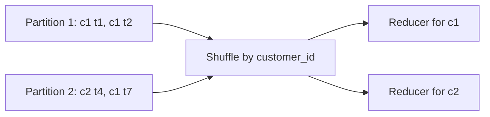

# 16 - Spark First-Principles Examples for AML/TM

This guide is the low-level companion to `15-spark-sql-pyspark-deep-learning.md`.

The purpose is to slow Spark down until it becomes obvious. We start from tiny tables, manually compute expected results, then show the same logic in PySpark and Spark SQL.

Use this file when you feel you know the words "join", "shuffle", "window", or "partition", but cannot yet see the rows moving in your head.

Companion code:

- `examples/spark/aml_spark_first_principles_examples.py`
- `examples/spark/aml_spark_first_principles_queries.sql`

For query basics with many standalone Spark SQL examples, use [`17-spark-sql-query-basics-examples.md`](17-spark-sql-query-basics-examples.md) and `examples/spark/aml_query_basics_examples.sql`.

---

## 1. First principle: Spark transforms tables

At the lowest level, most AML/TM Spark work is:

```text
input rows -> transformation rules -> output rows
```

The transformation may be simple:

```text
keep only posted transactions
```

Or complex:

```text
join transactions to historical account owners, join to historical country risk,
aggregate by customer over a 30-day window, compare to a threshold,
write alert rows and supporting transaction rows
```

But Spark still sees a graph of table transformations.

---

## 2. Tiny source data

We will use this tiny AML/TM dataset.

### Transactions

| transaction_id | account_id | transaction_date | amount_cad | transaction_type | status | country_code |
|---|---|---|---:|---|---|---|
| t1 | a1 | 2022-06-01 | 60.00 | WIRE | POSTED | IR |
| t2 | a1 | 2022-06-03 | 50.00 | WIRE | POSTED | IR |
| t3 | a1 | 2022-06-05 | 10.00 | CARD | POSTED | CA |
| t4 | a2 | 2022-06-02 | 200.00 | WIRE | POSTED | CA |
| t5 | a3 | 2022-06-02 | 20.00 | WIRE | REVERSED | IR |
| t6 | a9 | 2022-06-02 | 80.00 | WIRE | POSTED | IR |

### Account ownership history

| account_id | customer_id | effective_start_date | effective_end_date |
|---|---|---|---|
| a1 | c1 | 2020-01-01 | 2023-01-01 |
| a2 | c2 | 2020-01-01 | 2023-01-01 |
| a3 | c3 | 2020-01-01 | 2023-01-01 |

### Country risk history

| country_code | risk_level | effective_start_date | effective_end_date |
|---|---|---|---|
| IR | HIGH | 2020-01-01 | 2023-01-01 |
| CA | LOW | 2020-01-01 | 2023-01-01 |

### Rule

```text
Rule ID: TM_HIGH_RISK_WIRE_001
Generate an alert when a customer sends more than 100 CAD in posted WIRE transactions
to HIGH-risk countries during June 2022.
```

Expected result:

```text
c1 has t1 + t2 = 110 CAD high-risk posted wires.
c1 alerts.

c2 has t4 = 200 CAD, but CA is LOW risk.
c2 does not alert.

c3 has t5 = 20 CAD, but status is REVERSED.
c3 does not alert.

t6 has account_id a9, which does not resolve to a customer.
t6 is a DQ exception, not a valid alert input.
```

Final expected alert:

| customer_id | observed_amount_cad | supporting_transaction_count |
|---|---:|---:|
| c1 | 110.00 | 2 |

---

## 3. First principle: schema is a contract

Spark can infer schema, but production AML work should usually define schema explicitly.

Why?

```text
amount "60.00" as string is not the same as amount 60.00 as decimal.
transaction_date as string is not the same as transaction_date as date.
```

PySpark:

```python
from pyspark.sql import types as T

transaction_schema = T.StructType([
    T.StructField("transaction_id", T.StringType(), False),
    T.StructField("account_id", T.StringType(), True),
    T.StructField("transaction_date", T.StringType(), False),
    T.StructField("amount_cad", T.StringType(), False),
    T.StructField("transaction_type", T.StringType(), False),
    T.StructField("status", T.StringType(), False),
    T.StructField("country_code", T.StringType(), True),
])
```

Then standardize:

```python
from pyspark.sql import functions as F

tx = (
    raw_tx
    .withColumn("transaction_date", F.to_date("transaction_date", "yyyy-MM-dd"))
    .withColumn("amount_cad", F.col("amount_cad").cast("decimal(18,2)"))
    .withColumn("account_id", F.upper(F.trim("account_id")))
    .withColumn("country_code", F.upper(F.trim("country_code")))
)
```

Spark SQL:

```sql
SELECT
    transaction_id,
    UPPER(TRIM(account_id)) AS account_id,
    TO_DATE(transaction_date, 'yyyy-MM-dd') AS transaction_date,
    CAST(amount_cad AS DECIMAL(18,2)) AS amount_cad,
    transaction_type,
    status,
    UPPER(TRIM(country_code)) AS country_code
FROM raw_transactions;
```

Manual check:

```text
t1 amount changes from string "60.00" to decimal 60.00.
t1 date changes from string "2022-06-01" to date 2022-06-01.
```

---

## 4. First principle: filters remove rows

The rule only uses:

```text
status = POSTED
transaction_type = WIRE
processing month = 2022-06
```

Before filter:

```text
t1, t2, t3, t4, t5, t6
```

After `status = POSTED`:

```text
t1, t2, t3, t4, t6
```

After `transaction_type = WIRE`:

```text
t1, t2, t4, t6
```

PySpark:

```python
posted_wires = (
    tx
    .filter(F.col("status") == "POSTED")
    .filter(F.col("transaction_type") == "WIRE")
    .filter(F.col("transaction_date").between("2022-06-01", "2022-06-30"))
)
```

Spark SQL:

```sql
SELECT *
FROM tx
WHERE status = 'POSTED'
  AND transaction_type = 'WIRE'
  AND transaction_date BETWEEN DATE '2022-06-01' AND DATE '2022-06-30';
```

Learning check:

```text
Why did t3 drop? It is CARD, not WIRE.
Why did t5 drop? It is REVERSED, not POSTED.
Why did t6 remain? It passes the transaction filters, even though its account may fail later.
```

---

## 5. First principle: joins attach context

Transactions alone do not have `customer_id`.

To alert by customer, we need account ownership history.

### Point-in-time account join

```text
transaction.account_id = account_history.account_id
transaction.transaction_date >= effective_start_date
transaction.transaction_date < effective_end_date
```

Manual result:

| transaction_id | account_id | customer_id | result |
|---|---|---|---|
| t1 | a1 | c1 | matched |
| t2 | a1 | c1 | matched |
| t4 | a2 | c2 | matched |
| t6 | a9 | null | orphan |

PySpark:

```python
tx_with_customer = (
    posted_wires.alias("t")
    .join(
        account_history.alias("a"),
        (F.col("t.account_id") == F.col("a.account_id"))
        & (F.col("t.transaction_date") >= F.col("a.effective_start_date"))
        & (F.col("t.transaction_date") < F.col("a.effective_end_date")),
        "left"
    )
)
```

Spark SQL:

```sql
SELECT
    t.*,
    a.customer_id
FROM posted_wires t
LEFT JOIN account_history a
  ON t.account_id = a.account_id
 AND t.transaction_date >= a.effective_start_date
 AND t.transaction_date <  a.effective_end_date;
```

Why left join first?

```text
If we inner join immediately, t6 disappears.
If t6 disappears silently, we lose DQ evidence.
With a left join, t6 remains with customer_id = null, so we can quarantine it.
```

---

## 6. First principle: left anti join finds missing relationships

Find transaction rows that do not have an account match.

PySpark:

```python
orphan_accounts = (
    posted_wires.alias("t")
    .join(
        account_history.alias("a"),
        (F.col("t.account_id") == F.col("a.account_id"))
        & (F.col("t.transaction_date") >= F.col("a.effective_start_date"))
        & (F.col("t.transaction_date") < F.col("a.effective_end_date")),
        "left_anti"
    )
)
```

Expected:

| transaction_id | account_id |
|---|---|
| t6 | a9 |

Spark SQL:

```sql
SELECT t.*
FROM posted_wires t
LEFT ANTI JOIN account_history a
  ON t.account_id = a.account_id
 AND t.transaction_date >= a.effective_start_date
 AND t.transaction_date <  a.effective_end_date;
```

Interview phrase:

> I use left anti joins constantly for DQ coverage checks because they show what failed to match instead of hiding it.

---

## 7. First principle: reference joins classify rows

The high-risk geography rule needs country risk.

Manual classification:

| transaction_id | country_code | risk_level | keep for rule |
|---|---|---|---|
| t1 | IR | HIGH | yes |
| t2 | IR | HIGH | yes |
| t4 | CA | LOW | no |
| t6 | IR | HIGH | DQ exception because account orphan |

PySpark:

```python
valid_tx = tx_with_customer.filter(F.col("customer_id").isNotNull())

tx_with_risk = (
    valid_tx.alias("t")
    .join(
        country_risk.alias("r"),
        (F.col("t.country_code") == F.col("r.country_code"))
        & (F.col("t.transaction_date") >= F.col("r.effective_start_date"))
        & (F.col("t.transaction_date") < F.col("r.effective_end_date")),
        "left"
    )
)

high_risk_tx = tx_with_risk.filter(F.col("risk_level") == "HIGH")
```

Spark SQL:

```sql
SELECT
    t.*,
    r.risk_level
FROM valid_tx t
LEFT JOIN country_risk r
  ON t.country_code = r.country_code
 AND t.transaction_date >= r.effective_start_date
 AND t.transaction_date <  r.effective_end_date
WHERE r.risk_level = 'HIGH';
```

Subtle issue:

```text
Putting r.risk_level = 'HIGH' in the WHERE clause turns the result into high-risk matched rows only.
That is fine for rule input, but not enough for DQ.
For DQ, separately check country_code rows that failed to match any reference row.
```

---

## 8. First principle: groupBy collapses rows

Before groupBy:

| transaction_id | customer_id | amount_cad |
|---|---|---:|
| t1 | c1 | 60.00 |
| t2 | c1 | 50.00 |

After groupBy customer:

| customer_id | observed_amount_cad | supporting_transaction_count |
|---|---:|---:|
| c1 | 110.00 | 2 |

PySpark:

```python
customer_totals = (
    high_risk_tx
    .groupBy("customer_id")
    .agg(
        F.sum("amount_cad").alias("observed_amount_cad"),
        F.count("*").alias("supporting_transaction_count")
    )
)
```

Spark SQL:

```sql
SELECT
    customer_id,
    SUM(amount_cad) AS observed_amount_cad,
    COUNT(*) AS supporting_transaction_count
FROM high_risk_tx
GROUP BY customer_id;
```

Learning check:

```text
groupBy changed the grain.
Before: one row per transaction.
After: one row per customer.
```

This is one of the most important first principles in Spark and BI.

---

## 9. First principle: thresholds create alert rows

Rule threshold:

```text
observed_amount_cad > 100
```

Manual:

```text
c1 observed_amount_cad = 110
110 > 100, so c1 alerts.
```

PySpark:

```python
alerts = (
    customer_totals
    .filter(F.col("observed_amount_cad") > F.lit(100))
    .withColumn("rule_id", F.lit("TM_HIGH_RISK_WIRE_001"))
    .withColumn("rule_version", F.lit("1.0.0"))
    .withColumn("processing_month", F.lit("2022-06"))
)
```

Spark SQL:

```sql
SELECT
    customer_id,
    observed_amount_cad,
    supporting_transaction_count,
    'TM_HIGH_RISK_WIRE_001' AS rule_id,
    '1.0.0' AS rule_version,
    '2022-06' AS processing_month
FROM customer_totals
WHERE observed_amount_cad > 100;
```

Boundary test:

```text
If observed_amount_cad = 100, should it alert?
Only if the spec says >= 100.
If the spec says > 100, it should not alert.
```

---

## 10. First principle: deterministic keys make reruns safe

A deterministic alert key uses business fields, not random values.

```text
alert_key = hash(rule_id, rule_version, processing_month, customer_id)
```

PySpark:

```python
alerts = alerts.withColumn(
    "alert_key",
    F.sha2(
        F.concat_ws(
            "|",
            F.col("rule_id"),
            F.col("rule_version"),
            F.col("processing_month"),
            F.col("customer_id")
        ),
        256
    )
)
```

Spark SQL:

```sql
SHA2(CONCAT_WS('|', rule_id, rule_version, processing_month, customer_id), 256) AS alert_key
```

Why it matters:

```text
Run 1 produces the same alert_key as Run 2 for the same logical alert.
This lets you compare, merge, overwrite, deduplicate, and explain reruns.
```

---

## 11. First principle: supporting rows preserve explainability

Alert row:

| alert_key | customer_id | observed_amount_cad |
|---|---|---:|
| hash(...) | c1 | 110.00 |

Supporting transaction rows:

| alert_key | transaction_id | amount_cad |
|---|---|---:|
| hash(...) | t1 | 60.00 |
| hash(...) | t2 | 50.00 |

PySpark:

```python
supporting_transactions = (
    high_risk_tx.alias("t")
    .join(alerts.select("alert_key", "customer_id"), on="customer_id", how="inner")
    .select(
        "alert_key",
        "transaction_id",
        "customer_id",
        "account_id",
        "transaction_date",
        "amount_cad",
        "country_code",
        "risk_level"
    )
)
```

Why:

```text
An alert without supporting rows is hard to audit.
An investigator or auditor should see exactly which transactions contributed to the threshold.
```

---

## 12. First principle: partitions are buckets of work

Imagine six transactions in two partitions:

```text
Partition 1: t1, t2, t3
Partition 2: t4, t5, t6
```

A filter can run independently:

```text
Partition 1: keep t1, t2
Partition 2: keep t4, t6
```

No row needs to move between partitions.

But a groupBy customer may require movement:

```text
All rows for c1 must meet in the same place to compute SUM(amount_cad).
```

That movement is a shuffle.



Learning check:

```text
filter is usually narrow.
groupBy is usually wide.
join is often wide unless broadcast or colocated.
```

---

## 13. First principle: shuffles are expensive because data moves

Shuffle costs:

- network transfer
- disk spill
- serialization
- sorting
- waiting for slow partitions

Example:

```text
If customer c1 has 10 million transactions and most customers have 10,
the c1 reducer has much more work.
That is skew.
```

How to see it:

```text
Spark UI -> Stage -> Tasks
Look for a few tasks with huge duration or shuffle read.
```

Possible fixes:

- filter earlier
- pre-aggregate by customer/day
- broadcast small dimension tables
- split or salt skewed keys
- tune AQE/skew handling
- redesign the rule grain

---

## 14. First principle: `explain` is the map, Spark UI is the trip report

`explain` tells you what Spark plans to do.

```python
alerts.explain(True)
```

Spark UI tells you what happened.

Look at:

- jobs
- stages
- tasks
- duration
- shuffle read/write
- spill
- input size
- output size

Practical sequence:

```text
1. Run explain.
2. Predict expensive steps.
3. Run on a controlled sample or period.
4. Inspect Spark UI.
5. Tune one thing.
6. Compare output.
```

---

## 15. First principle: nulls are unknown, not zero

Tiny example:

| transaction_id | country_code |
|---|---|
| t1 | IR |
| t2 | null |
| t3 | CA |

SQL:

```sql
WHERE country_code <> 'CA'
```

Result:

```text
t1 only
```

Why not t2?

```text
null <> 'CA' is unknown, not true.
WHERE keeps true rows only.
```

If missing country should become an exception:

```sql
WHERE country_code IS NULL
```

If rule wants non-Canada plus missing:

```sql
WHERE country_code <> 'CA'
   OR country_code IS NULL
```

PySpark:

```python
df.filter((F.col("country_code") != "CA") | F.col("country_code").isNull())
```

Interview phrase:

> In Spark and SQL, nulls are not normal values. I test null behavior explicitly because it can change rule eligibility.

---

## 16. First principle: dates need boundary tests

Effective-dated record:

```text
account_id = a1
customer_id = c1
effective_start_date = 2020-01-01
effective_end_date = 2023-01-01
```

Recommended condition:

```sql
transaction_date >= effective_start_date
AND transaction_date < effective_end_date
```

Boundary behavior:

| transaction_date | should match |
|---|---|
| 2019-12-31 | no |
| 2020-01-01 | yes |
| 2022-12-31 | yes |
| 2023-01-01 | no |

Why `< effective_end_date`?

It prevents overlap when the next record starts on the same date.

```text
c1: 2020-01-01 to 2023-01-01
c2: 2023-01-01 to 9999-12-31
```

On 2023-01-01, only c2 matches.

---

## 17. First principle: deduplication needs a rule

Bad:

```python
df.dropDuplicates(["transaction_id"])
```

Why bad?

```text
If duplicate rows differ, Spark may keep either one.
```

Better:

```python
w = Window.partitionBy("source_system", "transaction_id").orderBy(F.col("ingestion_ts").desc())

deduped = (
    df
    .withColumn("rn", F.row_number().over(w))
    .filter(F.col("rn") == 1)
    .drop("rn")
)
```

First-principles question:

```text
Which row should survive?
latest ingestion?
highest source sequence?
non-null correction?
business-approved status?
```

If you cannot answer, you do not have a deduplication rule yet.

---

## 18. First principle: DQ is a parallel output

Do not only write the good rows.

Write:

```text
valid rule input rows
DQ exception rows
reconciliation metrics
```

Example exception row:

| exception_type | transaction_id | account_id | reason |
|---|---|---|---|
| ORPHAN_ACCOUNT | t6 | a9 | account_id did not match account history |

PySpark:

```python
dq_orphan_accounts = orphan_accounts.withColumn("exception_type", F.lit("ORPHAN_ACCOUNT"))
```

Reconciliation:

```text
posted wire transactions = 4
valid customer-matched posted wires = 3
orphan account exceptions = 1
unexplained difference = 0
```

This is the control mindset.

---

## 19. First principle: record-level comparison explains mismatches

Legacy alerts:

| alert_key | customer_id | observed_amount_cad |
|---|---|---:|
| k1 | c1 | 110.00 |
| k2 | c2 | 200.00 |

Cloud alerts:

| alert_key | customer_id | observed_amount_cad |
|---|---|---:|
| k1 | c1 | 110.00 |
| k3 | c3 | 150.00 |

Full outer join result:

| alert_key | status |
|---|---|
| k1 | matched |
| k2 | legacy_only |
| k3 | cloud_only |

Spark SQL:

```sql
SELECT
    COALESCE(l.alert_key, c.alert_key) AS alert_key,
    CASE
        WHEN l.alert_key IS NULL THEN 'cloud_only'
        WHEN c.alert_key IS NULL THEN 'legacy_only'
        WHEN l.observed_amount_cad <> c.observed_amount_cad THEN 'field_difference'
        ELSE 'matched'
    END AS comparison_status
FROM legacy_alerts l
FULL OUTER JOIN cloud_alerts c
  ON l.alert_key = c.alert_key;
```

PySpark:

```python
comparison = (
    legacy.alias("l")
    .join(cloud.alias("c"), on="alert_key", how="full_outer")
    .withColumn(
        "comparison_status",
        F.when(F.col("l.alert_key").isNull(), F.lit("cloud_only"))
         .when(F.col("c.alert_key").isNull(), F.lit("legacy_only"))
         .when(F.col("l.observed_amount_cad") != F.col("c.observed_amount_cad"), F.lit("field_difference"))
         .otherwise(F.lit("matched"))
    )
)
```

---

## 20. First principle: optimization must preserve meaning

Suppose a rule is slow.

Unsafe optimization:

```text
Change an inner join to a left join without checking output semantics.
```

Safe optimization:

```text
Pre-aggregate transactions by customer/day before a 30-day rolling calculation.
Then compare alert output before and after.
```

Proof checklist:

- same alert keys
- same observed amounts
- same supporting transaction counts
- same DQ exception counts
- same reconciliation totals
- golden records still pass

Performance is not a win if the business output changed silently.

---

## 21. Full tiny rule in PySpark

This is the complete rule from the first-principles example.

```python
from pyspark.sql import functions as F

posted_wires = (
    tx
    .filter(F.col("status") == "POSTED")
    .filter(F.col("transaction_type") == "WIRE")
    .filter(F.col("transaction_date").between("2022-06-01", "2022-06-30"))
)

orphan_accounts = (
    posted_wires.alias("t")
    .join(
        account_history.alias("a"),
        (F.col("t.account_id") == F.col("a.account_id"))
        & (F.col("t.transaction_date") >= F.col("a.effective_start_date"))
        & (F.col("t.transaction_date") < F.col("a.effective_end_date")),
        "left_anti"
    )
)

valid_tx = (
    posted_wires.alias("t")
    .join(
        account_history.alias("a"),
        (F.col("t.account_id") == F.col("a.account_id"))
        & (F.col("t.transaction_date") >= F.col("a.effective_start_date"))
        & (F.col("t.transaction_date") < F.col("a.effective_end_date")),
        "inner"
    )
    .select(
        F.col("t.transaction_id"),
        F.col("t.account_id"),
        F.col("t.transaction_date"),
        F.col("t.amount_cad"),
        F.col("t.transaction_type"),
        F.col("t.status"),
        F.col("t.country_code"),
        F.col("a.customer_id")
    )
)

high_risk_tx = (
    valid_tx.alias("t")
    .join(
        country_risk.alias("r"),
        (F.col("t.country_code") == F.col("r.country_code"))
        & (F.col("t.transaction_date") >= F.col("r.effective_start_date"))
        & (F.col("t.transaction_date") < F.col("r.effective_end_date")),
        "inner"
    )
    .filter(F.col("r.risk_level") == "HIGH")
)

customer_totals = (
    high_risk_tx
    .groupBy("customer_id")
    .agg(
        F.sum("amount_cad").alias("observed_amount_cad"),
        F.count("*").alias("supporting_transaction_count")
    )
)

alerts = (
    customer_totals
    .filter(F.col("observed_amount_cad") > F.lit(100))
    .withColumn("rule_id", F.lit("TM_HIGH_RISK_WIRE_001"))
    .withColumn("rule_version", F.lit("1.0.0"))
    .withColumn("processing_month", F.lit("2022-06"))
    .withColumn(
        "alert_key",
        F.sha2(F.concat_ws("|", "rule_id", "rule_version", "processing_month", "customer_id"), 256)
    )
)
```

Expected alert:

```text
customer_id = c1
observed_amount_cad = 110.00
supporting_transaction_count = 2
```

---

## 22. Debugging exercise: where did t6 go

Question:

```text
t6 exists in source, passes posted wire filters, but does not appear in alerts.
Is that correct?
```

Answer:

```text
Yes, if it is routed to DQ exceptions because account_id a9 does not match account history.
No, if it disappeared silently in an inner join with no exception record.
```

Good evidence:

```text
posted wire count = 4
valid account-matched count = 3
orphan account exception count = 1
unexplained difference = 0
```

---

## 23. Debugging exercise: why did c2 not alert

Question:

```text
c2 has a 200 CAD posted wire. Why no alert?
```

Answer:

```text
The rule is high-risk geography only.
t4 country_code = CA.
CA risk_level = LOW.
Therefore t4 is excluded after reference classification.
```

Good evidence:

```text
t4 appears in valid posted wires.
t4 joins to country risk.
t4 risk_level = LOW.
t4 does not appear in high_risk_tx.
```

---

## 24. Debugging exercise: why did c1 alert

Question:

```text
Which rows caused c1 to alert?
```

Answer:

```text
t1 = 60 CAD, WIRE, POSTED, IR, HIGH
t2 = 50 CAD, WIRE, POSTED, IR, HIGH
total = 110 CAD
threshold = > 100 CAD
110 > 100, so alert.
```

Good evidence:

```text
supporting transaction table has t1 and t2 linked to the alert key.
```

---

## 25. Practice: build expected output before code

Before writing Spark, fill this table by hand.

| Step | Count | Rows |
|---|---:|---|
| raw transactions | 6 | t1,t2,t3,t4,t5,t6 |
| posted wires | 4 | t1,t2,t4,t6 |
| account orphans | 1 | t6 |
| valid account-matched posted wires | 3 | t1,t2,t4 |
| high-risk posted wires | 2 | t1,t2 |
| customer totals | 1 | c1=110 |
| alerts | 1 | c1 |

This is how experts avoid being fooled by Spark output. They know what should happen before running the job.

---

## 26. Low-level interview story

If asked "How would you implement and validate a rule in Spark?", answer like this:

```text
I would start with tiny golden records and manually compute expected output.
Then I would standardize schema and types, filter eligible transactions,
join account ownership with point-in-time conditions, route orphan accounts to DQ exceptions,
join country risk with effective dates, aggregate at the customer grain,
apply the threshold, generate deterministic alert keys, and write supporting transactions.
I would reconcile counts after each step and compare outputs with legacy at aggregate and record level.
For performance, I would inspect explain plans and Spark UI, but only after the golden output is correct.
```

---

## 27. Closed-book first-principles drills

Answer without looking:

1. Why should you define expected output before coding Spark?
2. Which rows survive the posted WIRE filter in the tiny dataset?
3. Why is t6 a DQ exception?
4. Why does c2 not alert even though the amount is 200?
5. Why does c1 alert?
6. What does groupBy change about row grain?
7. Why does left anti join help DQ?
8. Why can an inner join hide defects?
9. What is the difference between `country_code <> 'CA'` and `country_code <> 'CA' OR country_code IS NULL`?
10. Why is `< effective_end_date` usually safer than `<= effective_end_date`?
11. What makes a deduplication rule deterministic?
12. Why should supporting transactions be stored separately from alert rows?
13. Which operations usually cause shuffles?
14. How do you know an optimization preserved business meaning?
15. What evidence proves the tiny rule is correct?
