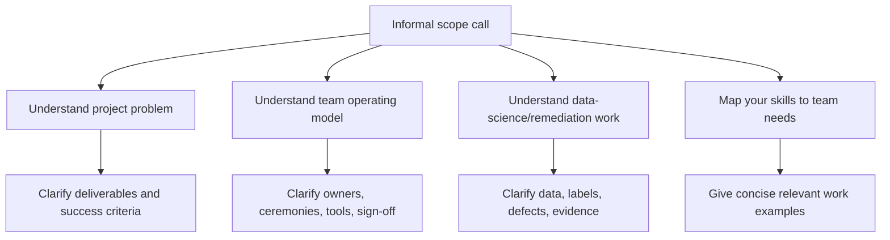

# 17 - Project Scope Call Preparation

Use this guide when a project contact says the meeting is informal and will cover project scope, how the team operates, similar work items, remediation exercises, and how your skills fit.

Public-safety note: this page is derived from a private screenshot, but it does not include the screenshot, personal names, private chat wording, or identifying details.

---

## 1. Sanitized Source Summary

The source described an informal pre-meeting or scope call. The other party offered to walk through:

- what the project entails
- how the team operates
- how the candidate's current work and skills fit
- similar data-science work items
- remediation exercises
- open questions the candidate wants to ask

This is not a formal interview, but it functions like a discovery and fit discussion.

---

## 2. Mental Model

Treat the call as four conversations happening at once:

```text
project scope -> operating model -> remediation/data-science work -> skill fit
```

The goal is not to impress with tool names. The goal is to show that you can clarify ambiguous work, connect data science to controls and evidence, and ask questions that reduce delivery risk.

---

## 3. Call Flow



---

## 4. Questions To Ask

### Project scope

| Question | Why it matters |
|---|---|
| What business or control problem is the project solving? | Separates real objective from task list. |
| What deliverables are expected from the team? | Clarifies whether work is analysis, remediation, model development, validation, reporting, or production support. |
| What time period, data domains, and source systems are in scope? | Reveals data volume, historical replay, and stitching complexity. |
| What does success look like at sign-off? | Forces evidence and acceptance criteria into the discussion. |
| What is explicitly out of scope? | Prevents accidental ownership of unclear work. |

### Team operating model

| Question | Why it matters |
|---|---|
| How is work split across data science, data engineering, QA/DQ, analytics, and business owners? | Identifies boundaries and handoffs. |
| Who owns requirements, validation, and final approval? | Clarifies governance and escalation path. |
| What tools does the team use for code, notebooks, tickets, dashboards, and evidence? | Shows day-to-day delivery mechanics. |
| How are defects triaged and closed? | Reveals whether remediation is controlled or ad hoc. |
| What recurring meetings or checkpoints drive the work? | Shows cadence and stakeholder expectations. |

### Data-science and remediation work

| Question | Why it matters |
|---|---|
| Are data scientists mainly doing exploratory analysis, feature engineering, model work, validation, or remediation analytics? | Prevents assuming the role is only model training. |
| What data-quality or reconciliation issues are currently blocking progress? | Connects analytics work to delivery risk. |
| What labels, outcomes, or target variables exist, and how reliable are they? | Surfaces leakage and label-quality risk. |
| What does a remediation exercise produce as evidence? | Clarifies expected artifacts. |
| How are analytics outputs reviewed by business, QA, or audit stakeholders? | Connects insights to sign-off. |

### Skill-fit questions

| Question | Why it matters |
|---|---|
| Which skills would make someone productive in the first 30 days? | Reveals immediate ramp-up priorities. |
| Where does the team need the most help right now? | Helps position your examples. |
| Are you looking for deeper Spark/Databricks execution, analytics, DQ/reconciliation, ML, or stakeholder coordination? | Narrows the answer to the real need. |
| What would a strong contribution look like after the first few weeks? | Converts vague fit into observable outcomes. |

---

## 5. How To Position Yourself

Use this structure:

```text
I can help connect data, controls, and evidence.
My relevant experience is [one concrete project or skill].
I would first clarify scope, data sources, expected outputs, DQ/reconciliation gates, and sign-off criteria.
Then I would produce artifacts the team can review: analysis, code/notebooks, validation outputs, dashboards, or defect evidence.
```

Example:

```text
For remediation-heavy work, I would not start by assuming the issue is a model problem.
I would profile the affected data, identify missing or inconsistent keys, quantify impacted records,
tie the issue to affected outputs, and document the fix and retest evidence.
If data science is involved, I would also check whether labels, features, and evaluation windows remain valid after remediation.
```

---

## 6. Artifacts To Listen For

When the team describes the project, listen for concrete artifacts:

- scope document
- backlog or work-item list
- data inventory
- rule inventory or analytics inventory
- DQ exception report
- reconciliation output
- defect ticket
- remediation evidence pack
- feature table
- model or analysis notebook
- dashboard or scorecard
- sign-off checklist

If the discussion stays abstract, ask which artifact proves the work is done.

---

## 7. Common Mistakes

| Mistake | Better move |
|---|---|
| Treating informal as unimportant | Prepare structured questions and take notes. |
| Asking only about tools | Ask about scope, evidence, ownership, and success criteria. |
| Assuming data science means model training | Clarify analytics, remediation, validation, feature, and governance work. |
| Over-claiming before scope is clear | State how you would clarify and prove the work. |
| Ignoring team operations | Ask how work is assigned, reviewed, and signed off. |
| Not asking about defects | Remediation work usually depends on root cause, impact, and retest evidence. |

---

## 8. Pre-Call Checklist

Before the call, prepare:

- a 30-second introduction
- one data-engineering or analytics example
- one DQ/reconciliation or remediation example
- one Spark/Databricks or SQL example if relevant
- one example of stakeholder or evidence-driven work
- five questions from section 4
- a note-taking table for scope, owners, artifacts, risks, and follow-ups

---

## 9. Note-Taking Table

| Area | Notes to capture |
|---|---|
| Project objective | Business/control problem, expected outcome, timeline |
| Scope | data domains, periods, systems, deliverables, exclusions |
| Team model | roles, owners, ceremonies, tools, approval path |
| Data science work | analysis, features, labels, models, monitoring, remediation analytics |
| DQ/remediation | known defects, root causes, affected outputs, retest evidence |
| Your fit | skills needed, first 30-day contribution, gaps to close |
| Follow-ups | documents to read, people to meet, actions, due dates |

---

## 10. Closed-Book Practice

Answer without looking:

1. Why can an informal scope call still matter as much as a formal interview?
2. What are the four conversations happening in this type of call?
3. What five questions clarify project scope?
4. What five questions clarify team operating model?
5. Why should you ask about remediation evidence?
6. How do you avoid assuming data science means only model training?
7. What should your 30-second positioning answer include?
8. What artifacts should you listen for?
9. What is a weak answer when asked how your skills fit?
10. What follow-up note should you send after the call?

### Model answers

1. An informal scope call matters because it can reveal project needs, decision makers, team operating model, delivery risks, and whether your experience fits the problem.
2. The four conversations are project scope, team operating model, remediation/evidence expectations, and skill fit.
3. Scope questions: Which rules and periods are in scope? What legacy outputs are the baseline? Which source systems feed customer/account/transaction/reference data? What are the sign-off criteria? Which known defects or data limitations already exist?
4. Team questions: Who owns rule interpretation? Who approves expected differences? How are defects triaged? What is the delivery cadence? What evidence closes remediation?
5. Ask about remediation evidence because completion is proven by reconciliation, DQ impact, defect closure, and approval, not by “work completed” status.
6. Avoid assuming data science means only model training by discussing profiling, anomaly detection, prioritization, threshold impact, feature readiness, and governance before modeling.
7. A 30-second positioning answer should include domain fit, data/platform fit, evidence/control mindset, and how you would help the team quickly.
8. Listen for rule inventory, source-to-target mapping, DQ checks, reconciliation outputs, defect log, evidence pack, dashboards, and sign-off artifacts.
9. A weak answer is a generic tool list with no connection to AML/TM controls, evidence, DQ, reconciliation, or remediation outcomes.
10. Follow up with a short note summarizing scope understood, risks heard, how your skills map to their needs, and 2-3 clarifying questions or next steps.
