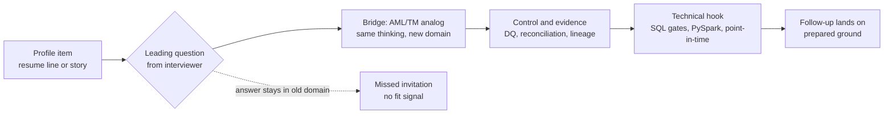

# 18 - Candidate Profile Fit: Leading Questions and Drills for AML Team Interviews

Most candidates do not fail AML/TM interviews on missing trivia. They fail on the bridge question: the interviewer reads their background, picks one item, and asks a **leading question** that invites them to map their past work onto the AML team's problems. A candidate who answers only about the past work misses the invitation; a candidate who maps it lands the fit.

Use this guide to:

- recognize leading questions for your specific background profile
- practice the mapping from your artifacts to AML/TM analogs
- anticipate the technical screen (usually SQL logic or PySpark translation) that follows the profile chat
- drill closed-book until the bridge is automatic

Companion assets:

- role-by-role knowledge: [`08-interview-knowledge-by-role-and-tech-stack.md`](08-interview-knowledge-by-role-and-tech-stack.md)
- informal scope/team-fit calls: [`17-project-scope-call-prep.md`](17-project-scope-call-prep.md)
- the technical screen that follows: [`spark/where-having-filter-placement.md`](spark/where-having-filter-placement.md) and the Spark track in [`spark/README.md`](spark/README.md)

---

## 1. First principles: how an interviewer reads a profile

An AML/TM team is hiring for four transferable signals, whatever the resume says:

```text
1. Grain thinking   - can you always say what one row means and what survives a step?
2. Control thinking - do you validate, reconcile, and produce evidence by habit?
3. Stack depth      - SQL logic, PySpark translation, Spark execution, Databricks/Delta
4. Auditability     - can your work be defended to a reviewer, auditor, or regulator?
```

A leading question is the interviewer testing one of these signals **through your own history**, because your history is the only ground where you cannot bluff. The question shape is almost always:

```text
"I see you did X. How would that work / what would change / what would you watch for
 in a transaction monitoring context?"
```

The mental model for every answer is a four-part bridge:

```text
my artifact -> AML/TM analog -> control or evidence I would add -> technical hook
```

The technical hook matters: a strong bridge answer invites a deeper technical follow-up you are ready for, which lets you steer the interview onto prepared ground.



---

## 2. Vocabulary check: "PySQL", Spark SQL, and PySpark

Interviewers and job descriptions use these terms loosely. Sort them once so a vocabulary wobble never reads as a knowledge gap:

| Term as heard | What it usually means | Safe clarifying reply |
|---|---|---|
| Spark SQL | SQL text executed by Spark (`spark.sql("...")`, SQL cells, Databricks SQL) | answer in SQL, mention it compiles to the same engine as DataFrames |
| PySpark | the Python DataFrame API (`filter`, `groupBy`, `agg`, windows) | answer in API chains, name the SQL equivalent of each step |
| "PySQL" | informal: SQL strings run from Python through `spark.sql()`, or loosely "SQL plus Python" | restate it: "SQL executed from Python in Spark - happy to show both the SQL and the DataFrame version" |

One sentence that scores well: both front doors compile through the same Catalyst optimizer, so the choice is about readability, review, and testing, not performance - then prove it by writing the same rule both ways. That exact exercise is runnable in the canonical notebook's Step 14 micro-lab and Appendix C.

---

## 3. Profile playbooks

Each playbook lists what the interviewer sees, the leading questions they reach for, the trap inside each question, the strong answer shape, and the repo assets to drill before the interview.

### 3.1 General data engineer (no AML background)

What the interviewer sees: pipelines, Spark or SQL at scale, orchestration, maybe Databricks. The open question is whether you can work in a regulated, evidence-first environment.

| Leading question | The trap | Strong answer shape |
|---|---|---|
| "Your pipelines moved marketing data. What changes when the output feeds a regulator-facing control?" | answering "nothing, data is data" | Correctness must now be **provable**: immutable bronze, versioned logic, DQ exceptions visible, reconciliation per run, batch lineage on every output row. The pipeline is the same; the evidence around it is the product. |
| "You optimized Spark jobs. When would you refuse to optimize?" | jumping into tuning tricks | During migration, equivalence comes before optimization. An optimization that changes alert behavior is a silent policy change. Optimize after parity is signed off, and prove no behavior change with before/after reconciliation. |
| "How would you rerun three months of history safely?" | describing a manual backfill | Idempotent, partitioned, parameterized reruns: deterministic keys, selective overwrite by period, point-in-time reference joins, and a run manifest so every alert traces to a batch. |
| "What is the riskiest filter in an aggregation rule?" | reciting WHERE vs HAVING trivia | Placement relative to the aggregation: a threshold pushed to row level silently stops catching split (structuring) behavior. In PySpark it is the same `.filter()` either side of `groupBy().agg()`, so I pin it with tiny golden-record tests. |

Drill before the interview: [`09-role-data-engineer.md`](09-role-data-engineer.md), [`spark/where-having-filter-placement.md`](spark/where-having-filter-placement.md), notebook Steps 1-8 plus Appendix C.

### 3.2 SQL / BI analyst

What the interviewer sees: strong SQL, dashboards, stakeholder reporting. The open question is grain discipline and whether the SQL survives a Spark/PySpark translation test.

| Leading question | The trap | Strong answer shape |
|---|---|---|
| "Your dashboard showed revenue by region. How is an alert dashboard different?" | treating it as another KPI board | Every number is a control statement. I would tie each metric to a governed definition, show reconciliation status next to the trend, and make every alert count drillable to supporting transactions - an unexplained number is a finding, not a feature. |
| "You write a lot of SQL. Walk me through WHERE vs HAVING on a monitoring rule." | textbook one-liner with no scenario | Define both gates, then volunteer the failure that matters here: an amount threshold in WHERE misses customers who split transactions; only HAVING on the group total catches structuring. Offer the row trace on a tiny example. |
| "We use PySpark, not just SQL. How do you bridge?" | "I'd learn it on the job" | The logic transfers one-to-one: WHERE is `.filter()` before `groupBy`, HAVING is `.filter()` on the aggregate's alias after `agg`, and PySpark has no HAVING keyword - placement carries the meaning. Then name one thing SQL hides that the API exposes: the aggregated grain becomes an explicit DataFrame you can test. |
| "Your numbers disagreed with another team's. What did you do?" | blaming the other team's data | Reconcile at three levels - population (filters and date boundaries), grain (alert vs supporting transaction), and definition (governed metric) - and show the tie-out, because in AML the discrepancy itself must be documented. |

Drill before the interview: [`10-role-data-analyst-bi.md`](10-role-data-analyst-bi.md), [`spark/spark-sql-query-basics-examples.md`](spark/spark-sql-query-basics-examples.md), [`spark/where-having-filter-placement.md`](spark/where-having-filter-placement.md), notebook Appendix B then Appendix C.

### 3.3 Legacy ETL / SAS / mainframe developer

What the interviewer sees: exactly the systems being migrated away from. The open question is whether you are a bridge or a blocker. This profile has the strongest hidden advantage in lookback projects.

| Leading question | The trap | Strong answer shape |
|---|---|---|
| "We are replacing the stack you know. How do you feel about that?" | defending the legacy stack, or trashing it | The migration's hardest problem is reconstructing legacy behavior, and I can read it at the source: implicit type coercions, merge semantics, macro-driven parameters, scheduler assumptions. I am the person who can say what the old rule actually did, not what its comment claims. |
| "Why is rule migration not just code translation?" | describing syntax conversion | Behavior lives outside the code: parameter tables, data quirks the logic silently relies on, undocumented exclusions, date semantics. I would rebuild rules as specs with golden records, then prove equivalence by reconciliation, period by period. |
| "Where would a SAS-to-PySpark port silently break?" | "the syntax is different" | Nulls and grain: legacy merge/sort behavior versus Spark joins, implicit type handling versus explicit casts, and filter placement around aggregation - a PROC SUMMARY threshold has to land after `groupBy().agg()`, not on rows. Each one is testable with tiny golden records. |
| "How current is your cloud knowledge?" | apologizing for the gap | Name what you have already done in this repo's stack: ran the medallion flow, wrote the same rule in Spark SQL and PySpark, reconciled the two. Frame it as: deep legacy semantics plus working cloud literacy is rarer than either alone. |

Drill before the interview: [`03-rule-migration-spec-as-code.md`](03-rule-migration-spec-as-code.md), [`02-5year-lookback-azure-modernization.md`](02-5year-lookback-azure-modernization.md), notebook top-to-bottom once, then Appendix C.

### 3.4 Backend / application developer moving to data

What the interviewer sees: engineering rigor, testing culture, APIs - but no data-grain track record. The open question is set thinking versus record-at-a-time thinking.

| Leading question | The trap | Strong answer shape |
|---|---|---|
| "How is processing 100M transactions different from handling 100M requests?" | talking about throughput only | Requests are independent; monitoring is **relational and temporal** - the unit of suspicion is a pattern across rows (a customer's month of wires), so the work is joins, grouping grains, and windows, and the failure modes are row explosion and silent population drift, not latency. |
| "You unit test everything. How would you test a monitoring rule?" | proposing mocks and coverage metrics | Golden records: tiny curated inputs with known expected alerts, including the two traps - rows individually under a threshold whose total must alert, and ineligible rows that must not contaminate a total. Assert account sets, amounts, and supporting IDs, not just schemas. |
| "Where would your instincts mislead you in PySpark?" | "they wouldn't" | Loops and per-record handlers: the instinct to iterate becomes `groupBy`/window logic; lazy evaluation means errors surface at actions, not where the bug is; and `filter` position around `agg` changes semantics while types stay identical, so the compiler cannot save you. |
| "Why do you want a regulated data team?" | generic "I like data" | The engineering bar that backend developers value - determinism, idempotency, observability - is the actual product here: reruns must be reproducible and every output must carry evidence. It is rigor applied where it is mandatory, not optional. |

Drill before the interview: [`spark/first-principles-examples.md`](spark/first-principles-examples.md), [`spark/pyspark-dataframe-basics-examples.md`](spark/pyspark-dataframe-basics-examples.md), notebook Appendix A then Appendix C.

### 3.5 Data scientist / ML practitioner

What the interviewer sees: modeling skill. The open question is whether you respect that AML is rules-and-evidence first, and whether your data handling is point-in-time safe.

| Leading question | The trap | Strong answer shape |
|---|---|---|
| "Why not replace the rules with a model?" | agreeing enthusiastically | Rules are governed policy: explainable, tunable, auditable, and regulator-facing. ML earns its place around them - alert prioritization, false-positive analysis, segmentation - with explainability and monitoring. Replacing policy with an opaque score is a governance regression. |
| "Your features used customer history. What could go wrong here?" | listing generic leakage talk | Point-in-time leakage with teeth: using today's risk rating or post-alert outcomes to score last year's transaction means training on the future. Every feature needs an as-of join against effective-dated reference data, and I would test boundary dates explicitly. |
| "How do you build features on transactions at scale?" | pandas-first answers | Window functions and grouped aggregations in PySpark on reconciled silver/gold data, with the same filter-placement discipline as rules: eligibility before the aggregation, behavioral thresholds after it - a feature pipeline with a misplaced filter learns a different behavior than specified. |
| "An investigator asks why your model flagged this customer. What do you show?" | quoting SHAP without context | Evidence chain first: the inputs (which reconciled rows), the feature values, the contribution explanation, and the model version/lineage from MLflow - the same alert-as-lineage-object standard rules are held to. |

Drill before the interview: [`ml/aml-ml-data-science-guide.md`](ml/aml-ml-data-science-guide.md), [`spark/spark-sql-pyspark-deep-learning.md`](spark/spark-sql-pyspark-deep-learning.md) windows and point-in-time sections, notebook Step 12 and Appendix C.

### 3.6 Business analyst / MBA / product-strategy profile

What the interviewer sees: requirements work, stakeholder management, business cases, maybe consulting. The open question is whether you can translate between compliance, business owners, and engineers **with enough data literacy to be precise** - not whether you can code.

| Leading question | The trap | Strong answer shape |
|---|---|---|
| "You wrote requirements for product teams. What is different about requirements for a monitoring rule?" | treating rules as features | A rule is policy, so the spec must be executable and testable: population definition, eligibility filters, threshold and window, exclusions, edge cases, and the evidence that proves the build matches the approved behavior. Ambiguity here is not a backlog item; it is a compliance defect. |
| "How would you run the meeting where business and engineering disagree on an alert count?" | process talk with no data anchor | Anchor on grain and population first: are both sides counting the same thing (alerts vs supporting transactions) over the same population (filters, date boundaries)? Most "disagreements" are definition mismatches, so I would walk the reconciliation levels before opinions. |
| "You do not code. How will you keep engineers honest?" | promising to learn PySpark deeply | I read logic even if I do not write it: I can trace whether a threshold sits before or after the aggregation and ask the structuring question - "if a customer splits the amount, does this still alert?" That one question catches the most expensive class of rule defect, and I verify with golden-record acceptance cases, not code review. |
| "Where does the business case for modernization come from in an AML program?" | cost savings only | Risk and evidence economics: faster lookback replays, fewer manual reconciliations, defensible audit trails, and tuning agility under governance. Cost matters, but the buyer is risk reduction with proof - regulator findings are more expensive than infrastructure. |
| "What would you own in the first 90 days?" | generic onboarding plan | The artifacts that bridge sides: rule inventory and spec backlog, definition catalog for alert metrics, expected-difference register for the migration, and the sign-off path - who approves a behavior change and what evidence they need to see. |

Drill before the interview: [`19-role-business-analyst.md`](19-role-business-analyst.md) (the target role guide for this profile), [`01-aml-transaction-monitoring-foundations.md`](01-aml-transaction-monitoring-foundations.md), [`03-rule-migration-spec-as-code.md`](03-rule-migration-spec-as-code.md), [`17-project-scope-call-prep.md`](17-project-scope-call-prep.md), and sections 1, 5, and 6 of [`spark/where-having-filter-placement.md`](spark/where-having-filter-placement.md) (concepts only - the structuring trap is explainable without code).

Business-profile data literacy floor - own these five sentences and you can hold any technical conversation on the team:

```text
1. Every table has a grain: what one row means.
2. Filters before aggregation define who is counted; filters after define which totals matter.
3. A customer who splits amounts is caught only by the aggregated view.
4. A count that matches can still hide wrong amounts and wrong evidence.
5. Every alert must trace to its inputs, rule version, and run.
```

---

## 4. The technical screen that follows the profile chat

Profile questions and technical screens are one conversation: the interviewer uses your background to pick the screen. Prepare the pair, not the parts.

| If your profile says | Expect this screen | Drill asset |
|---|---|---|
| "strong SQL" | WHERE vs HAVING with a structuring scenario; rewrite in PySpark | [`spark/where-having-filter-placement.md`](spark/where-having-filter-placement.md), notebook Appendix C |
| "PySpark pipelines" | same rule in Spark SQL and DataFrame API, reconcile the outputs | notebook Step 14 micro-lab |
| "performance tuning" | when optimization is allowed, plan reading, shuffle reasoning | [`spark/spark-sql-pyspark-deep-learning.md`](spark/spark-sql-pyspark-deep-learning.md) |
| "BI / dashboards" | grain of an alert metric, tie-out to source, filter behavior | [`10-role-data-analyst-bi.md`](10-role-data-analyst-bi.md) |
| "testing culture" | design golden records for an aggregation rule | [`12-role-qa-dq-engineer.md`](12-role-qa-dq-engineer.md), section 8 of the filter-placement guide |
| "ML features" | point-in-time joins, leakage, window functions | [`spark/spark-sql-pyspark-deep-learning.md`](spark/spark-sql-pyspark-deep-learning.md), [`ml/aml-ml-data-science-guide.md`](ml/aml-ml-data-science-guide.md) |
| "business analyst / MBA" | grain and population probing in plain language; spec a rule from a policy sentence | [`03-rule-migration-spec-as-code.md`](03-rule-migration-spec-as-code.md), [`templates/rule_spec_template.yaml`](../templates/rule_spec_template.yaml) |

---

## 5. Failure modes: answers that lose the fit

| Failure mode | Why it loses | Repair |
|---|---|---|
| Staying in the old domain | ignores the invitation; interviewer cannot see transfer | always finish the bridge: analog, control, hook |
| Tool-list answers | names technologies, proves no thinking | one concrete artifact plus the evidence it produced beats ten tools |
| Faking AML depth | one follow-up exposes it and poisons real strengths | own the gap, show the learning system: case study, runnable labs, drills |
| Dismissing legacy or rules as outdated | the team lives with both; you just insulted the work | respect behavior reconstruction; modernize the platform, preserve the policy |
| No evidence vocabulary | regulated teams hire for proof habits | every answer ends with what would convince a reviewer: counts, tie-outs, golden records, lineage |
| Conflating correctness and performance | optimization that changes alerts is a policy change | equivalence first, optimization after sign-off, reconciliation proves both |

---

## 6. Self-drill protocol

Run this loop out loud, three profile items per session:

1. Write one resume line or project story in a single sentence.
2. Generate the leading question an AML interviewer would build from it (use the playbook shapes above).
3. Answer in 90 seconds using the bridge: artifact, AML/TM analog, control/evidence, technical hook.
4. Take the hook yourself: answer the technical follow-up you just invited (for example, run the WHERE/HAVING trace from memory).
5. Score against the four signals from section 1: grain, control, stack, auditability. Repair the weakest and repeat.

Pair it with [`templates/retrieval_session_template.md`](../templates/retrieval_session_template.md) for spaced practice.

---

## 7. Closed-book drills

Answer without looking:

1. What four transferable signals is an AML/TM team probing when it asks leading questions off your profile?
2. State the four-part bridge structure for answering any leading question.
3. You are a BI analyst asked "we use PySpark, not just SQL - how do you bridge?" Give the strong answer in three sentences.
4. You are a legacy SAS developer asked how you feel about your stack being replaced. What makes the strong answer strong?
5. An interviewer hears "strong SQL" on your profile. Which technical screen should you expect, and which trap inside it separates candidates?
6. Name three answers that lose fit even when technically correct, and the repair for each.
7. A backend developer claims their unit-testing habits transfer directly. What is the AML-specific upgrade to that claim?
8. Why does "equivalence before optimization" come up in profile questions for performance-focused engineers?

### Model answers

1. Grain thinking (what one row means and what survives each step), control thinking (validation, reconciliation, evidence by habit), stack depth (SQL logic, PySpark translation, Spark execution, Databricks/Delta), and auditability (work defensible to reviewers and regulators).
2. My artifact, then the AML/TM analog, then the control or evidence I would add, then a technical hook that invites a follow-up I am prepared for.
3. The logic transfers one-to-one: WHERE is a `.filter()` before `groupBy` and HAVING is a `.filter()` on the aggregate's alias after `agg`. PySpark has no HAVING keyword, so position in the chain carries the meaning. The API even helps: the aggregated grain becomes an explicit DataFrame I can test directly.
4. It reframes the candidate from blocker to bridge: the migration's hardest problem is reconstructing what legacy rules actually did, and the legacy developer can read behavior at the source - implicit coercions, merge semantics, parameter tables - then prove equivalence with golden records and reconciliation.
5. A WHERE vs HAVING screen wrapped in a monitoring scenario, usually with a PySpark translation. The separating trap is the structuring case: an amount threshold placed at row level misses customers who split transactions; only the group-level threshold catches them, and in PySpark only filter placement distinguishes the two.
6. Staying in the old domain (finish the bridge), tool-list answers (one artifact plus its evidence), and dismissing legacy or rules (respect behavior reconstruction; modernize platform, preserve policy). Faking AML depth also qualifies - own the gap and show the learning system instead.
7. Replace coverage-and-mocks framing with golden records on tiny data: a case where rows individually fail a threshold but the group must alert, a case where ineligible rows must not contaminate a total, and assertions on account sets, amounts, and supporting transaction IDs - behavioral proof at the business grain, not just passing tests.
8. Because tuning that changes alert behavior is an ungoverned policy change in a regulated control system. The expected answer sequences the work: prove legacy-to-cloud equivalence first, optimize after sign-off, and demonstrate with before/after reconciliation that performance work changed no outcomes.
