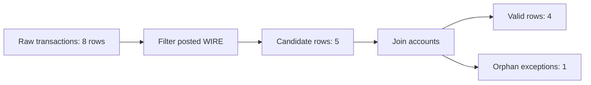

# 18 - Runnable Code Example Standards

This repository should not contain fake coding examples.

For learning code, "example" means something the learner can run step by step with a known setup and known expected output. Short fragments are allowed only when they are explicitly marked as concept fragments and linked to a runnable version.

---

## 1. Runnable example contract

Every runnable code example must include:

1. **Purpose** - what the learner is proving.
2. **Environment** - where it runs, such as Databricks SQL, Spark SQL, PySpark, or local shell.
3. **Setup** - tables, temp views, sample rows, imports, and schemas.
4. **Run order** - numbered steps or cells.
5. **Expected output** - row counts, specific rows, or validation checks.
6. **Failure checks** - what wrong output means.
7. **Cleanup or rerun behavior** - if the example writes state.

Minimum acceptable pattern:

```text
Step 0: Create tiny input tables.
Step 1: Run one transformation.
Step 2: Inspect output.
Step 3: Validate expected counts or rows.
Step 4: Explain what changed and why.
```

---

## 2. Code block labels

Use one of these labels before any code block.

### Runnable

Use when the learner can run the block after completing prior setup steps in the same doc or companion file.

```text
Runnable after Step 0 setup.
```

### Standalone runnable

Use when the block includes all setup needed to run by itself.

```text
Standalone runnable in Databricks SQL.
```

### Concept fragment

Use only when the code is intentionally incomplete and exists to explain a small concept.

```text
Concept fragment, not runnable alone. Full runnable version: examples/spark/...
```

Avoid concept fragments in beginner-facing docs. Prefer runnable examples.

---

## 3. SQL example standard

A SQL learning file should use this structure:

```sql
-- Step 0. Setup tiny tables.
CREATE OR REPLACE TEMP VIEW transactions AS ...

-- Step 1. Query candidate rows.
SELECT ...

-- Expected:
-- transaction_id values: t1,t2,t4

-- Step 2. Validation query.
SELECT
  CASE WHEN COUNT(*) = 3 THEN 'PASS' ELSE 'FAIL' END AS test_status
FROM ...
```

For AML/TM examples, include:

- expected row count
- expected business keys
- expected DQ exceptions
- expected alert rows
- expected supporting rows
- expected reconciliation totals

---

## 4. PySpark example standard

A PySpark learning file should use this structure:

```python
"""Purpose and environment."""

from pyspark.sql import SparkSession
from pyspark.sql import functions as F
from pyspark.sql import types as T

spark = SparkSession.builder.appName("example-name").getOrCreate()

# Step 0: Create tiny input DataFrames.

# Step 1: Transform.

# Step 2: Show output.

# Step 3: Validate expected output.
actual = result.count()
expected = 1
assert actual == expected, f"Expected {expected}, got {actual}"
```

For PySpark examples:

- define schemas explicitly
- create tiny in-memory DataFrames
- use deterministic ordering before display
- include assertions for important outputs
- avoid external files unless the setup creates them
- avoid hidden dependencies on private paths or production tables

---

## 5. Diagram standard

Every beginner code example should include at least one low-level diagram when row movement matters.

Useful diagram types:

```text
input rows -> filter -> output rows
left table + right table -> join result
transaction rows -> groupBy customer -> customer totals
candidate rows -> DQ exceptions + valid rows
```

Example:



---

## 6. Anti-patterns

Do not write examples like this:

```python
df = spark.read.table("some_table")
df.filter(...).show()
```

Why it is weak:

- no setup
- no schema
- no rows
- no expected output
- no validation
- may depend on a private table

Better:

```python
transactions = spark.createDataFrame([...], schema=transaction_schema)
posted_wires = transactions.filter(...)
assert posted_wires.count() == 5
```

Do not use:

- unexplained `...`
- private paths
- production table names without setup
- hidden variables
- random output without seeding
- examples that cannot be copied and run

---

## 7. Review checklist

Before committing a code example, answer:

1. Can a learner run it from a clean notebook or shell?
2. Are all input rows created in the example or companion setup?
3. Is the run order explicit?
4. Are expected outputs written down?
5. Are there validation checks?
6. Does it avoid private data and private paths?
7. Does it teach why each step exists?
8. Does it show what failure means?
9. Is there a companion runnable file if the Markdown has many snippets?
10. Did `npm run lint` and relevant syntax checks pass?

---

## 8. Current runnable example files

Spark examples:

- `examples/spark/aml_spark_first_principles_examples.py`
  - Environment: PySpark or Azure Databricks Python notebook.
  - Setup: creates tiny in-memory DataFrames.
  - Validation: Python `assert` checks for counts, alert customer, supporting transactions, and DQ exception.

- `examples/spark/aml_spark_first_principles_queries.sql`
  - Environment: Databricks SQL or Spark SQL notebook.
  - Setup: creates temp views.
  - Validation: final query returns `PASS` / `FAIL` checks.

- `examples/spark/aml_query_basics_examples.sql`
  - Environment: Databricks SQL or Spark SQL notebook.
  - Setup: creates temp views.
  - Validation: final query returns `PASS` / `FAIL` checks.
