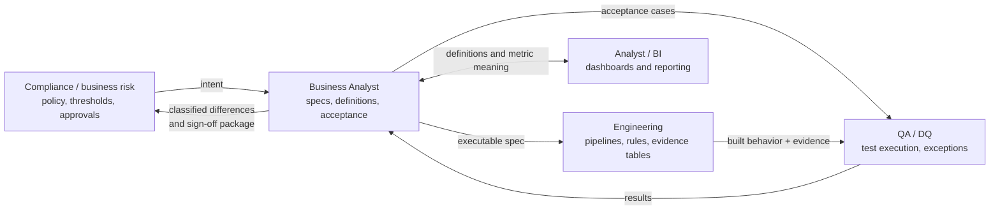

# 19 - Role Guide: Business Analyst (AML/TM)

This guide is for candidates targeting the Business Analyst seat on an AML / Transaction Monitoring modernization team: business analysts, product owners, consultants, and MBA-track candidates moving toward regulated data programs.

The BA role here is not generic requirements gathering. It is owning the **translation layer** between compliance policy, business owners, and engineering - precisely enough that what gets built is provably what was approved.

Use this guide with:

- profile-fit leading questions for this background: [`18-candidate-profile-fit-interview-drills.md`](18-candidate-profile-fit-interview-drills.md), section 3.6
- spec-as-code method: [`03-rule-migration-spec-as-code.md`](03-rule-migration-spec-as-code.md)
- informal scope calls: [`17-project-scope-call-prep.md`](17-project-scope-call-prep.md)

---

## 1. Role scope

### What the Business Analyst owns

- Rule and requirement inventory: what exists, who owns it, what state it is in.
- Rule specifications: executable, testable definitions of monitoring behavior.
- Definition catalog: one approved meaning per business term and metric.
- Acceptance criteria and golden-record cases for UAT.
- Expected-difference register: proposed classifications of legacy/cloud differences.
- Traceability: every requirement maps to a spec, a build item, a test, and evidence.
- Decision log: what was decided, by whom, with what rationale.
- The sign-off package narrative: assembling evidence into an approvable story.

### What this role does not own alone

- Policy and threshold decisions: compliance and business risk own them; the BA makes them explicit and testable.
- Approval of expected differences: the BA classifies and proposes; the accountable owner approves.
- Pipeline and rule implementation: engineering owns the build; the BA owns whether it matches the spec.
- Test execution mechanics: QA owns execution; the BA owns acceptance criteria and business cases.
- Architecture: the architect owns boundaries; the BA supplies the business constraints.

---

## 2. Mental model

```text
policy intent -> executable spec -> built behavior -> acceptance evidence -> sign-off
```

Two principles drive everything in this role:

```text
1. Ambiguity is a compliance defect, not a backlog item.
   An ambiguous monitoring requirement does not produce a flexible system;
   it produces an unapproved decision made silently by whoever wrote the code.

2. A requirement is done when it is provable, not when it is built.
   "Matches legacy" is not a requirement until legacy behavior is defined,
   and "works" is not acceptance until evidence exists that an approver can read.
```

The BA's daily test: for any sentence in a requirement, ask "could two reasonable engineers implement this differently?" If yes, the sentence is not done.

---

## 3. Ownership boundary diagram



The BA sits on every edge of this diagram. When an edge has no owner, requirements drift, definitions fork, and differences get approved by accident.

---

## 4. Theory you must know

### 4.1 A rule spec is not a user story

A product user story tolerates discovery during the sprint. A monitoring rule spec cannot, because the behavior **is** the control.

| Dimension | Feature user story | AML rule spec |
|---|---|---|
| Ambiguity | resolved during build | resolved before build, in writing |
| Acceptance | demo and product judgment | golden records with expected outputs |
| Change | iterate freely | versioned, approved, replayable |
| Failure cost | rework | unapproved policy change, audit finding |

A complete rule spec states: population definition, eligibility filters, grouping grain, threshold and operator, time window and boundaries, exclusions, reference-data effective-dating, output fields, edge cases, and the evidence that proves each part.

### 4.2 Population, grain, and the two filter gates

The data literacy floor for this role, in plain language:

```text
1. Every table has a grain: what one row means.
2. Filters before aggregation define WHO IS COUNTED.
   Filters after aggregation define WHICH TOTALS MATTER.
3. A customer who splits amounts is caught only by the aggregated view.
4. A count that matches can still hide wrong amounts and wrong evidence.
5. Every alert must trace to its inputs, rule version, and run.
```

Point 2 is the difference between SQL's `WHERE` and `HAVING`, and it is a BA-level concern: "alert accounts whose posted wires total over 10,000" contains both gates in one sentence, and a spec that does not separate them invites the implementation to merge them. The review question that catches the most expensive rule defect requires no code:

```text
"If a customer splits the amount into pieces below the threshold,
 does this still alert?"
```

Concepts (no code needed): sections 1, 5, and 6 of [`spark/where-having-filter-placement.md`](spark/where-having-filter-placement.md).

### 4.3 Expected difference versus defect

During migration, legacy and cloud outputs will differ. The BA's job is to make every difference one of two things:

| Classification | Meaning | Required from the BA |
|---|---|---|
| Expected difference | approved, explained, documented | written rationale, impact quantification, owner approval, register entry |
| Defect | unapproved mismatch | defect record, root-cause ownership, retest criteria, closure evidence |

There is no third category. A difference that is "probably fine" is a defect until classified. The amount-drift factor catalog in [`04-data-quality-reconciliation-defect-management.md`](04-data-quality-reconciliation-defect-management.md) section 11 is the BA's vocabulary for these conversations.

### 4.4 Acceptance evidence and golden records

The BA defines acceptance as tiny curated cases with known expected outcomes:

- a case where rows individually stay under the threshold but the customer total must alert (catches a threshold placed at the wrong gate)
- a case where ineligible rows must not contaminate a total (catches a missing eligibility filter)
- a boundary case at exactly the threshold, and one cent either side
- a case with a customer whose risk rating changed mid-period (catches point-in-time errors)
- a duplicate and a reversal (catches dedupe and netting behavior)

The BA does not run Spark to define these. The BA writes the inputs and expected outputs in business terms; QA and engineering automate them.

---

## 5. Artifacts and what good looks like

| Artifact | What good looks like | Template |
|---|---|---|
| Rule inventory | every legacy rule with owner, purpose, inputs, parameters, schedule, known defects, migration status | start from [`03-rule-migration-spec-as-code.md`](03-rule-migration-spec-as-code.md) |
| Rule specification | business-readable and engineering-testable; no sentence implementable two ways | [`../templates/rule_spec_template.yaml`](../templates/rule_spec_template.yaml) |
| Definition catalog | one approved definition per term (alert, case, eligible population, posted, monitoring month) with owner and date | section 4.2 of [`10-role-data-analyst-bi.md`](10-role-data-analyst-bi.md) for metric definitions |
| Golden-record acceptance cases | tiny inputs, expected outputs, and the failure each case exists to catch | section 4.4 above |
| Expected-difference register | classification, rationale, quantified impact, approver, date | section 4.3 above |
| Traceability matrix | requirement -> spec section -> build item -> test -> evidence link, with no orphan rows in either direction | - |
| Decision log | decision, options considered, owner, date, and the spec sections it changed | [`../templates/meeting_to_memory_converter.md`](../templates/meeting_to_memory_converter.md) |
| Sign-off package narrative | a reviewer can reconstruct what was built, what was tested, what differs, and who approved what | section 9 of [`04-data-quality-reconciliation-defect-management.md`](04-data-quality-reconciliation-defect-management.md) |

---

## 6. Lifecycle playbook

1. **Intake**: capture the policy intent, the requesting owner, the affected rules and periods, and what "done" means to the approver - before discussing solutions.
2. **Elicitation**: interview compliance and operations with grain questions: who is counted, over what window, with which exclusions, at which boundaries. Write down what legacy *actually does*, not what people remember it doing.
3. **Draft the spec**: one rule per spec, every field of the template filled or explicitly marked as an open question with an owner.
4. **Walkthrough**: review the spec with engineering and QA together. Every "we'll figure that out during build" becomes an open question with an owner and a date.
5. **Build support**: answer questions in writing against the spec; spec changes are versioned, never verbal.
6. **Acceptance**: run UAT against golden records. A failed case is either a build defect or a spec defect - both are findings, neither is a surprise to absorb silently.
7. **Reconciliation review**: read the legacy/cloud comparison with the diagnostic mindset of doc 04 section 11; classify every difference (4.3).
8. **Sign-off**: assemble the package so the approver reads a narrative, not a folder of files.
9. **Change control**: post-sign-off changes restart from step 3 with a new version, however small.

---

## 7. Worked example: from policy sentence to testable spec

Policy sentence as received:

```text
"We need to catch customers sending large wire amounts to high-risk countries."
```

A feature-style story would stop near there. The BA's spec extracts every hidden decision:

```yaml
rule_id: TM_HIGH_RISK_WIRE_001
intent: detect aggregate wire activity to high-risk countries above threshold
population: customers with ACTIVE status as of the processing month
eligibility:
  transaction_type: WIRE
  status: POSTED            # decision: reversals excluded - approved by ops 2022-05-10
  country_risk: HIGH        # via country_risk reference, point-in-time on transaction_date
window: calendar month, transaction_date basis   # decision: NOT posting_date
grain: one alert per customer per month per rule version
threshold: SUM(amount_cad) > 10000               # group total, not per-transaction
boundaries: exactly 10000 does not alert; tested at 9999.99 / 10000.00 / 10000.01
exclusions: internal test accounts (list ref), same-customer transfers
output: alert key, customer, window, trigger amount, supporting transaction ids
open_questions: []          # spec is not approvable while this is non-empty
```

Every comment marks a decision that, left unwritten, an engineer would have made alone. The threshold line is the section 4.2 lesson: the policy said "large amounts," and the BA had to determine - and document - that the control targets the aggregate, so splitting cannot evade it.

---

## 8. Stack literacy for this role

The bar is reading and verifying, not writing code.

| Stack piece | What the BA does with it |
|---|---|
| Databricks SQL | read verification queries; check a definition catalog entry against the governed table it claims to come from |
| Canonical notebook | read the explanation cells and predict outputs; the [`one-stop notebook`](../examples/spark/notebooks/aml_databricks_one_stop_learning.ipynb) narrates every code cell for exactly this audience |
| Delta / Unity Catalog | understand that tables are versioned and governed, and lineage answers "where did this number come from" |
| Power BI | challenge dashboard numbers via the definition catalog: metric, grain, filters, refresh |
| ADO / Jira / Confluence | traceability and decision logs live where the team works, not in private notes |
| Rule spec repo | specs are versioned artifacts; the BA owns their content lifecycle |

---

## 9. Q&A bank

### Q1. How is writing requirements for a monitoring rule different from writing user stories?

> A rule is policy, so the spec must be executable and testable before build: population, eligibility, grain, threshold, window, boundaries, exclusions, and the evidence proving each. Ambiguity is not discovered during a sprint; it is an unapproved decision made silently in code. My test is whether two engineers could implement a sentence differently - if yes, it is not done.

### Q2. Business and engineering disagree on an alert count. Run the meeting.

> I anchor on definitions before opinions: are both sides counting the same thing (alerts versus supporting transactions) over the same population (filters, date basis, boundaries) for the same period? Most disagreements are definition mismatches, so I walk the reconciliation levels - population, grain, definition - and the meeting output is either a definition catalog fix or a classified difference with an owner.

### Q3. You do not code. How do you keep the build honest?

> I read logic even though I do not write it, and I design acceptance so honesty is testable: golden records where splitting amounts must still alert, where ineligible rows must not contaminate totals, and where boundary values behave as approved. The structuring question - "if the customer splits the amount, does this still alert?" - catches the most expensive class of rule defect and needs no code.

### Q4. A legacy/cloud comparison shows differences. What do you do with them?

> Every difference becomes one of exactly two things: an expected difference with rationale, quantified impact, and an owner's approval in the register, or a defect with root-cause ownership and retest criteria. There is no "probably fine." I use the amount-drift factor catalog to put a name on each difference before classification.

### Q5. What does your sign-off package look like?

> A narrative an approver can read: what was specified, what was built against it, what golden records and UAT proved, what differs from legacy and who approved each difference, what defects remain with severity, and what the approver is actually signing. Evidence files support the narrative; they are not a substitute for it.

### Q6. The team wants to start building while requirements are still moving. What do you do?

> I separate what is stable from what is open: stable sections get versioned and built; open questions get owners and dates, not optimism. Building against an unowned open question in a monitoring rule means someone unapproved is deciding policy. If the timeline cannot absorb that discipline, that is a risk decision for the project owner to make explicitly - and I put it in the decision log.

### Q7. How do you add value in the first 90 days?

> The bridge artifacts: rule inventory with owners and states, the definition catalog for contested terms, the expected-difference register before reconciliation produces surprises, and the sign-off path - who approves behavior changes and what evidence they need. Those four make every later conversation shorter.

---

## 10. Common mistakes

- Writing rules as feature stories and resolving meaning during the build.
- Specifying a threshold without stating which side of the aggregation it sits on.
- Leaving "matches legacy" as acceptance without defining what legacy actually does.
- Keeping decisions in meeting memory instead of a versioned log tied to spec sections.
- Letting "probably fine" differences pass reconciliation unclassified.
- Treating the definition catalog as documentation instead of a control.
- Accepting UAT pass counts without checking the cases cover boundaries, splits, duplicates, and point-in-time changes.
- Assembling sign-off as a folder of files instead of an approvable narrative.
- Confusing this role with BI: the analyst reports on outcomes; the BA defines what the system must do and proves it does it.

---

## 11. Closed-book drills

Answer without looking:

1. State the two principles of the BA mental model and what each prevents.
2. Name six fields a complete rule spec must define beyond "the requirement."
3. Recite the five-sentence data literacy floor.
4. What single review question catches a threshold placed at the wrong filter gate, and why does it need no code?
5. What are the only two classifications for a legacy/cloud difference, and what does each require?
6. Name five golden-record cases every aggregation rule's acceptance should include.
7. What makes a sign-off package approvable rather than just complete?
8. Where does the BA's ownership end on thresholds, and what does the BA still own about them?
9. How does this role differ from the Data Analyst / BI role?
10. The team wants to build while requirements are open. What is the disciplined response?

### Model answers

1. Ambiguity is a compliance defect (prevents unapproved decisions being made silently in code) and a requirement is done when it is provable, not when it is built (prevents acceptance without evidence).
2. Population, eligibility filters, grouping grain, threshold and operator, time window and date basis, boundary behavior, exclusions, reference-data effective-dating, output fields, and edge cases.
3. Every table has a grain; filters before aggregation define who is counted and filters after define which totals matter; split amounts are caught only by the aggregated view; matching counts can hide wrong amounts and evidence; every alert traces to inputs, rule version, and run.
4. "If a customer splits the amount into pieces below the threshold, does this still alert?" It tests the business behavior of the control directly, so the answer exposes the gate placement regardless of implementation language.
5. Expected difference (rationale, quantified impact, owner approval, register entry) or defect (record, root-cause owner, retest criteria, closure evidence). Nothing stays unclassified.
6. A split-amounts case that must alert, an ineligible-rows case that must not contaminate totals, exact-threshold and one-cent-either-side boundaries, a mid-period risk-rating change, and a duplicate plus a reversal.
7. A narrative the approver can read - specified, built, proved, differing, approved by whom - with evidence supporting the story, plus an explicit statement of what is being signed.
8. Compliance and business risk decide threshold values; the BA owns making them explicit, versioned, boundary-tested, and traceable to approval.
9. The Data Analyst / BI role reports and validates outcomes through governed metrics and dashboards; the BA defines what the system must do, writes it testably, and proves the build matches the approval.
10. Version and build the stable sections, give every open question an owner and a date, refuse silent policy decisions in code, and if the timeline cannot absorb that, escalate it as an explicit, logged risk decision for the project owner.
