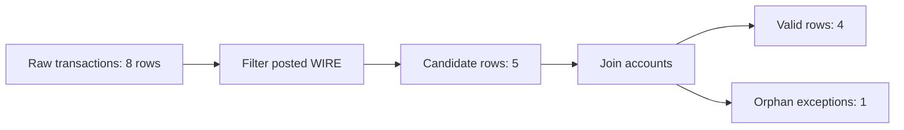

# Notebook-First Runnable Code Example Standards

This repository should not contain fake coding examples.

For learning code, "example" means something the learner can run step by step with a known setup and known expected output. Short fragments are allowed only when they are explicitly marked as concept fragments and linked to a runnable version.

Repository rule:

```text
PySpark, Python, Spark SQL, and PySQL-style learning examples belong in notebooks.
Markdown should explain the concept, show diagrams, describe expected outputs,
and link to the runnable notebook section.
```

Markdown may still contain shell commands, configuration snippets, Mermaid
diagrams, expected text output, and small pseudo-code mental models. It should
not duplicate full runnable PySpark, Python, or Spark SQL examples that the
learner is expected to execute.

---

## 1. Runnable example contract

Every runnable code example must include:

1. **Purpose** - what the learner is proving.
2. **Environment** - where it runs, such as Databricks SQL, Spark SQL, PySpark, or local shell.
3. **Setup** - tables, temp views, sample rows, imports, and schemas.
4. **Run order** - numbered steps or cells.
5. **Expected output** - row counts, specific rows, or validation checks.
6. **Failure checks** - what wrong output means.
7. **Cleanup or rerun behavior** - if the example writes state.

Every code-heavy learning section must begin with a **Code Bootstrap**. The bootstrap is the learner's launch pad: it creates imports, tiny input data, schemas, helper assertions, temp views, and expected outputs before any concept examples appear.

Minimum acceptable pattern:

```text
Step 0: Create tiny input tables.
Step 1: Run one transformation.
Step 2: Inspect output.
Step 3: Validate expected counts or rows.
Step 4: Explain what changed and why.
```

---

## 2. Code Bootstrap standard

A code bootstrap must include:

- environment
- run command or notebook instruction
- setup code
- tiny input rows
- schemas or temp-view definitions
- helper assertions or PASS/FAIL checks
- expected row counts
- expected key rows
- notes on how to rerun safely

Use the template:

```text
templates/code_bootstrap_template.md
```

Current Spark bootstraps live inside notebooks:

- `examples/spark/notebooks/aml_databricks_one_stop_learning.ipynb`
- `examples/spark/notebooks/aml_pyspark_dataframe_basics.ipynb`
- `examples/spark/notebooks/aml_spark_sql_query_basics.ipynb`

Beginner docs should:

- point to a companion notebook and clearly say "Run this first", or
- paste a small concept fragment only when a notebook contains the full runnable version.

Notebook-friendly topics should also provide a notebook companion under `examples/.../notebooks/` when the learner benefits from running cells step by step.

---

## 3. Code block labels

Use one of these labels before any code block.

### Runnable

Use when the learner can run the block after completing prior setup steps in the same doc or companion file.

```text
Runnable after Step 0 setup.
```

### Standalone runnable

Use when the block includes all setup needed to run by itself.

```text
Standalone runnable in Databricks SQL.
```

### Concept fragment

Use only when the code is intentionally incomplete and exists to explain a small concept.

```text
Concept fragment, not runnable alone. Full runnable version: examples/spark/...
```

Avoid concept fragments in beginner-facing docs. Prefer runnable examples.

---

## 4. Spark SQL / PySQL notebook standard

A SQL learning example should be a notebook section, not a standalone Markdown
code block.

Notebook structure:

1. Markdown cell: purpose and expected result.
2. Code cell: create tiny temp views or DataFrames.
3. Code cell: execute the SQL through the notebook environment.
4. Markdown cell: expected output and grain.
5. Code cell: validation query or Python assertion.
6. Markdown cell: what wrong output means.

For AML/TM examples, include:

- expected row count
- expected business keys
- expected DQ exceptions
- expected alert rows
- expected supporting rows
- expected reconciliation totals

The runnable SQL should live in one of:

- `examples/spark/notebooks/aml_databricks_one_stop_learning.ipynb`
- `examples/spark/notebooks/aml_spark_sql_query_basics.ipynb`
- a new notebook under `examples/.../notebooks/` when the topic deserves its own flow

---

## 5. PySpark / Python notebook standard

A PySpark or Python learning example should be a notebook section, not a
Markdown code block.

Notebook structure:

1. Markdown cell: purpose, environment, and expected result.
2. Code cell: imports and SparkSession only if the notebook does not already
   bootstrap them.
3. Code cell: tiny in-memory DataFrames with explicit schemas.
4. Code cell: one transformation at a time.
5. Code cell: deterministic display ordered by key.
6. Code cell: assertions for expected output.
7. Markdown cell: failure modes and closed-book prompt.

For PySpark examples:

- define schemas explicitly
- create tiny in-memory DataFrames
- use deterministic ordering before display
- include assertions for important outputs
- avoid external files unless the setup creates them
- avoid hidden dependencies on private paths or production tables

The runnable PySpark/Python should live in one of:

- `examples/spark/notebooks/aml_databricks_one_stop_learning.ipynb`
- `examples/spark/notebooks/aml_pyspark_dataframe_basics.ipynb`
- a new notebook under `examples/.../notebooks/` when the topic deserves its own flow

---

## 6. Notebook example standard

A notebook example should be runnable from top to bottom and should not depend on private workspace state.

Required notebook pattern:

1. Markdown title and purpose.
2. Step 0 bootstrap cell.
3. Tiny input data created inside the notebook.
4. One concept per small group of cells.
5. Assertions or PASS/FAIL checks.
6. Final reconciliation or evidence cell.
7. Closed-book drill.

Notebook examples must live under an `examples/.../notebooks/` folder and must pass:

```bash
python scripts/check_notebooks.py
```

---

## 7. Diagram standard

Every beginner code example should include at least one low-level diagram when row movement matters.

Useful diagram types:

```text
input rows -> filter -> output rows
left table + right table -> join result
transaction rows -> groupBy customer -> customer totals
candidate rows -> DQ exceptions + valid rows
```

Example:



---

## 8. Anti-patterns

Do not write Markdown examples that tell the learner to run hidden code such as:

```text
df = spark.read.table("some_table")
df.filter(...).show()
```

Why it is weak:

- no setup
- no schema
- no rows
- no expected output
- no validation
- may depend on a private table

Better:

```text
Create a notebook section that builds `transactions` from tiny public-safe rows,
filters `posted_wires`, displays deterministic output, and asserts the expected
count.
```

Then link to that notebook section from Markdown.

Do not use:

- unexplained `...`
- private paths
- production table names without setup
- hidden variables
- random output without seeding
- examples that cannot be copied and run

---

## 9. Review checklist

Before committing a code example, answer:

1. Can a learner run it from a clean notebook or shell?
2. Does the section begin with a Code Bootstrap or a clear "Run this first" bootstrap reference?
3. Are all input rows created in the example or companion setup?
4. Is the run order explicit?
5. Are expected outputs written down?
6. Are there validation checks?
7. Does it avoid private data and private paths?
8. Does it teach why each step exists?
9. Does it show what failure means?
10. Is there a companion runnable file if the Markdown has many snippets?
11. Is there a notebook companion when notebook flow would make the learning easier?
12. Did `npm run lint` and relevant syntax checks pass?

---

## 10. Current runnable learning examples

Learning examples are notebook-first. Standalone `.py` and `.sql` files are reserved for repo automation, production-style source artifacts, or templates that cannot naturally live in a notebook.

Notebook examples:

- `examples/spark/notebooks/aml_databricks_one_stop_learning.ipynb`
  - Environment: Azure Databricks, Fabric Spark notebooks, or Jupyter with PySpark.
  - Setup: creates synthetic AML/TM extracts and Databricks-style job parameters.
  - Validation: Python `assert` checks for bronze, silver, gold, DQ, reconciliation, alerts, support records, feature readiness, and final scorecard.

- `examples/spark/notebooks/aml_pyspark_dataframe_basics.ipynb`
  - Environment: Azure Databricks, Fabric Spark notebooks, or Jupyter with PySpark.
  - Setup: creates tiny in-memory DataFrames.
  - Validation: Python `assert` checks for filters, joins, windows, DQ checks, alert output, and reconciliation counts.

- `examples/spark/notebooks/aml_spark_sql_query_basics.ipynb`
  - Environment: Azure Databricks, Fabric Spark notebooks, or Jupyter with PySpark.
  - Setup: creates Spark SQL temp views through `spark.sql`.
  - Validation: Python `assert` checks for query results, DQ exceptions, supporting transactions, and reconciliation counts.
