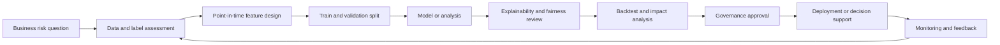
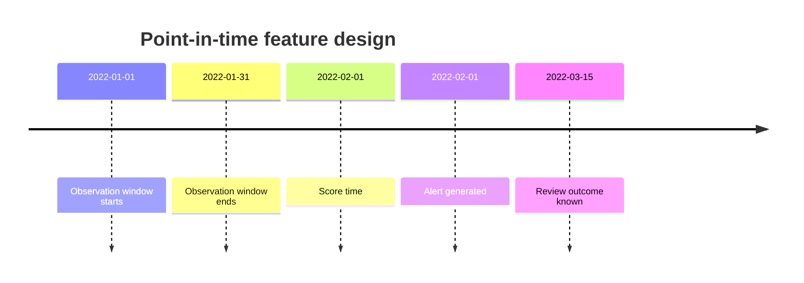
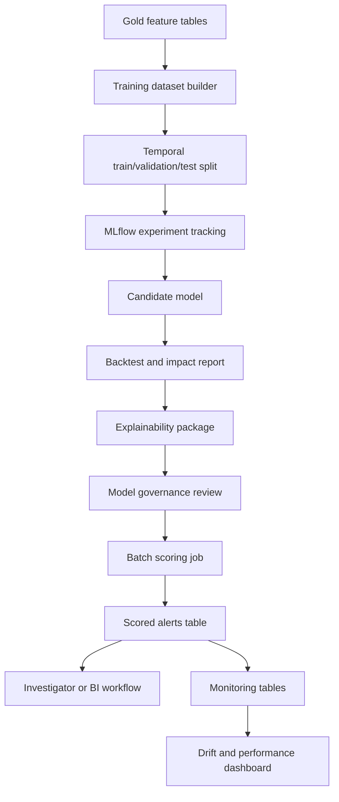

# ML and Data Science Guide for AML/TM

This is a one-stop interview and study guide for a Data Scientist working on AML / Transaction Monitoring analytics, alert prioritization, false-positive analysis, anomaly detection, and governed ML on Azure Databricks.

The role is not just "train a model." In AML/TM, a strong Data Scientist improves detection and prioritization while preserving explainability, auditability, and control ownership.

---

## 1. Role scope

### What the Data Scientist owns

- Exploratory analysis of alert, case, customer, account, transaction, and reference data.
- Feature engineering for customer behavior, transaction patterns, counterparties, geography, products, and channels.
- Alert prioritization or risk scoring experiments.
- False-positive analysis and segmentation.
- Threshold sensitivity analysis.
- Anomaly detection and typology discovery.
- Model evaluation under imbalanced and delayed labels.
- Explainability outputs for compliance, audit, and investigators.
- MLflow experiment tracking and model lifecycle evidence.
- Drift, stability, and performance monitoring.

### What the Data Scientist does not own alone

- Final rule policy.
- Case investigation decisions.
- Regulatory reporting decisions.
- Model risk approval.
- Production data pipeline ownership.

But the data scientist must design analytics that can survive those review processes.

For informal project-scope calls, use [`../17-project-scope-call-prep.md`](../17-project-scope-call-prep.md). When a team mentions data scientists and remediation exercises, clarify whether the work is exploratory analysis, feature engineering, model validation, DQ/reconciliation analysis, defect remediation evidence, or governed ML.

---

## 2. Mental model

AML/TM data science is decision support under governance:

```text
historical behavior -> features -> score or insight -> explanation -> controlled action
```

In this domain, a model that cannot be explained, monitored, and challenged is usually not production-ready.

### The safest positioning

Start with ML as:

- alert prioritization
- investigator decision support
- threshold tuning analysis
- segmentation
- anomaly discovery
- typology exploration
- quality monitoring

Move toward automated decisioning only with explicit governance, validation, and approval.

---

## 3. Analytics lifecycle diagram



Interview explanation:

- Do not start with an algorithm.
- Start with the decision being improved.
- Validate labels and timing.
- Use point-in-time features.
- Evaluate impact on workload and risk, not only model metrics.
- Monitor after deployment.

---

## 4. Theory you must know

### 4.1 Rule-based monitoring versus ML

Rule-based monitoring:

- deterministic
- explainable
- easy to map to policy
- easier to validate
- can create high false-positive volume
- may miss complex relationship patterns

ML-assisted monitoring:

- can rank alerts
- can detect non-obvious patterns
- can segment behavior
- can learn from historical outcomes
- requires careful labels
- requires explainability and monitoring
- may create governance and fairness risk

Strong interview synthesis:

> I would not frame ML as replacing rules by default. I would use deterministic rules as the governed baseline and apply analytics to prioritize, tune, segment, and discover patterns. Any model used in workflow needs explainability, validation, monitoring, and approval.

### 4.2 Labels are imperfect

Possible labels:

- alert became a case
- case was escalated
- SAR/STR was filed
- investigator marked suspicious
- alert closed as no issue
- confirmed typology tag

Problems:

- outcomes are delayed
- investigator decisions vary
- policies change
- SAR/STR filing is rare
- false negatives are often unknown
- historical rules determine what got reviewed
- labels may reflect workload and policy, not true risk

Interview point:

A model trained only on past reviewed alerts may learn investigator workflow and rule bias, not financial crime risk.

### 4.3 Temporal leakage

Leakage happens when training data includes information that would not have been available at scoring time.

Examples:

- using case outcome before the alert would have been reviewed
- using future transactions inside the feature window
- using current risk rating for a past transaction
- using post-investigation notes as input features
- using rule outputs from a future rule version

Safe feature timing:

```text
observation window -> score time -> outcome window
```

Example:

```text
Use transactions from Jan 1 to Jan 31.
Score alert on Feb 1.
Measure review outcome after Feb 1.
```

### 4.4 Imbalanced evaluation

Suspicious outcomes are rare. Accuracy is usually misleading.

Better metrics:

- precision
- recall
- PR-AUC
- lift at top K
- capture rate at review capacity
- false-positive reduction at fixed recall
- workload reduction
- case conversion improvement
- stability by segment

Example:

```text
If investigators can review 10,000 alerts, how many true escalations are captured in the top 10,000 ranked alerts?
```

### 4.5 Explainability

In AML/TM, explainability needs to work for:

- model developers
- compliance owners
- investigators
- QA
- audit
- model risk
- operations

Explainability outputs:

- top contributing features
- reason codes
- segment-level performance
- example supporting transactions
- feature values at score time
- model version
- training data period
- thresholds or decision bands
- known limitations

---

## 5. Feature engineering

### 5.1 Entity features

Customer features:

- customer risk rating
- customer type
- tenure
- geography
- expected activity profile
- products held
- segment
- historical alert count
- historical case count

Account features:

- account age
- account status
- product type
- average balance band
- transaction frequency
- ownership changes

Transaction behavior features:

- total amount by window
- count by window
- average amount
- max amount
- transaction velocity
- cash/wire/EFT mix
- inbound versus outbound ratio
- unusual time-of-day activity
- round amount count

Counterparty and network features:

- unique counterparties
- new counterparties
- high-risk country counterparties
- repeated counterparties
- shared counterparties across customers
- network centrality, if graph data is available

Geography features:

- count of high-risk geography transactions
- amount to high-risk geographies
- new geography indicator
- geography risk changes over time

### 5.2 Feature window diagram



Correct:

- features use data available up to score time
- label uses future outcome after score time

Incorrect:

- features include review outcome
- features include transactions after score time

---

## 6. Model use cases

### 6.1 Alert prioritization

Goal:

```text
Rank generated alerts so investigators review highest-risk alerts first.
```

Common methods:

- logistic regression
- gradient boosted trees
- random forest
- calibrated classifiers
- learning-to-rank approaches

Outputs:

- score
- risk band
- reason codes
- top features
- model version
- score timestamp

### 6.2 False-positive analysis

Goal:

```text
Find segments or rule conditions that produce many low-value alerts.
```

Methods:

- segmentation
- decision trees for interpretable patterns
- cohort analysis
- threshold sensitivity
- rule overlap analysis

### 6.3 Anomaly detection

Goal:

```text
Identify behavior unusual for the customer, peer group, product, or geography.
```

Methods:

- z-scores and robust statistics
- isolation forest
- clustering
- autoencoders, when justified
- graph anomaly methods, when relationship data is mature

Warning:

Anomaly does not automatically mean suspicious. It means "worth explanation."

### 6.4 Threshold tuning support

Goal:

```text
Estimate impact of threshold changes before business approves rule changes.
```

Analysis:

- historical backtest
- alert volume impact
- case conversion impact
- segment impact
- risk coverage impact
- investigator workload impact
- expected difference documentation

---

## 7. ML system diagram



---

## 8. Databricks and ML stack knowledge

### 8.1 PySpark for feature engineering

Use PySpark when:

- data is too large for memory on one machine
- features require joins and windows over multi-year transactions
- outputs need Delta tables
- feature creation must be reproducible

### 8.2 MLflow

Track:

- experiment name
- code version
- data version
- feature list
- training period
- validation period
- parameters
- metrics
- artifacts
- model object
- explainability outputs

Interview point:

MLflow is not only a convenience tool. In regulated work, it helps produce evidence of what was trained, when, with which data, and with what results.

### 8.3 Unity Catalog / governed model registry

Know:

- governed tables
- model registration
- model versions
- permissions
- lineage
- promotion stages or lifecycle controls

### 8.4 Model serving versus batch scoring

Batch scoring fits:

- daily or monthly alert prioritization
- lookback analysis
- rule tuning studies

Online serving fits:

- low-latency decision support
- interactive applications
- real-time scoring needs

In AML/TM, batch scoring is often easier to control and audit.

---

## 9. Monitoring

### Data monitoring

- row counts
- null rates
- feature distributions
- out-of-range values
- source freshness
- join coverage
- new category values

### Model monitoring

- score distribution
- top feature distribution
- drift by segment
- precision/recall when labels arrive
- alert ranking stability
- overrides or investigator feedback
- model version comparison

### Governance monitoring

- approval status
- model version in production
- training data period
- retraining schedule
- exception log
- rollback plan

---

## 10. Q&A bank

### Q1. How would you reduce false positives in AML alerts?

Strong answer:

> I would first define what false positive means using reviewed outcomes. Then I would analyze volume by rule, customer segment, product, geography, and threshold bands. I would separate data quality issues from rule behavior. For ML, I might build an alert prioritization model or segmentation analysis, but I would evaluate workload impact and risk coverage, not just accuracy. Any recommendation would need explainability and business approval.

### Q2. What features would you build for alert prioritization?

Strong answer:

> I would build point-in-time features around customer risk, transaction velocity, amount patterns, counterparty behavior, high-risk geography exposure, product/channel behavior, historical alert activity, and peer-group deviation. I would ensure features use only data available at score time and preserve feature values with the scored alert for explanation.

### Q3. How do you avoid leakage?

Strong answer:

> I define an observation window, score time, and outcome window. Features can only use data available before score time. Labels can come after score time. I avoid current-state tables for historical scoring unless they are effective-dated, and I exclude investigator notes or outcomes that were created after the alert.

### Q4. What metric would you use for an imbalanced AML model?

Strong answer:

> Accuracy is not useful because suspicious outcomes are rare. I would use precision, recall, PR-AUC, lift at top K, capture rate at investigator capacity, and false-positive reduction at a fixed recall. I would also report performance by segment to detect uneven behavior.

### Q5. How would you explain a model to compliance?

Strong answer:

> I would explain the business purpose, training population, label definition, feature groups, validation approach, limitations, and monitoring plan. For individual alerts, I would show reason codes or top contributing features and supporting transaction context. I would avoid presenting a score as a final decision.

### Q6. When should ML not replace rules?

Strong answer:

> ML should not replace deterministic rules when policy requires explicit conditions, when labels are weak, when explainability is insufficient, when monitoring is immature, or when business and model governance approval are not in place. ML can still support prioritization, tuning, and exploration.

### Q7. How do you evaluate a threshold change?

Strong answer:

> I would backtest historical periods, compare alert volume, eligible population, case conversion, segment impact, and missed-case risk. I would document expected differences and get approval before changing rule behavior. I would not mix threshold tuning with migration equivalence testing.

### Q8. How do you monitor a model after deployment?

Strong answer:

> I monitor data freshness, feature distributions, score distribution, drift by segment, label-based performance when outcomes arrive, investigator feedback, overrides, and production incidents. I also track model version, training data period, and approval status.

---

## 11. Common mistakes

- Training on future information.
- Using accuracy on imbalanced labels.
- Treating investigator outcomes as perfect truth.
- Claiming anomaly equals suspicious activity.
- Ignoring rule version and policy changes.
- Producing a model score without reason codes.
- Not preserving scored feature values.
- Optimizing alert reduction without risk coverage.
- Ignoring model drift.
- Forgetting that governance approval is part of production readiness.

---

## 12. Interview case template

Use this structure for any AML/TM data science project:

```text
Problem:
  What decision are we improving?

Data:
  What sources, entities, periods, and labels are available?

Timing:
  What is the observation window, score time, and outcome window?

Features:
  What point-in-time features are created?

Model or analysis:
  What method is appropriate and why?

Evaluation:
  What metrics reflect business and risk impact?

Explainability:
  How will compliance, investigators, and audit understand the result?

Governance:
  What approvals, monitoring, and evidence are required?

Deployment:
  Batch scoring, dashboard, API, or offline recommendation?
```

---

## 13. Closed-book drills

Model answers: [`../16-model-answer-bank.md#data-scientist--ml-closed-book-drills`](../16-model-answer-bank.md#data-scientist--ml-closed-book-drills)

Answer without looking:

1. Why are AML labels imperfect?
2. What is temporal leakage?
3. What is the difference between observation window, score time, and outcome window?
4. Why is accuracy weak for alert models?
5. What is lift at top K?
6. What features would you create for high-risk geography monitoring?
7. How would you explain a model score to an investigator?
8. What should MLflow track for governed AML analytics?
9. How would you monitor drift?
10. Why should ML usually support rules before replacing them?
