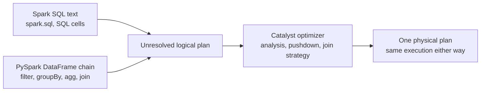

# Spark SQL vs PySpark: When To Use Which, and the Key Functions That Matter

Both Spark SQL and the PySpark DataFrame API compile through the same Catalyst optimizer to the same physical plans. Choosing between them is therefore **not a performance decision**. It is a decision about who must read the logic, how it gets parameterized, how it gets tested, and how it survives review in a regulated AML/TM program.

Vocabulary first, because job descriptions and interviewers mix these terms:

| Term | Meaning in practice |
|---|---|
| Spark SQL | SQL text executed by Spark: `spark.sql("...")`, notebook SQL cells, Databricks SQL |
| PySpark | the Python DataFrame API: `filter`, `groupBy`, `agg`, `join`, windows |
| "PySQL" | informal: SQL strings run from Python through `spark.sql()` - that is, Spark SQL driven from a Python program |

Companion assets:

- run the same rule both ways with a reconciliation assertion: canonical notebook **Step 14 micro-lab**
- filter-gate semantics that apply to both doors: [`where-having-filter-placement.md`](where-having-filter-placement.md)
- focused practice: notebook **Appendix A** (PySpark) and **Appendix B** (Spark SQL)

---

## 1. First principles: one engine, two front doors



Consequences worth saying out loud in an interview:

1. "Which is faster?" is a trick question - same optimizer, same plan for equivalent logic. Prove it with `explain()` on both versions.
2. Because performance is a tie, every real selection criterion is a **human factor**: reviewability, parametrization, testability, composition, and team workflow.
3. The two doors interoperate freely: `createOrReplaceTempView` exposes a DataFrame to SQL; `spark.table()` and `spark.sql()` bring SQL results back as DataFrames. Mixed pipelines are normal, not a smell.

---

## 2. Decision framework: when to use what

| Situation | Prefer | Why |
|---|---|---|
| Rule logic that compliance or business must review | Spark SQL | a reviewer who reads policy can read `WHERE`/`GROUP BY`/`HAVING`; rule core stays close to its spec |
| Reusable pipeline code with functions and unit tests | PySpark | logic decomposes into testable functions; pytest and `pyspark.testing.assertDataFrameEqual` apply directly |
| Rules generated from parameter/spec tables | PySpark | build predicates programmatically; never assemble SQL strings from parameters |
| Ad-hoc validation, tie-outs, investigation queries | Spark SQL | fastest path in Databricks SQL editor or a notebook SQL cell; throwaway by design |
| Multi-step transformations needing intermediate checks | PySpark | named intermediate DataFrames with assertions between steps - the notebook pattern of this repo |
| BI-facing governed outputs and metric definitions | Spark SQL views | views document the definition where analysts and Power BI consume it |
| Golden-record acceptance tests | PySpark | assertions on sets, totals, and supporting keys belong in code, not eyeballs |
| Point-in-time joins, windows, dedupe inside pipelines | either; PySpark in pipelines | identical semantics; the API version composes with the surrounding tested code |
| Logic only expressible procedurally (rare) | PySpark | loops over rule lists, dynamic column sets; prefer built-ins over UDFs even here |
| The review-critical rule core inside a Python pipeline | hybrid | temp view + `spark.sql` for the core the business approved, DataFrame API around it |

The hybrid row is the senior answer: the repo's notebook Step 14 runs the same alert rule through both doors and asserts the outputs match - that assertion *is* the governance argument for mixing them freely.

Parameterization rule (interview gold, security relevant):

```text
Never build SQL by string-formatting parameters into the text.
Use parameter binding (spark.sql(query, args=...) on Spark 3.4+,
Databricks widgets/parameters), or stay in the DataFrame API where
parameters are typed Python values.
String-built SQL is an injection risk and silently mis-types
dates, decimals, and nulls - all three are AML evidence killers.
```

---

## 3. Key Spark SQL constructs for AML/TM work

Verified against Spark 4.1.2; everything here also runs in Databricks SQL. Runnable practice: notebook Appendix B.

### Population and eligibility

| Construct | AML/TM use |
|---|---|
| `WHERE` | eligibility: posted status, transaction type, monitoring window - decides who is counted |
| `BETWEEN` / half-open date ranges (`>= start AND < end`) | monitoring windows without boundary-day bugs; prefer half-open |
| `IN` / `NOT IN` (beware `NOT IN` with nulls) | product or country lists; `NOT IN` against a list containing null returns nothing - use `NOT EXISTS` or anti join |
| `CASE WHEN` | review buckets, reason codes, amount bands |
| `TRY_CAST` | amount/date typing that routes failures to DQ instead of nulling silently or killing the run (ANSI) |

### Aggregation and thresholds

| Construct | AML/TM use |
|---|---|
| `GROUP BY` + `SUM` / `COUNT(*)` / `COUNT(DISTINCT ...)` | customer/account totals, velocity counts, distinct counterparties |
| `HAVING` | the behavioral threshold on group totals - the structuring gate |
| `count_if(condition)` | exception counts inside control-total queries |

### Joins and DQ

| Construct | AML/TM use |
|---|---|
| `LEFT JOIN ... WHERE right IS NULL` or `LEFT ANTI JOIN` | orphan transactions, missing reference rows - DQ exception queries |
| `LEFT SEMI JOIN` | filter to matched keys without duplicating columns or rows |
| effective-date join predicates (`event_date >= start AND event_date < end`) | point-in-time customer risk, ownership, country risk |
| `FULL OUTER JOIN` | legacy-to-cloud reconciliation: matched, legacy-only, cloud-only |

### Windows, dedupe, and evidence

| Construct | AML/TM use |
|---|---|
| `ROW_NUMBER() OVER (PARTITION BY ... ORDER BY ...)` | deterministic dedupe and latest-record selection; always add tie-breakers |
| `SUM(...) OVER (PARTITION BY ... ORDER BY ... ROWS BETWEEN ...)` | rolling totals per customer without collapsing transaction rows |
| `LAG` / `LEAD` | gaps between transactions, velocity patterns |
| `QUALIFY` | filter on window results in one block - **Databricks SQL only**, not open-source Spark; use a CTE elsewhere |
| `SHA2(CONCAT_WS('\|', ...), 256)` | deterministic alert keys from rule/customer/period fields |
| CTEs (`WITH ... AS`) | make each rule stage reviewable: eligible -> aggregated -> thresholded -> evidence |

### Nulls, dates, strings

| Construct | AML/TM use |
|---|---|
| `COALESCE`, `<=>` (null-safe equal), `IS DISTINCT FROM` | reconciliation comparisons where null vs null must count as a match |
| `IS NULL` / `IS NOT NULL` | the only reliable null tests; `= NULL` is always unknown |
| `to_date`, `date_trunc('MONTH', ...)`, `last_day`, `add_months`, `datediff`, `months_between` | monitoring periods, lookback windows, aging |
| `TRIM`, `UPPER`, `CONCAT_WS`, `regexp_extract`, `regexp_replace` | key standardization before joins; parsing source quirks |
| `UNION ALL` (not `UNION`) | combining populations without silently deduplicating; dedupe deliberately |
| `VALUES` + `CREATE OR REPLACE TEMP VIEW` | golden-record inputs and tiny test populations |

---

## 4. Key PySpark functions for AML/TM work

Verified against PySpark 4.1.2. Runnable practice: notebook Appendix A. Convention: `from pyspark.sql import functions as F`.

### Columns and typing

| Function | AML/TM use |
|---|---|
| `F.col`, `F.lit`, `.alias` | reference and name columns; `F.lit` for typed constants (thresholds) |
| `.withColumn` | derive typed business columns: cast dates, decimal amounts |
| `.cast('decimal(18,2)')`, `Column.try_cast` (4.0+), `F.expr('try_cast(...)')` | money typing; never float for amounts |
| `.select`, `.drop` | shape evidence rows; drop helper columns before output |

### Filtering (the WHERE gate)

| Function | AML/TM use |
|---|---|
| `.filter` / `.where` (aliases - position carries meaning, not the name) | eligibility before `groupBy`; thresholds after `agg` |
| `&`, `\|`, `~` with parentheses | compound predicates; missing parentheses is the most common PySpark syntax bug |
| `.isin`, `.between` | lists and ranges |
| `.isNull()`, `.isNotNull()` | DQ checks and explicit null population handling |

### Aggregation and thresholds (the HAVING gate)

| Function | AML/TM use |
|---|---|
| `.groupBy(...).agg(...)` | change grain from transaction to account/customer |
| `F.sum`, `F.count('*')`, `F.count_distinct`, `F.max`, `F.min`, `F.avg` | totals, velocities, distinct counterparties |
| `.filter(F.col('total') > threshold)` **after** `.agg` | the HAVING equivalent - filter the aggregate's alias |
| `F.when(...).otherwise(...)` | conditional aggregation and reason codes |

### Joins and DQ

| Function | AML/TM use |
|---|---|
| `.join(other, on, 'inner'/'left'/'left_anti'/'left_semi'/'full')` | enrichment, preservation, orphan detection, matched-key filtering, reconciliation |
| compound join conditions with date bounds | point-in-time reference joins |
| `F.broadcast(small_df)` | small reference tables (country risk, parameters) without a shuffle |
| `.dropDuplicates([keys])` | dedupe - but prefer the `row_number` pattern when the *kept* row matters |

### Windows

| Function | AML/TM use |
|---|---|
| `Window.partitionBy(...).orderBy(...)` | per-customer / per-account ordering |
| `F.row_number().over(w)` then `.filter(rn == 1)` | deterministic latest-record and dedupe with explicit tie-breakers |
| `.rowsBetween(...)` with `F.sum().over(w)` | rolling totals keeping row identity (features and velocity rules) |
| `F.lag` / `F.lead` | inter-transaction gaps and sequences |

### Nulls, sets, and reshaping

| Function | AML/TM use |
|---|---|
| `F.coalesce`, `.na.fill`, `.na.drop` | explicit null policy - silent defaulting is an amount-drift factor |
| `Column.eqNullSafe` / `<=>` | reconciliation equality where null must match null |
| `.union` (positional), `.unionByName(allowMissingColumns=...)` | combining periods/systems; `unionByName` survives column-order drift |
| `.subtract`, `.exceptAll` | quick set reconciliation between two outputs |
| `F.sha2(F.concat_ws('\|', ...), 256)` | deterministic alert keys |
| `F.explode` | unpack arrays (supporting transaction id lists) into evidence rows |

### Bridge, diagnostics, and testing

| Function | AML/TM use |
|---|---|
| `.createOrReplaceTempView`, `spark.table`, `spark.sql` | the bridge between the two doors |
| `.explain()` | prove SQL and DataFrame versions share a plan; check pushdown and join strategy |
| `.printSchema()`, `.dtypes` | schema contracts before and after each stage |
| `.count()`, `.show()` | control totals and visual checks; both are actions that trigger execution |
| `.collect()` | small asserted results only - driver memory and data-exposure risk at scale |
| `.cache()` / `.persist()` | reused expensive intermediates; always measure before and after |
| `pyspark.testing.assertDataFrameEqual` (3.5+) | golden-record equality in pytest suites |

---

## 5. Failure modes of each door

| Door | Failure mode | Repair |
|---|---|---|
| Spark SQL | parameters f-stringed into query text | parameter binding or DataFrame API; treat string-built SQL as a review blocker |
| Spark SQL | one giant query nobody can review | CTE per rule stage, names matching the spec vocabulary |
| Spark SQL | logic exists only as text - no unit tests | wrap in `spark.sql` driven by tests with golden-record temp views |
| Spark SQL | `NOT IN` with nullable subquery silently returns nothing | `NOT EXISTS` or left anti join |
| PySpark | `.filter` moved across `groupBy().agg()` in a refactor | the structuring trap: [`where-having-filter-placement.md`](where-having-filter-placement.md) |
| PySpark | unparenthesized `&`/`\|` predicates | always parenthesize each comparison |
| PySpark | `.collect()` on production-size data | aggregate first; collect only asserted summaries |
| PySpark | Python UDFs for logic built-ins can express | built-ins keep Catalyst optimization and avoid serialization cost |
| both | "SQL is faster" / "DataFrames are faster" claims | same plan; show `explain()` and move the conversation to reviewability |
| both | temp-view name collisions and hidden cell-order dependencies in notebooks | one bootstrap cell owns view creation; downstream cells only read |

---

## 6. Interview answer scripts

**Q: When do you write Spark SQL and when do you write PySpark?**

> Same engine, same optimizer, same plan - so I choose by who consumes the logic. Rule cores that business and compliance review stay in SQL, close to the approved spec. Pipeline machinery - parameterization, intermediate checks, golden-record tests - lives in the DataFrame API where Python testing applies. They interoperate through temp views, so the real pattern is hybrid, and I prove the doors agree by running the same rule both ways and asserting the outputs match.

**Q: Is one faster than the other?**

> No - equivalent logic compiles to the same physical plan through Catalyst, and I verify that claim with explain() on both versions rather than asserting it. Performance differences appear only when the logic is not actually equivalent, like a filter that moved across an aggregation, which is a correctness bug wearing a performance costume.

**Q: How do you parameterize monitoring rules safely?**

> Never by formatting strings into SQL. Thresholds and windows come from versioned parameter tables; in the DataFrame API they are typed Python values, and in SQL I use parameter binding. String-built SQL risks injection and silently mis-types dates, decimals, and nulls - and in AML the parameter value is policy, so it must also be traceable to an approved version.

---

## 7. Closed-book drills

Answer without looking:

1. Why is "which is faster, SQL or DataFrames?" the wrong question, and what one method proves it?
2. Give three situations that favor Spark SQL and three that favor PySpark, with the reason for each.
3. What is the hybrid pattern, and which notebook section of this repo demonstrates its governance argument?
4. Name the SQL construct and the PySpark function for: orphan detection, deterministic dedupe, point-in-time joins, and alert keys.
5. Why is `NOT IN` dangerous in DQ queries, and what replaces it?
6. State the parameterization rule and the two reasons behind it.
7. Which PySpark testing helper supports golden-record suites, and since which version?
8. A teammate claims their DataFrame refactor of a SQL rule is "the same but faster." What two checks do you run?

### Model answers

1. Both doors compile through Catalyst to the same physical plan, so equivalent logic performs identically; `explain()` on both versions shows the shared plan.
2. SQL: business-reviewable rule cores, ad-hoc validation queries, BI-facing view definitions (readability where consumers live). PySpark: parameterized reusable pipelines, multi-step transformations with intermediate assertions, golden-record test suites (typed values, decomposition, pytest).
3. Keep the review-critical rule core in `spark.sql` over temp views, with DataFrame API machinery around it; notebook Step 14 runs the same rule both ways and asserts the outputs match, which is the proof that mixing doors is safe.
4. Orphan detection: `LEFT ANTI JOIN` / `.join(..., 'left_anti')`. Dedupe: `ROW_NUMBER() OVER (PARTITION BY ... ORDER BY ...)` / `F.row_number().over(Window...)` then filter to 1, with tie-breakers. Point-in-time: effective-date predicates in the join condition, both doors. Alert keys: `SHA2(CONCAT_WS(...), 256)` / `F.sha2(F.concat_ws(...), 256)`.
5. `NOT IN` against a set containing null compares with unknown and returns no rows at all, silently emptying the exception report; use `NOT EXISTS` or a left anti join.
6. Never format parameters into SQL text; use binding or stay in the DataFrame API. Reasons: injection risk, and silent mis-typing of dates, decimals, and nulls - plus, in AML, parameters are policy and must trace to an approved version.
7. `pyspark.testing.assertDataFrameEqual`, available since PySpark 3.5.
8. First `explain()` both versions - same plan means "faster" is imagined. Then run the golden records: if outputs differ, look for a filter that crossed the aggregation boundary; the speed came from computing a different rule.
