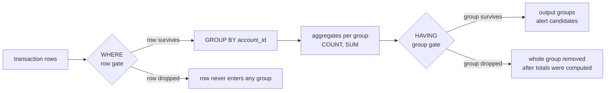

# WHERE vs HAVING and PySpark Filter Placement

This is an interview-grade deep dive into one question that data interviews keep asking in different costumes:

```text
Where does my filter run: before grouping or after grouping?
```

In SQL the answer is spelled out by keyword: `WHERE` is the row gate before `GROUP BY`, and `HAVING` is the group gate after aggregation. In PySpark there is no `HAVING` keyword at all; the same `.filter()` method means either gate, and only its position in the chain relative to `.groupBy().agg()` decides which one you wrote.

Use this guide when you want to:

- explain `WHERE` vs `HAVING` from first principles, not memorized phrasing
- translate both gates into PySpark without losing the semantics
- predict when moving a filter changes the result and when it only changes the plan
- defend filter placement decisions with AML/TM evidence

Companion runnable lab:

- [`../../examples/spark/notebooks/aml_databricks_one_stop_learning.ipynb`](../../examples/spark/notebooks/aml_databricks_one_stop_learning.ipynb), **Appendix C - WHERE vs HAVING and PySpark Filter Placement Micro-Lab**

Code Bootstrap: run Appendix B Step 0 of the notebook first; Appendix C reuses its `transactions` temp view, and every claim below is asserted there.

---

## 1. First principles: one pipeline, two filter gates

A grouped query is a pipeline with two different populations flowing through it:

```text
input rows -> [WHERE: row gate] -> GROUP BY -> aggregates -> [HAVING: group gate] -> output groups
```

- Before `GROUP BY`, the unit moving through the pipeline is a **row** (here: one transaction).
- After `GROUP BY`, the unit is a **group** (here: one account). The original rows no longer exist as addressable things.

So the real distinction is not "before vs after" as trivia. It is **what kind of thing you are filtering**:

| Gate | Filters | Can reference | Cannot reference |
|---|---|---|---|
| `WHERE` | individual rows | raw columns | aggregate results (`SUM`, `COUNT`, ...) |
| `HAVING` | aggregated groups | grouping keys and aggregates | columns that did not survive grouping |

`WHERE SUM(amount) > 100` fails because at row time no sum exists yet. `HAVING amount_cad > 100` fails (or silently misleads where dialects tolerate it) because after grouping there is no single `amount_cad` per group.



Memory hook: `WHERE` decides **who is counted**; `HAVING` decides **which totals matter**.

---

## 2. Tiny dataset used throughout

Same rows as the canonical notebook, so every number below can be re-derived by hand:

| transaction_id | account_id | transaction_date | amount_cad | transaction_type | status | country_code |
|---|---|---|---:|---|---|---|
| t1 | a1 | 2022-06-01 | 60.00 | WIRE | POSTED | IR |
| t2 | a1 | 2022-06-03 | 50.00 | WIRE | POSTED | IR |
| t3 | a1 | 2022-06-05 | 10.00 | CARD | POSTED | CA |
| t4 | a2 | 2022-06-02 | 200.00 | WIRE | POSTED | CA |
| t5 | a3 | 2022-06-02 | 20.00 | WIRE | REVERSED | IR |
| t6 | a9 | 2022-06-02 | 80.00 | WIRE | POSTED | IR |
| t7 | a2 | 2022-07-01 | 300.00 | WIRE | POSTED | IR |
| t8 | a4 | 2022-06-10 | 100.00 | CASH | POSTED | null |

Business rule used as the running example:

```text
Alert any account whose POSTED WIRE transactions total more than 100 CAD.
```

This sentence already contains both gates. "POSTED WIRE transactions" is row eligibility (`WHERE`). "Total more than 100" is a group threshold (`HAVING`).

---

## 3. The reference query and its row trace

Concept fragment, not runnable alone. Runnable version: [Appendix C in the canonical notebook](../../examples/spark/notebooks/aml_databricks_one_stop_learning.ipynb).

```sql
SELECT
  account_id,
  COUNT(*) AS txn_count,
  SUM(amount_cad) AS total_amount_cad
FROM transactions
WHERE status = 'POSTED'
  AND transaction_type = 'WIRE'
GROUP BY account_id
HAVING SUM(amount_cad) > 100;
```

Trace it stage by stage:

```text
WHERE gate (row level):
  survive: t1, t2, t4, t6, t7        (posted wires)
  dropped: t3 (CARD), t5 (REVERSED), t8 (CASH)

GROUP BY account_id (grain change: transaction -> account):
  a1 -> {t1, t2}   total 110.00, count 2
  a2 -> {t4, t7}   total 500.00, count 2
  a9 -> {t6}       total  80.00, count 1

HAVING gate (group level):
  survive: a1 (110 > 100), a2 (500 > 100)
  dropped: a9 (80 <= 100)
```

Expected output:

| account_id | txn_count | total_amount_cad |
|---|---:|---:|
| a1 | 2 | 110.00 |
| a2 | 2 | 500.00 |

The logical evaluation order behind the trace (regardless of written order):

```text
FROM/JOIN -> WHERE -> GROUP BY -> aggregates -> HAVING -> SELECT -> ORDER BY -> LIMIT
```

---

## 4. PySpark has no HAVING: placement decides meaning

PySpark exposes one filtering method (`filter`, alias `where`). There is no keyword to tell the engine "this is a group filter." You tell it by **where you put the call in the chain**:

Concept fragment, not runnable alone. Runnable version: [Appendix C in the canonical notebook](../../examples/spark/notebooks/aml_databricks_one_stop_learning.ipynb).

```python
account_totals = (
    transactions
    .filter((F.col("status") == "POSTED") & (F.col("transaction_type") == "WIRE"))  # WHERE gate
    .groupBy("account_id")
    .agg(
        F.count("*").alias("txn_count"),
        F.sum("amount_cad").alias("total_amount_cad"),
    )
    .filter(F.col("total_amount_cad") > 100)  # HAVING gate
)
```

Translation table:

| SQL | PySpark | Filters |
|---|---|---|
| `WHERE status = 'POSTED'` | `.filter(...)` **before** `.groupBy()` | rows |
| `HAVING SUM(amount_cad) > 100` | `.filter(...)` **after** `.agg()` | groups |

Two details interviewers probe here:

1. **The post-aggregation filter references the alias, not the aggregate call.** After `.agg(F.sum("amount_cad").alias("total_amount_cad"))`, the group-level DataFrame has a real column named `total_amount_cad`. You filter on that column. This is the PySpark equivalent of `HAVING SUM(amount_cad) > 100`, and it is one reason the API version often reads more clearly than SQL: the "group" is just another DataFrame.
2. **`filter` and `where` are the same method.** `df.where(...)` does not mean "SQL WHERE semantics"; it is an alias. Position, not name, carries the meaning. Saying this unprompted signals you understand the API instead of pattern-matching keywords.

First-principles restatement that lands well in interviews:

> SQL needs two keywords because a single statement describes the whole pipeline at once, so the keyword tells the planner which side of the aggregation the predicate belongs to. PySpark builds the pipeline step by step, so the step order itself carries that information and a second keyword would be redundant.

---

## 5. The structuring trap: a row filter is not a group filter

This is the highest-value AML example of the whole topic. Suppose someone "simplifies" the reference rule by filtering amounts at row level:

Concept fragment, not runnable alone. Runnable version: [Appendix C in the canonical notebook](../../examples/spark/notebooks/aml_databricks_one_stop_learning.ipynb).

```sql
-- WRONG for this rule: amount threshold applied at the row gate
SELECT account_id, SUM(amount_cad) AS total_amount_cad
FROM transactions
WHERE status = 'POSTED'
  AND transaction_type = 'WIRE'
  AND amount_cad > 100
GROUP BY account_id;
```

Compare populations:

| Version | Surviving accounts | Why |
|---|---|---|
| `WHERE amount_cad > 100` (row gate) | a2 only | only t4 (200) and t7 (300) pass row filter |
| `HAVING SUM(amount_cad) > 100` (group gate) | a1, a2 | a1 = 60 + 50 = 110 in total |

Account `a1` is exactly the pattern transaction monitoring exists to catch: **structuring**. Each wire (60, 50) stays under the row threshold; only the aggregate crosses it. A row-level amount filter systematically misses customers who split amounts — the rule silently stops detecting the behavior it was written for, and no error or DQ exception tells you.

In PySpark the same bug is even quieter because both versions are just `.filter()` calls:

Concept fragment, not runnable alone. Runnable version: [Appendix C in the canonical notebook](../../examples/spark/notebooks/aml_databricks_one_stop_learning.ipynb).

```python
# WRONG: threshold before groupBy -> misses structuring account a1
posted_wires.filter(F.col("amount_cad") > 100).groupBy("account_id").agg(...)

# RIGHT: threshold after agg -> catches a1 (60 + 50 = 110)
posted_wires.groupBy("account_id").agg(...).filter(F.col("total_amount_cad") > 100)
```

A code review that only checks "the threshold 100 appears in the code" passes both. Only grain reasoning catches it.

---

## 6. The mirror trap: a missing row filter corrupts evidence

The opposite mistake is dropping (or misplacing) the row gate and keeping only `HAVING`:

```text
No WHERE, group all 8 rows, HAVING SUM(amount_cad) > 100:
  a1 -> 60 + 50 + 10 = 120.00   (CARD transaction t3 leaked in)
  a2 -> 500.00
  a4 -> 100.00  (dropped, not > 100)
  a3, a9 -> dropped
```

Surviving accounts: still `{a1, a2}` — **identical to the correct query**. But a1's total is now 120.00 instead of 110.00, and its supporting transactions wrongly include a CARD payment.

This is the sneakiest failure mode because the cheap reconciliation passes:

| Check | Result | Verdict |
|---|---|---|
| Alert account set: `{a1, a2}` vs `{a1, a2}` | match | falsely reassuring |
| Alert amounts: 110.00 vs 120.00 for a1 | mismatch | catches the defect |
| Supporting transaction IDs: `{t1, t2}` vs `{t1, t2, t3}` | mismatch | catches it and explains it |

Evidence lesson: reconcile **counts, amounts, and supporting keys**, never counts alone. An investigator working alert a1 from the broken query would present a CARD transaction as wire-structuring evidence — a credibility problem in front of a regulator, even though the "right" account was alerted.

---

## 7. What the optimizer changes, and what it never changes

A frequent senior-level follow-up: "Does Spark actually execute WHERE before HAVING? Doesn't the optimizer move filters around?"

The clean answer separates **semantics** from **physical execution**:

- The logical contract is fixed: your `WHERE` (or pre-`groupBy` filter) defines the population entering aggregation; your `HAVING` (or post-`agg` filter) prunes finished groups. Catalyst never reorders operations in a way that changes the result.
- Within that contract, Catalyst freely optimizes. Row predicates get **pushed down** toward the scan (predicate pushdown into Parquet/Delta, partition pruning), so filtering early in your code and letting Spark filter early physically usually coincide.
- One nuance worth volunteering: a `HAVING` predicate that only touches **grouping keys** — for example `HAVING account_id = 'a1'` — is semantically a row filter in disguise, and the optimizer may evaluate it before aggregation because the result cannot change. A `HAVING` on an aggregate can never be moved before grouping, because the aggregate does not exist yet.

Practical placement rule for PySpark:

```text
Put every predicate at the earliest position where it is still correct.
Row eligibility (status, type, dates, population scoping) -> before groupBy.
Thresholds on aggregates -> after agg, nowhere else.
```

Filtering rows early is both the correctness habit (clear population definition) and the performance habit (smaller shuffle into the aggregation). When the two gates are confused, you do not get a slower query — you get a **different rule**.

---

## 8. Failure modes and the evidence that catches them

| Failure mode | What it looks like | Detection evidence |
|---|---|---|
| Aggregate threshold applied at row level | structuring accounts disappear from alerts | golden record with split amounts (a1-style) must alert; population comparison vs legacy |
| Row eligibility applied after aggregation or dropped | totals and supporting transactions include ineligible rows | amount reconciliation and supporting-transaction key comparison per alert |
| Aggregate referenced in `WHERE` | query error (best case) | failing test; in code review, any `WHERE` containing `SUM`/`COUNT` is an instant flag |
| Non-grouped column referenced in `HAVING` | error, or accidental rewrite to a grouping-key filter | grain review: every `HAVING` term must be a grouping key or an aggregate |
| PySpark `.filter()` moved across `groupBy` during refactor | silent behavior change, all tests on schema still pass | tiny-input regression tests asserting both account sets and totals, like notebook Appendix C |

Golden-record habit that closes most of these: keep one test case where **rows pass individually but the group fails the threshold** (catches a misplaced group gate) and one where **rows fail individually but the group passes** (catches a misplaced row gate — the structuring case).

---

## 9. Interview answer scripts

**Q: What is the difference between WHERE and HAVING?**

> WHERE filters individual rows before GROUP BY, so it defines which rows are allowed into the aggregation. HAVING filters after aggregation, so it operates on groups and can reference aggregates like SUM or COUNT. In an AML rule, WHERE is eligibility — posted wires in the monitoring window — and HAVING is the behavioral threshold — total amount over the limit. Mixing them up does not throw an error in the dangerous direction: putting an amount threshold in WHERE silently stops the rule from catching structuring, where each transaction is small but the total is large.

**Q: PySpark has no HAVING. How do you express it?**

> By position. PySpark has one filter method, and its place in the chain relative to groupBy().agg() carries the meaning: a filter before groupBy is the WHERE gate on rows, and a filter after agg is the HAVING gate on the aggregated DataFrame, referencing the aggregate's alias. SQL needs two keywords because one statement describes the whole pipeline at once; PySpark builds the pipeline step by step, so step order replaces the keyword. filter and where are aliases in PySpark — the name carries no semantics, only the position does.

**Q: Does filter placement matter for performance, or only correctness?**

> Both, but they must not be conflated. Correctness first: moving a predicate across the aggregation changes which rule you implemented, full stop. Performance second: within correct placement, filtering rows as early as possible shrinks the data entering the shuffle and lets Catalyst push predicates down to the file scan. Catalyst will reorder physical execution for speed but never across an aggregate when it would change results — so I write filters at the earliest correct position and let the optimizer handle the rest, then verify with the query plan if it matters.

**Q: How would you test that a filter sits on the right side of the aggregation?**

> With two tiny golden records. One where individual rows are under the threshold but the group total is over — that account must alert, which fails if the threshold leaked into the row gate. One where ineligible rows would push a group over the threshold — that account's total must exclude them, which fails if the eligibility filter leaked past the aggregation. I assert account sets, totals, and supporting transaction IDs, because account-set reconciliation alone can pass while the evidence is wrong.

---

## 10. Q&A bank

**Q1: Why can't WHERE reference `SUM(amount_cad)`?**

Because WHERE runs at row scope, before grouping; no aggregate value exists yet for any row. The fix is not syntax — it is recognizing the predicate belongs to the group gate.

**Q2: Why can't HAVING reference plain `amount_cad` (not grouped, not aggregated)?**

After grouping, a group like a1 contains two different `amount_cad` values (60 and 50). "The amount of the group" is undefined; you must say which aggregate you mean (`SUM`, `MAX`, ...) or filter the rows before grouping.

**Q3: `HAVING account_id = 'a1'` runs without error. Is it fine?**

It is legal because `account_id` is a grouping key, but it is a row filter wearing a HAVING costume — the result equals `WHERE account_id = 'a1'`, and the optimizer may even execute it before aggregation. Write it as WHERE: cheaper to reason about and it tells reviewers the predicate is about population, not behavior.

**Q4: In PySpark, is `df.where(...)` the row gate and `df.filter(...)` the group gate?**

No. They are aliases of the same method. Only chain position determines which gate you wrote. This is a deliberately tempting wrong answer.

**Q5: A teammate moves a `.filter()` two lines up "for readability" and all type checks still pass. What is the risk?**

If the move crossed `groupBy().agg()`, the rule's semantics changed: a group threshold became a row filter or vice versa. Schema and types are identical in both versions, so only behavioral tests on tiny data (account sets plus totals) catch it.

**Q6: Both the correct query and the missing-WHERE query alert accounts {a1, a2} on the tiny dataset. Why is the second still a defect?**

Because alerts are evidence products, not just account lists: a1's total (120 vs 110) and supporting transactions (t3 included) are wrong, which breaks investigation and audit. It also only coincidentally matches on this data — other data would alert wrong accounts.

**Q7: Where do window functions fit in this mental model?**

A window function computes an aggregate **without collapsing rows** — every transaction keeps its identity and gains a group-level number. Filtering on a windowed value (in SQL via a subquery/CTE, since window results cannot appear in WHERE or HAVING of the same query block) is a third pattern: "rows whose group context satisfies X," for example "all transactions of accounts whose total exceeds 100" in one pass.

---

## 11. Closed-book drills

Answer without looking:

1. State the logical evaluation order of a grouped SQL query and mark where the two filter gates sit.
2. Using the tiny dataset, which accounts survive `WHERE status='POSTED' AND transaction_type='WIRE' ... HAVING SUM(amount_cad) > 100`, and with what totals?
3. Rewrite that query as a PySpark chain. Which `.filter()` is the WHERE gate and which is the HAVING gate?
4. Explain why `WHERE amount_cad > 100` misses account a1 and name the AML behavior this failure mode hides.
5. Both the correct query and the no-WHERE variant alert {a1, a2}. Name two reconciliation checks that distinguish them.
6. True or false, with reasoning: "In PySpark, `where()` filters rows and `filter()` filters groups."
7. When may Spark evaluate a HAVING predicate before aggregation, and why is that not a semantics change?
8. Design two golden records that pin a threshold filter to the correct side of an aggregation.

### Model answers

1. `FROM/JOIN -> WHERE -> GROUP BY -> aggregates -> HAVING -> SELECT -> ORDER BY -> LIMIT`. WHERE gates rows before grouping; HAVING gates groups after aggregates exist.
2. a1 with 110.00 (t1 60 + t2 50) and a2 with 500.00 (t4 200 + t7 300). a9 groups to 80.00 and is dropped by HAVING; t3, t5, t8 never enter any group because WHERE drops them.
3. `transactions.filter(posted-wire predicate).groupBy("account_id").agg(F.sum("amount_cad").alias("total_amount_cad")).filter(F.col("total_amount_cad") > 100)`. The pre-groupBy filter is the WHERE gate; the post-agg filter on the alias is the HAVING gate.
4. At row level both of a1's wires (60, 50) fail `> 100`, so a1 never reaches aggregation even though its total is 110. This hides structuring: splitting amounts to stay under per-transaction thresholds.
5. Amount reconciliation per alert (110.00 vs 120.00 for a1) and supporting-transaction key comparison ({t1, t2} vs {t1, t2, t3}). Account-set comparison alone passes and proves nothing about evidence quality.
6. False. `where` is an alias of `filter`; the method name carries no semantics. Only the call's position relative to `groupBy().agg()` decides which gate it is.
7. When the predicate references only grouping keys (e.g. `HAVING account_id = 'a1'`), pre-aggregation evaluation cannot change the result, so the optimizer may push it down. Predicates on aggregates can never move, because the value does not exist before grouping.
8. Record A: several eligible rows each below the threshold whose total exceeds it (must alert; fails if the threshold became a row filter). Record B: ineligible rows that would push a group over the threshold (group total must exclude them; fails if eligibility leaked past the aggregation). Assert account sets, totals, and supporting IDs for both.

---

## 12. Run and extend it

Run **Appendix C** of [`../../examples/spark/notebooks/aml_databricks_one_stop_learning.ipynb`](../../examples/spark/notebooks/aml_databricks_one_stop_learning.ipynb) top to bottom after Appendix B Step 0. Every claim in sections 3, 5, and 6 is an assertion there.

Practice changes to make and predict before rerunning:

1. Change the HAVING threshold to `>= 100`. Predict which new account appears in the no-WHERE variant (a4 at exactly 100.00) and why the correct variant is unaffected.
2. Add a transaction `('t9', 'a9', DATE '2022-06-20', 30.00, 'WIRE', 'POSTED', 'IR')`. Predict a9's new total (110.00) and which assertions in Appendix C must be updated.
3. Move the posted-wire filter after the aggregation in the PySpark chain and watch which assertion fails first — then explain the failure in WHERE/HAVING vocabulary.
